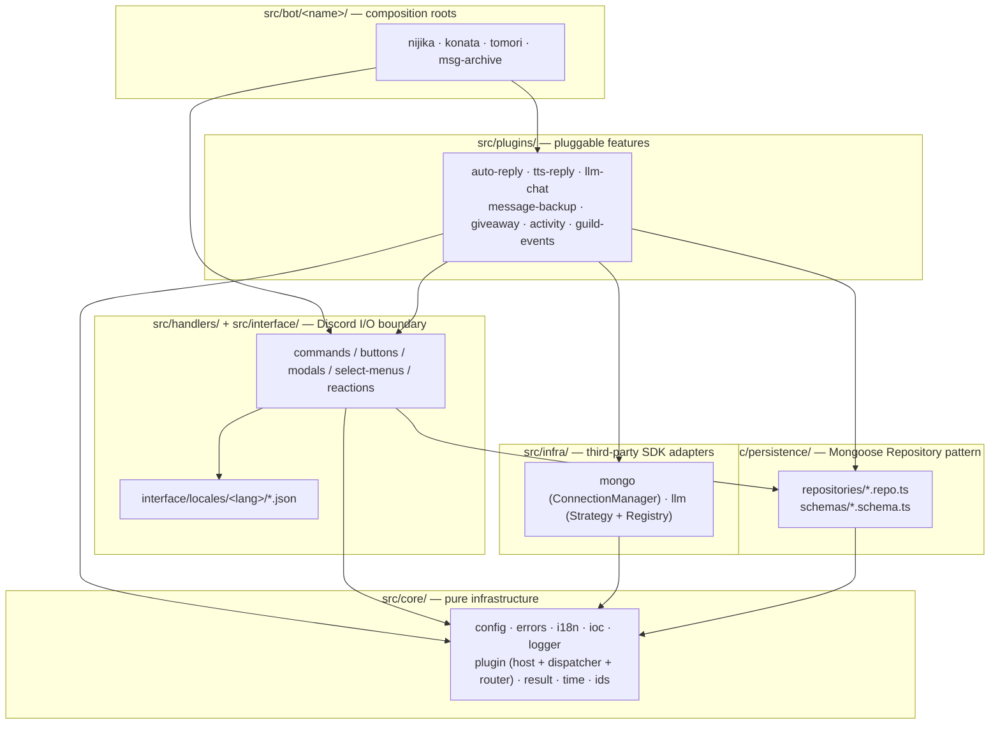
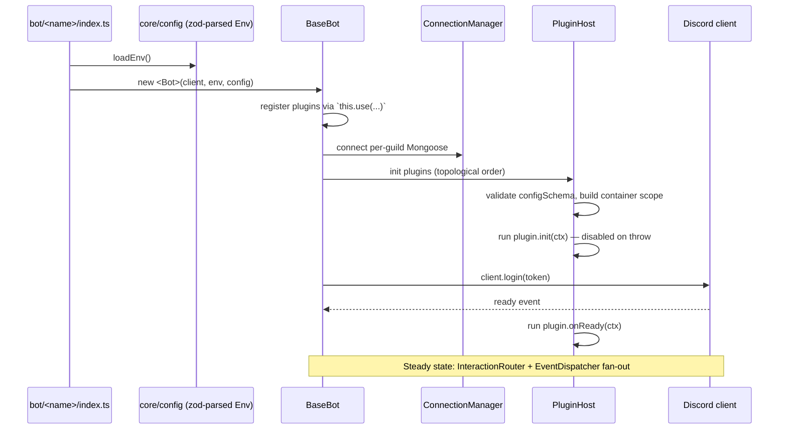

# Architecture

This document describes the layered architecture this project landed on
after the Phase 0–7 refactor (see [the long-form plan](../CLAUDE.md) for
historical context). The codebase is a TypeScript + Discord.js +
MongoDB service that hosts multiple bot personalities (`nijika`,
`konata`, `tomori`, `msg-archive`) on a shared core.

Two ideas drive the structure:

1. **Layered architecture.** Each `src/<layer>/` directory has a single
   responsibility and may only depend on layers below it. The bot
   composition root in `src/bot/<name>/` wires everything together.
2. **Plugin-based bot behaviour.** Business features (auto-reply, TTS,
   LLM chat, message backup, giveaway, activity) are `Plugin` instances
   registered with a `PluginHost`. Each bot picks the plugin set it
   wants — the base never gets subclassed.

## Layer diagram



Arrows point in the direction of dependency. **Nothing under `core/`
imports anything else in `src/`.**

## Layer responsibilities

| Layer             | Path                     | Responsibility                                                                                                                                          | May import                                   |
| ----------------- | ------------------------ | ------------------------------------------------------------------------------------------------------------------------------------------------------- | -------------------------------------------- |
| Core              | `src/core/`              | Logger, errors, `Result<T,E>`, IoC container + tokens, i18n translator, plugin contract (host + dispatcher + router + registries), `Clock`, ID branding | Std lib only                                 |
| Persistence       | `src/persistence/`       | `*.schema.ts` (Mongoose docs + interfaces) and `*.repo.ts` (typed CRUD). Repositories are interface-defined so plugins receive a fake in tests          | `mongoose`, `core/*`                         |
| Infra             | `src/infra/`             | SDK adapters for the outside world: `mongo/ConnectionManager` (per-guild lifecycle) and `llm/*` (provider Strategy + registry + error translator)       | SDKs, `core/*`                               |
| Handlers          | `src/handlers/`          | Discord interaction entry points: one folder per slash command / button / modal / select-menu / reaction. Class-based, registered via codegen           | `core/*`, `persistence/*`, `infra/*`, `@bot` |
| Interface locales | `src/interface/locales/` | `zh-TW/*.json` catalogs loaded by the i18n module                                                                                                       | —                                            |
| Plugins           | `src/plugins/`           | Self-contained feature modules with their own state, jobs, and event subscriptions. One folder per plugin                                               | `core/*`, `persistence/*`, `infra/*`, `@bot` |
| Bots              | `src/bot/<name>/`        | Composition root: builds the Discord client, instantiates `BaseBot`, registers plugins, runs                                                            | Everything above                             |

## Core abstractions

### Plugin contract

Every business feature implements `Plugin<Config>` from
`src/core/plugin/types.ts`:

```ts
interface Plugin<Config = void> {
  readonly id: string; // globally unique, e.g. 'auto-reply'
  readonly version: string; // SemVer
  readonly scope: 'bot' | 'guild'; // host decides instantiation
  readonly critical?: boolean; // hard-fail vs soft-disable
  readonly dependencies?: readonly PluginDependency[];
  readonly configSchema?: z.ZodType<Config>;

  init?(ctx: PluginInitContext<Config>): Promise<void>;
  start?(ctx: PluginStartContext): Promise<void>;
  onReady?(ctx: PluginRuntimeContext): Promise<void>;
  onShutdown?(ctx: PluginRuntimeContext): Promise<void>;

  events?: PluginEventSubscriptions;
  contributes?: PluginContributions;
}
```

`PluginHost` (`src/core/plugin/host.ts`) topologically sorts plugins by
dependencies, runs lifecycle hooks, isolates errors (a plugin that
throws in `init` is marked disabled — non-critical plugins do not
bring the bot down), and merges `contributes.commands` etc. with the
codegen registries before handing them to the InteractionRouter.

### Codegen registries

`scripts/gen-registry.ts` scans each `src/handlers/<type>/` directory
and produces a `registry.generated.ts` file with explicit imports. The
codegen runs:

- on `yarn handlers:gen` (manual)
- via `yarn handlers:gen:check` in CI to fail if a handler was added
  without regenerating
- under `yarn dev`-style flows via the same script

The runtime imports `*_REGISTRY` arrays; nothing reflects over the
filesystem at boot.

### IoC container

`src/core/ioc/container.ts` is a ~150-line manual container with typed
`ServiceToken<T>`. Standard tokens live in `tokens.ts`:

```ts
TOKENS = {
  Env, Logger, Translator, Clock, DiscordClient,
  GuildRegistry, ConnectionManager,
  MessageRepoFactory, GiveawayRepoFactory, ...
}
```

Plugins resolve dependencies inside `init(ctx)` only — runtime hooks
must not call `container.resolve` (Service Locator anti-pattern).

### Repository pattern

Each domain entity has:

- `src/persistence/schemas/<name>.schema.ts` — Mongoose schema + TS
  doc interface
- `src/persistence/repositories/<name>.repo.ts` — typed interface +
  `Mongo<Name>Repo` implementation

`createRepositories(connection)` in `src/persistence/index.ts` is the
factory that produces the bundle used by `GuildRegistry`. Tests inject
in-memory fakes that satisfy the same interface.

### Error taxonomy

`src/core/errors/` exposes a discriminated `DomainError` tree:

- `ValidationError`, `NotFoundError`, `ConflictError`, `PermissionError`
- `ExternalServiceError` → `DiscordApiError`, `DatabaseError`,
  `LlmProviderError`
- `ConfigurationError`

Each carries `code` (machine-readable), `messageKey` (i18n key —
never a literal string), `messageParams`, and the original `cause`.

The outer interaction `try` translates a `DomainError` into a user
reply via `ctx.t(err.messageKey, err.messageParams)`. Unexpected
throws hit a generic translator key with a `traceId` correlatable to
the structured log line.

### i18n

`src/core/i18n/` wraps i18next. Catalogs live in
`src/interface/locales/<locale>/{commands,errors,replies}.json`. Key
naming: `<namespace>:<feature>.<purpose>`. The scanner at
`test/i18n/no-literal-cjk.test.ts` enforces zero CJK literals in
`src/handlers/`, `src/plugins/`, and `src/events/` from Phase 6
onwards.

### Logger

`src/core/logger/` is a pino-style structured logger with redaction
(`token`, `apiKey`, `mongoURI`, `password`, `authorization`,
`secret`). `unhandledRejection` and `uncaughtException` handlers are
installed at boot.

## Bot startup sequence



## Testing layers

| Layer                             | Runner                         | What it covers                                                       |
| --------------------------------- | ------------------------------ | -------------------------------------------------------------------- |
| Unit (`test/unit/`)               | Vitest, project `unit`         | `core/`, `domain` parts of `plugins/`, repo error paths, ID branding |
| Integration (`test/integration/`) | Vitest + mongodb-memory-server | Repository CRUD + cross-layer use cases                              |
| Contract (`test/contract/`)       | Vitest + nock                  | LLM provider adapters (200 / 401 / 429 / 5xx / context-too-long)     |
| i18n (`test/i18n/`)               | Vitest                         | Catalog parity + CJK-literal scanner                                 |

CI runs all four in parallel plus `typecheck`, `lint`, `format:check`,
`handlers:gen:check`, `knip`, `audit`, `gitleaks`, and `codeql`.

## Composition root template

The minimum a new bot needs (`src/bot/<name>/index.ts`):

```ts
import { Client, GatewayIntentBits } from 'discord.js';
import dotenv from 'dotenv';
import { MyBot } from './my-bot';
import config from './config.json';

dotenv.config({ path: `./src/bot/${name}/.env` });

const client = new Client({
  intents: [
    /* … */
  ],
});
const bot = new MyBot(
  client,
  process.env.TOKEN as string,
  process.env.MONGO_URI as string,
  process.env.CLIENT_ID as string,
  config,
);
bot.run();
```

And the bot class itself selects plugins:

```ts
export class MyBot extends BaseBot<MyConfig> {
  public constructor(/* … */) {
    super(/* … */);
    this.use(createAutoReplyPlugin({ blockedChannels: [] }));
    this.use(createLlmChatPlugin());
    // …
  }
}
```

That is the entire wiring layer — every other behaviour lives behind a
plugin, behind a repository, or behind the InteractionRouter middleware
chain.
