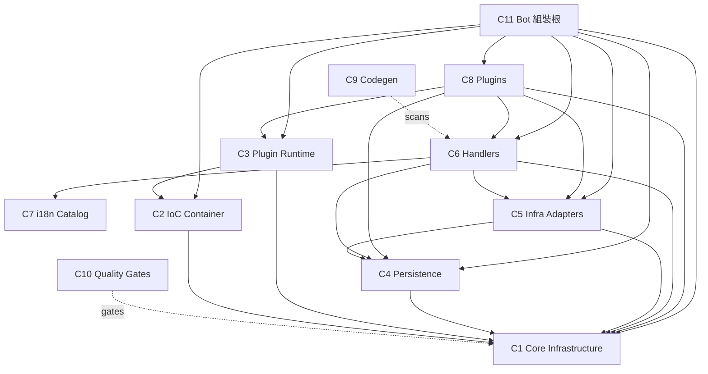

# 詳細設計文件 — Discord Bot 架構（索引）

| 欄位     | 內容                                                                                   |
| -------- | -------------------------------------------------------------------------------------- |
| 文件類型 | 詳細設計（Detailed Design）                                                            |
| 文件版本 | 1.0                                                                                    |
| 最後更新 | 2026-05-20                                                                             |
| 上游文件 | [`docs/proposal.md`](proposal.md)、[`docs/high-level-design.md`](high-level-design.md) |
| 讀者     | 技術團隊 / 工程師 / 架構審查者                                                         |

---

## 1. 文件目的

本文件是 [`docs/high-level-design.md`](high-level-design.md)（HLD）所切分之 11 個元件（C1–C11）的**詳細設計**。HLD 描述「系統應如何被切分」，本文件則描述「每個元件內部的類別、介面、互動與測試策略」，作為實作與審查的依據。

**撰寫基準**：本文件**以現況 codebase 為準**。每個元件檔逐一比對其對應的 HLD 段落，凡實作與 HLD（或 proposal）有出入者，於該檔的「§7 與 HLD 的偏差」段落明確標註，不靜默略過。

**分檔組織**：每個元件一個獨立檔案，置於 [`docs/design/`](design/) 之下。各檔結構一致：

1. 元件職責與邊界
2. 類別／介面詳細設計（含 TypeScript 簽章）
3. 類別圖（mermaid）
4. 關鍵流程序列圖（mermaid）
5. 採用的 design pattern 與理由
6. 獨立性與測試策略
7. 錯誤處理與邊界契約
8. 與 HLD 的偏差（如有）

---

## 2. 元件清單

| 元件 | 名稱                  | 路徑                         | 詳細設計檔                                                          |
| ---- | --------------------- | ---------------------------- | ------------------------------------------------------------------- |
| C1   | Core Infrastructure   | `src/core/`（除 ioc/plugin） | [C1-core-infrastructure.md](design/C1-core-infrastructure.md)       |
| C2   | IoC Container         | `src/core/ioc/`              | [C2-ioc-container.md](design/C2-ioc-container.md)                   |
| C3   | Plugin Runtime        | `src/core/plugin/`           | [C3-plugin-runtime.md](design/C3-plugin-runtime.md)                 |
| C4   | Persistence           | `src/persistence/`           | [C4-persistence.md](design/C4-persistence.md)                       |
| C5   | Infra Adapters        | `src/infra/`                 | [C5-infra-adapters.md](design/C5-infra-adapters.md)                 |
| C6   | Handlers              | `src/handlers/`              | [C6-handlers.md](design/C6-handlers.md)                             |
| C7   | i18n Catalog          | `src/interface/locales/`     | [C7-i18n-catalog.md](design/C7-i18n-catalog.md)                     |
| C8   | Plugins               | `src/plugins/`               | [C8-plugins.md](design/C8-plugins.md)                               |
| C9   | Codegen & Scripts     | `scripts/`                   | [C9-codegen-scripts.md](design/C9-codegen-scripts.md)               |
| C10  | Quality Gates         | CI / 設定檔                  | [C10-quality-gates.md](design/C10-quality-gates.md)                 |
| C11  | Bot Composition Roots | `src/bot/`                   | [C11-bot-composition-roots.md](design/C11-bot-composition-roots.md) |

---

## 3. 元件依賴總覽

依賴單向向下。`C1` 不 import `src/` 內任何其他模組，亦不依賴 Discord.js / Mongoose / LLM SDK（型別匯入除外）。注意 `C5 → C4`：`infra/mongo` 的 `ConnectionManager` 依賴 `persistence/schemas` 建構 model registry，此為 HLD 依賴圖未顯示的一條真實邊（見 C5 設計檔）。

---

## 4. 元件獨立性原則

本文件貫徹「component 間互相獨立、可獨立測試」的要求。獨立性透過三項機制達成，每個元件檔的 §6 會具體展開：

1. **介面優先**：跨元件依賴一律對介面（`Repos` 介面、`LLMService`、`ServiceToken<T>`、`ConnectionManager`、`Translator`、`Clock`、`Logger`），不對具體類別。
2. **建構子注入**：分層程式碼透過建構子或工廠參數取得依賴；只有組裝根（C11）與測試可觸及 IoC 容器（由 ESLint `no-restricted-imports` 強制）。
3. **可替換的測試替身**：每個元件提供 in-memory fake、`FakeClock`、SDK client 注入孔（nock contract test）、`StaticConnectionManager`（mongodb-memory-server）等替身接點。

---

## 5. 已知的現況與 HLD 偏差（彙總）

下列偏差於對應元件檔詳述。彙總於此供快速索引：

| #   | 偏差                                                                                                                    | 涉及元件    | 詳見          |
| --- | ----------------------------------------------------------------------------------------------------------------------- | ----------- | ------------- |
| D1  | 不存在 guild-onboarding port；`guildCreate` 仍由 `src/events/guild_event.ts` 處理                                       | C3、C8、C11 | C3 §7、C8 §7  |
| D2  | 不存在 `earthquake` plugin；地震速報仍是 `src/events/earthquake.ts` + `nijika/index.ts` inline 路由                     | C8、C11     | C8 §7         |
| D3  | `src/events/` 過渡層仍存在（`earthquake.ts`、`guild_event.ts`、`index.ts`）                                             | C8          | C8 §7         |
| D4  | `src/utils/` 仍存在（`bot_cmd.ts`、`job_manager.ts`、`misc.ts`、`index.ts`），giveaway/activity 仍 import 之            | C8、C11     | C8 §7         |
| D5  | `ConnectionManager` 無 retry／transient-vs-persistent 分類／`disabledGuilds` map；`disabledGuilds` 追蹤實際在 `BaseBot` | C5、C11     | C5 §7、C11 §7 |
| D6  | `host/` 僅 3 檔（`errors`、`topology`、`contributes-merger`），無 `lifecycle.ts`；lifecycle 邏輯內聯於 `host.ts`        | C3          | C3 §7         |
| D7  | i18n catalog 僅 `zh-TW` 一個語系；`commands.json` 為空 `{}`                                                             | C7          | C7 §7         |
| D8  | strict tsconfig（`tsconfig.strict.json`）尚未涵蓋 `src/bot/**`、`src/handlers/**`                                       | C10         | C10 §7        |
| D9  | handler 邊界不直接 `catch (DomainError)`；採 try/catch + 硬編碼 i18n key。`DomainError.messageKey` 由 plugin 層消費     | C6          | C6 §7         |

> 這些偏差代表 proposal／HLD 描述的「目標設計」尚有未落地處。本文件忠實記錄現況，並在偏差段落標示「目標 vs 現況」差距。

完整的收斂工作清單（含優先級、修正步驟、待決議點）見 [`docs/design/gaps.md`](design/gaps.md)。
