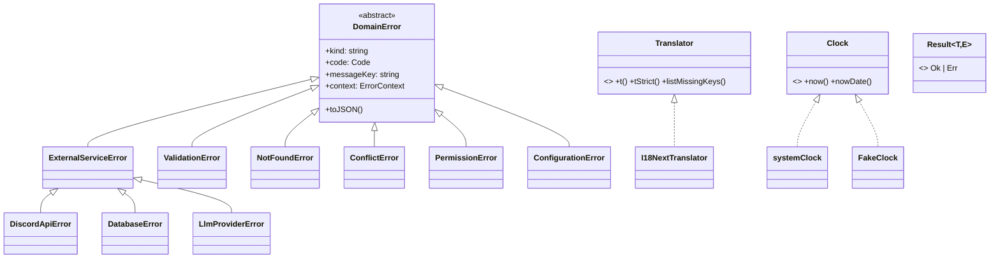
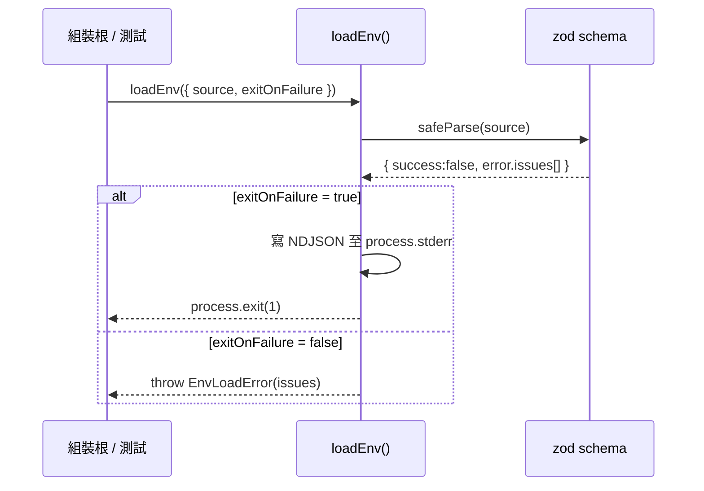

# C1 — Core Infrastructure 詳細設計

> 路徑：`src/core/`（不含 `ioc/`、`plugin/`）
> 對應 HLD：§5 C1 ｜對應需求：REQ-A1、REQ-C1、REQ-E1、REQ-F1

---

## 1. 元件職責與邊界

C1 是分層架構最底層，提供**與業務無關、與第三方 SDK 無關**的純基礎設施。八個子模組各有單一職責：

| 子模組              | 職責                                                               |
| ------------------- | ------------------------------------------------------------------ |
| `config/`           | zod 解析的 `Env`，單一 `loadEnv()` 進入點；敏感欄位 redaction 路徑 |
| `errors/`           | `DomainError` 結構化錯誤樹                                         |
| `result/`           | `Result<T, E>` 型別與組合子                                        |
| `i18n/`             | `Translator` 抽象（i18next-backed）+ catalog 載入 + locale 解析    |
| `logger/`           | 結構化 logger、敏感欄位 scrub、process-handler 安裝                |
| `time/`             | `Clock` 抽象（測試可注入固定時間）                                 |
| `ids.ts`            | branded ID 型別與 smart constructor                                |
| `guild-registry.ts` | `GuildRegistry` 唯讀介面（依 guild 查 channel/role/repo）          |

**邊界規則**：C1 不 import `src/` 內任何其他模組。允許的外部相依僅 `zod`、`dotenv`、`pino`、`i18next`、Node 標準庫；`discord.js` 僅以 type-only 形式出現（`GuildRegistry` 的 `Channel`/`Role` 型別）。`config/env.ts` 刻意直接寫 `process.stderr` 而不 import logger，以避免 bootstrap 循環相依。

---

## 2. 類別／介面詳細設計

### 2.1 `config/` — 環境設定

```ts
type Env = Readonly<{
  TOKEN: string;
  CLIENT_ID: string;
  MONGO_URI?: string;
  PORT?: number;
  NODE_ENV: 'development' | 'test' | 'production';
  LOG_LEVEL: 'trace' | 'debug' | 'info' | 'warn' | 'error' | 'fatal';
  OPENAI_API_KEY?: string;
  ANTHROPIC_API_KEY?: string;
  GEMINI_API_KEY?: string;
  XAI_API_KEY?: string;
  ACCUWEATHER_KEY?: string;
}>;

interface LoadEnvOptions {
  envFile?: string;
  requireDb?: boolean;
  requirePort?: boolean;
  exitOnFailure?: boolean;
  source?: NodeJS.ProcessEnv;
}
const loadEnv: (options?: LoadEnvOptions) => Env; // @throws EnvLoadError（當 exitOnFailure=false）
class EnvLoadError extends Error {
  readonly issues: readonly z.ZodIssue[];
}
```

`loadEnv` 為 fail-fast：以 zod schema 一次驗證所有欄位，聚合所有 `ZodIssue`。`exitOnFailure: true`（預設）時 `process.exit(1)`；`false` 時擲 `EnvLoadError`（測試路徑）。`buildPinoRedactPaths()` 將 `REDACT_FIELD_NAMES`（token / apiKey / mongoURI / password / authorization / secret …）展開為 4 層巢狀路徑供 logger 使用。

### 2.2 `errors/` — DomainError 錯誤樹

```ts
interface ErrorContext {
  readonly operation: string;
  readonly input?: Readonly<Record<string, unknown>>;
  readonly [key: string]: unknown;
}
interface DomainErrorInit<Code extends string, Params> {
  readonly code: Code;
  readonly messageKey: string;
  readonly context: ErrorContext;
  readonly cause?: unknown;
  readonly messageParams?: Params;
}
abstract class DomainError<Code extends string = string, Params = undefined> extends Error {
  abstract readonly kind: string; // 子類 discriminant
  readonly code: Code; // 機器可讀、SemVer 穩定
  readonly messageKey: string; // i18n catalog key（必填）
  readonly context: ErrorContext;
  readonly messageParams: Params;
  protected constructor(init: DomainErrorInit<Code, Params>);
  toJSON(): Readonly<Record<string, unknown>>; // pino-friendly
}
```

具體子類（每個 `override readonly kind`）與 `code` 列舉：

- `ValidationError` — `FIELD_REQUIRED | FIELD_OUT_OF_RANGE | FIELD_INVALID_FORMAT | FIELD_TOO_LONG | FIELD_TOO_SHORT`
- `NotFoundError` — `GUILD_NOT_FOUND | CHANNEL_NOT_FOUND | MESSAGE_NOT_FOUND | USER_NOT_FOUND | GIVEAWAY_NOT_FOUND | ACTIVITY_NOT_FOUND | SETTING_NOT_FOUND | RECORD_NOT_FOUND`
- `ConflictError` — `ALREADY_EXISTS | ALREADY_JOINED | ILLEGAL_STATE_TRANSITION`
- `PermissionError` — `PERMISSION_DENIED | NOT_WHITELISTED | ADMIN_ONLY`
- `ConfigurationError` — `MISSING_ENV | INVALID_ENV | INVALID_CONFIG_JSON | UNSUPPORTED_FEATURE`
- `ExternalServiceError`（base） → `DiscordApiError`、`DatabaseError`、`LlmProviderError`

`AnyDomainError` 為 8 個具體子類的 discriminated union（以 `kind` 收斂），供 handler 做 exhaustive switch。

### 2.3 `result/` — Result 型別

```ts
type Result<T, E extends DomainError = DomainError> = Ok<T> | Err<E>;
interface Ok<T>  { readonly ok: true;  readonly value: T; }
interface Err<E> { readonly ok: false; readonly error: E; }
const ok:  <T>(value: T) => Ok<T>;       // Object.freeze
const err: <E>(error: E) => Err<E>;      // Object.freeze
const isOk / isErr;                       // type guards
map / mapErr / andThen / unwrapOr;        // 組合子（andThen 為 monadic bind）
unwrap;                                   // 僅測試用，Err 時擲出 wrapped error
```

自製 Result（不採 `neverthrow`），保持 C1 零額外相依。約定：回傳 `Result` 的函式不得擲 `DomainError`（review 強制，非型別強制）。

### 2.4 `i18n/`、`logger/`、`time/`、`ids.ts`

```ts
interface Translator {
  t(key, params?, locale?): string;        // 缺 key 時回退
  tStrict(key, params?, locale?): string;  // 缺 key 時擲 MissingTranslationError
  listMissingKeys(reference: Locale): Record<Locale, readonly string[]>;
}
class I18NextTranslator implements Translator {  // private constructor
  static create(resources: CatalogResources, fallbackLocale?: Locale): Promise<I18NextTranslator>;
}
interface Clock { now(): number; nowDate(): Date; }
const systemClock: Clock;                         // 凍結之共享實例
const createFakeClock: (initial?: number) => FakeClock;   // advance / set
interface Logger { trace/debug/info/warn/error/fatal(...): void; child(bindings): Logger; }
const createLogger: (input: CreateLoggerInput) => Logger;

type GuildId = Brand<string, 'GuildId'>; /* ChannelId / MessageId / UserId / RoleId 同 */
const asGuildId: (value: unknown) => GuildId;     // 空值/非字串擲 TypeError
```

`logger/scrub-for-log.ts` 深拷貝並 redact 敏感鍵、把 `Error` 展開為 `{name,message,stack,code,cause}`、深度上限 4。`logger/process-handlers.ts` 之 `installProcessHandlers` 為 idempotent，安裝 `unhandledRejection`／`uncaughtException` handler。

---

## 3. 類別圖



---

## 4. 關鍵流程序列圖

`loadEnv` 失敗的 fail-fast 流程：



---

## 5. 採用的 Design Pattern

| Pattern                  | 位置                                                          | 理由                                     |
| ------------------------ | ------------------------------------------------------------- | ---------------------------------------- |
| Result / Either monad    | `result/result.ts`                                            | 邊界以值表達成敗，取代散落 try/catch     |
| Branded（nominal）type   | `ids.ts` 的 `Brand<T,B>`                                      | 防止 `GuildId`／`ChannelId` 互相誤用     |
| Strategy                 | `Translator`、`Clock` 介面                                    | 可注入替身；i18next / 系統時鐘為其一實作 |
| Abstract base + template | `DomainError`                                                 | 統一錯誤結構，`kind` 作 discriminant     |
| Factory                  | `createLogger`、`createFakeClock`、`I18NextTranslator.create` | 隱藏具體型別、便於替換                   |
| Singleton（stateless）   | `systemClock`、`process-handlers` 安裝                        | 無狀態服務，凍結共享                     |
| Adapter / Facade         | `logger.ts` 包裝 pino、`legacy.ts`                            | 把 pino 適配為專案 `Logger` 介面         |

---

## 6. 獨立性與測試策略

C1 為葉節點元件，零 `src/` 內相依，本身即可獨立測試。提供的測試接點：

- **`Clock`**：production 用 `systemClock`，測試注入 `createFakeClock(initial)`，以 `advance(ms)` / `set(ms)` 控制時間。
- **`Translator`**：介面化；測試可替身或用 `tStrict` 斷言缺 key。
- **`Logger`**：小介面，測試可不重作 pino 直接 fake。
- **option-object seam**：`loadEnv({ source, exitOnFailure:false })` 注入環境並捕捉 `EnvLoadError`；`loadCatalogResources({ localesDir })` 覆寫 locale 路徑。
- **test-only hook**：`unwrap()`（Result 測試 arrange）、`__resetProcessHandlersForTests()`（重置 module-level 狀態）。

**覆蓋率要求**：C10 對 `src/core/**` 設高標門檻（lines/functions/statements 90、branches 89），C1 屬此範圍。

---

## 7. 錯誤處理與邊界契約

C1 同時定義**兩條錯誤通道**，這是全 repo 的契約基準：

1. **`DomainError` 樹**：可預期、可回復的邊界失敗。必帶 `code`（機器可讀）、`messageKey`（i18n，必填）、`context.operation`、`cause`。infra 層只准擲 `DomainError` 子類。
2. **原生 `Error`／`TypeError`／`RangeError`**：程式員錯誤（invariant 違反），如 `asGuildId` 收到空字串。不走 i18n，不被視為 domain 失敗。

獨立非 domain 錯誤：`EnvLoadError`（聚合 zod issues）、`MissingTranslationError`。

**前置條件 / 不變式**：

- `DomainError.messageKey` 必為 catalog 中存在的 key；`context.operation` 必為非空字串。
- `ok()` / `err()` 回傳值為 frozen，呼叫端不得 mutate。
- branded ID smart constructor 對非字串／空值擲 `TypeError`——呼叫端須保證已是合法字串。

### 與 HLD 的偏差

無實質偏差。HLD §5 C1 所列職責與對外介面與現況一致。`config/bootstrap-logger.ts`（自 raw `process.env` 建 root logger）為 HLD 未逐項列出但合理的子模組，屬於 §7.3 可觀測性的 bootstrap 路徑。
