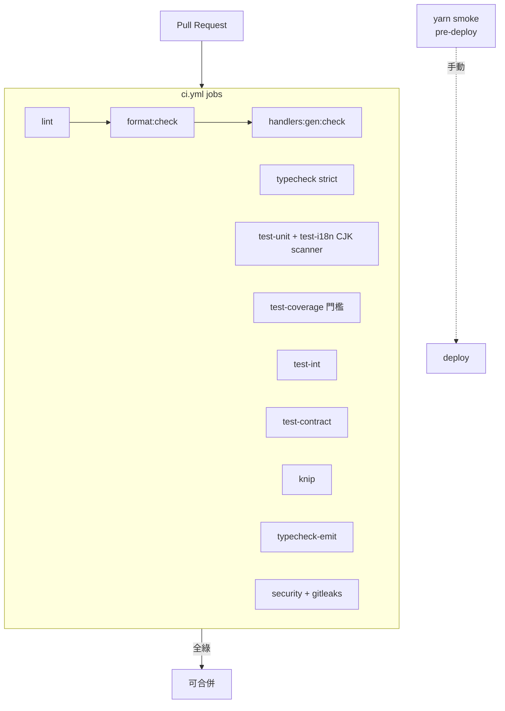
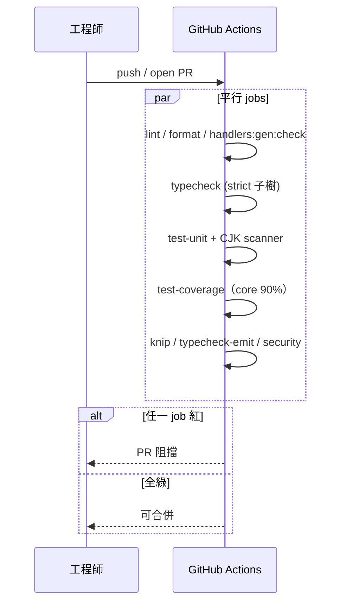

# C10 — Quality Gates 詳細設計

> 路徑：CI workflow（`.github/workflows/`）+ `tsconfig*.json` / `eslint.config.mjs` / `vitest.config.ts` / `package.json`
> 對應 HLD：§5 C10 ｜對應需求：REQ-E2、REQ-F1、REQ-F2、REQ-F3、REQ-F5、REQ-G2、REQ-G5、REQ-G6

---

## 1. 元件職責與邊界

C10 以 CI gate 橫切強制全 repo 品質。它不是程式模組，而是設定檔 + CI job 的集合。職責：型別檢查、lint、格式、codegen drift、未用程式碼偵測、測試、覆蓋率門檻、CJK literal 掃描、安全稽核、pre-deploy 探針。

---

## 2. 閘門詳細設計

### 2.1 `package.json` 品質相關 script

| Script                                                            | 內容                                                                                                       |
| ----------------------------------------------------------------- | ---------------------------------------------------------------------------------------------------------- |
| `typecheck`                                                       | `tsc -p tsconfig.strict.json`（strict，noEmit）                                                            |
| `typecheck:emit`                                                  | `tsc -p tsconfig.build.json`（emit 模式，全 `src/`）                                                       |
| `lint` / `lint:fix`                                               | `eslint src scripts test eslint.config.mjs vitest.config.ts`                                               |
| `format:check`                                                    | `prettier --check`（`src/core` `src/persistence` `src/infra` `scripts` `test` + 設定檔 + `*.md` + `docs`） |
| `handlers:gen:check`                                              | `ts-node scripts/gen-registry.ts --check`                                                                  |
| `knip`                                                            | `knip`（未用 export / 相依偵測）                                                                           |
| `test` / `test:unit` / `test:int` / `test:contract` / `test:i18n` | `vitest run`（依 project 選）                                                                              |
| `test:coverage`                                                   | `vitest run --coverage`（門檻 gate）                                                                       |
| `smoke`                                                           | `ts-node scripts/smoke.ts`                                                                                 |
| `security`                                                        | `audit-ci --config audit-ci.jsonc`                                                                         |

### 2.2 CI workflow（`.github/workflows/ci.yml`）

觸發：`pull_request` 與 push 至 `main`。各 job 於 `ubuntu-latest`：

| Job              | 內容                                                                   |
| ---------------- | ---------------------------------------------------------------------- |
| `lint`           | `lint` + `format:check` + `handlers:gen:check`                         |
| `typecheck`      | `typecheck`（strict）                                                  |
| `test-unit`      | `test:unit` + `test:i18n`                                              |
| `test-coverage`  | `test:coverage`（覆蓋率門檻）                                          |
| `test-int`       | `test:int`（JSON reporter）+ Empty-project guard（依 `.github/PHASE`） |
| `test-contract`  | `test:contract` + Empty-project guard                                  |
| `knip`           | `knip`                                                                 |
| `typecheck-emit` | 由 `config.example.json` 種出各 bot `config.json` 後 `typecheck:emit`  |
| `security`       | `audit-ci`（HIGH+）+ `gitleaks-action`                                 |

另有 `codeql.yml`：`CodeQL` 分析 `javascript-typescript`，PR 至 `[main, refactor/**]`、push 至 `main`、每週 cron。

### 2.3 tsconfig 階層

| 檔案                   | 用途             | include scope                                                                                                                                                                                                                                                                                 |
| ---------------------- | ---------------- | --------------------------------------------------------------------------------------------------------------------------------------------------------------------------------------------------------------------------------------------------------------------------------------------- |
| `tsconfig.json`        | 基底             | `src/**`、`scripts/**`、`test/**`；`strict:true`；path aliases                                                                                                                                                                                                                                |
| `tsconfig.strict.json` | `typecheck` gate | 加 `noUncheckedIndexedAccess`、`noImplicitOverride`、`noFallthroughCasesInSwitch`、`noUnusedLocals/Parameters`、`useUnknownInCatchVariables`。**include 受限**：`src/core/**`、`src/persistence/**`、`src/infra/mongo/**`、`src/infra/llm/**`、`src/utils/logger.ts`、`scripts/**`、`test/**` |
| `tsconfig.build.json`  | `typecheck:emit` | `src/**`，`noEmit:false`，`outDir:dist`                                                                                                                                                                                                                                                       |

### 2.4 ESLint（`eslint.config.mjs`，flat config，ESLint v9）

ignore `**/*.generated.ts`、`src/bot/**/config.json`。兩條硬 `error` 規則：

- **禁直接 `process.env`**：`no-restricted-syntax` 於 `src/**`+`test/**`（`src/core/config/**` 豁免）。
- **Service-Locator 防護**：`no-restricted-imports` 於 `application`/`domain`/`interface`/`persistence`/`infra`/`handlers`/`events`/`features`/`utils` 層，封鎖 import `**/core/ioc`、`@core/ioc`。容器 import 僅限組裝根與測試。

### 2.5 Vitest 覆蓋率門檻（`vitest.config.ts`）

provider `v8`。全域門檻 `lines:46 / functions:69 / branches:80 / statements:46`；`src/core/**` 覆寫為 `lines:90 / functions:90 / branches:89 / statements:90`。`vitest.workspace.ts` 定義 4 個 project：`unit`、`integration`（`globalSetup`、`pool:forks`、`singleFork`）、`contract`、`i18n`。

### 2.6 CJK literal scanner（REQ-E2）

位於 **`test/i18n/no-literal-cjk.test.ts`**（一個 Vitest 測試，**非獨立 script**，經 `yarn test:i18n` 跑）。掃描 `SCOPED_DIRECTORIES = ['src/handlers', 'src/plugins', 'src/events', 'src/bot']`，遞迴讀 `.ts`/`.tsx`，以 `CJK_REGEX` 比對；跳過註解行與帶 `// i18n-ignore: <reason>`（reason 必填）的行。三項斷言：報告預覽、對 `test/i18n/.baseline` 的單調 ratchet、`.github/PHASE >= 6` 時零違規的嚴格斷言。

### 2.7 smoke 探針（REQ-F5）

`scripts/smoke.ts`（`yarn smoke`，預設 `--bot nijika`）——連線探針，非完整 boot。三步 timeboxed：`loadEnv()`；可選 `mongoose.createConnection` + `admin.ping`；discord.js 登入並等 `clientReady`、斷言 `client.user.id === CLIENT_ID`。不註冊指令、不起 plugin。

### 2.8 必須通過的 status check（branch protection）

CI job 為「閘門即設定」，但唯有設為 branch-protection 的 **required status
check** 才真正阻擋合併。`refactor/architecture-overhaul`（重構整合分支）已設
required checks 為全部 **10 個 CI job**：`lint`、`typecheck`、`typecheck-emit`、
`test-unit`、`test-coverage`、`test-int`、`test-contract`、`knip`、`security`、
`analyze`（CodeQL）。設定為 `strict: false`（不要求 PR 先與 base 同步）、
**不要求人工 PR review**——使 `engineering-orchestrator` 的全自主開 PR / 合併
流程不需人工介入，同時任一 CI 閘門紅燈仍擋下合併。`yarn smoke` 需真實連線
憑證，為手動 pre-deploy 探針，刻意不列入 required check。

> 注：`main` 分支的 protection 目前仍列兩個過時的 check context
> （`test-integration`、`audit`），其為 CI job 改名前的舊名（現為 `test-int`、
> `security`）；待工程再以 `main` 為目標時須一併修正。

---

## 3. 閘門關係圖

---

## 4. 閘門執行序列圖

---

## 5. 採用的 Design Pattern

C10 非程式模組，無 OO pattern。設計要點為 **gate-as-config**（品質規則外部化為設定檔 + CI job）、**ratchet**（CJK scanner 對 `.baseline` 單調收斂，只准變好）、**fail-fast / fail-loud**（任一閘門紅燈即阻擋合併）。

---

## 6. 獨立性與測試策略

- C10 橫切所有元件，本身即「測試策略的執行者」。
- 各閘門互相獨立的 CI job——一個 job 紅不阻其他 job 跑完，便於一次看到所有問題。
- Empty-project guard 防止 `test:int`／`test:contract` 在尚無測試時靜默通過（silent-pass 偵測）。
- REQ-G6 要求 core facade（`host.ts`、`container.ts`、`result.ts`、`*.repo.ts`）補 unit test 達 core 90% 門檻。

---

## 7. 錯誤處理與邊界契約

- 每個閘門以 process exit code 表達成敗；非 0 即 CI job 紅。
- `handlers:gen:check` stale → `exit(1)`；CJK scanner phase≥6 違規 → 測試 fail；coverage 未達門檻 → `vitest` 非 0。
- **不變式**：合併至 `main` 前所有 CI job 必須綠；REQ-F5 要求四個 bot 的 `yarn smoke` 於 pre-deploy 通過。

### 與 HLD 的偏差（對應索引 D8）

**D8 — strict tsconfig 尚未涵蓋 `src/bot/**`、`src/handlers/**`**：

- HLD §5 C10 與 proposal REQ-F1 要求「strict typecheck 涵蓋全 `src`」「`include` 涵蓋 `src/handlers/**`、`src/bot/**`、`src/utils/**`」。實際 `tsconfig.strict.json` 的 include **僅** `src/core/**`、`src/persistence/**`、`src/infra/mongo/**`、`src/infra/llm/**`、`src/utils/logger.ts`、`scripts/**`、`test/**`——`src/bot/**`、`src/handlers/**`、`src/plugins/**`、`src/infra/discord/**` 不在 strict 範圍（檔內註解標明「PR-G 將擴大」）。REQ-F1「strict 涵蓋全 src」**部分未落地**。
- 另注：CJK scanner 掃描 `SCOPED_DIRECTORIES` 含 `src/events`——HLD §7.1 稱 `src/events` 已消除故不在掃描範圍，但因 `src/events/` 實際仍存在（見 C8 偏差 D3），scanner 仍將其納入掃描，此處實作與 HLD 文字相左但行為上是正確的（過渡層仍在就該掃）。
