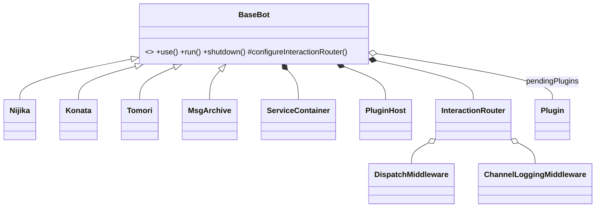

# C11 — Bot Composition Roots 詳細設計

> 路徑：`src/bot/`（`index.ts` = `BaseBot`、`nijika/`、`konata/`、`tomori/`、`msg-archive/`、`middlewares.ts`、`deploy.ts`）
> 對應 HLD：§5 C11 ｜對應需求：REQ-A3、REQ-G1、REQ-G4、REQ-G7

---

## 1. 元件職責與邊界

C11 是**唯一的 wiring 層**。`BaseBot` 為生命週期擁有者：建 Discord client、per-guild `ConnectionManager`、`GuildRegistry`、`Translator`，並以 `this.use(...)` 註冊 plugin。四個 bot 各自在 `src/bot/<name>/` 挑選 plugin 集合。`BaseBot` **不被繼承來承載業務行為**——bot 差異一律以 plugin 組合表達（不過四個 bot 仍是 `BaseBot` 的子類，用於覆寫 listener 與設定 config 型別）。

**邊界規則**：C11 是唯一可 import IoC 容器的層（ESLint Service-Locator 規則的豁免對象）。它依賴上述所有元件。

---

## 2. 類別／介面詳細設計

### 2.1 `BaseBot`

```ts
abstract class BaseBot<TConfig extends Config = Config> {
  constructor(client: Client, token: string, mongoURI: string, clientId: string, config: TConfig);

  use = <C>(plugin: Plugin<C>, config?: C): this;          // 流暢註冊，推入 pendingPlugins[]
  getPluginHost = (): PluginHost | undefined;
  run = async (callback?: () => Promise<void>): Promise<void>;
  shutdown = async (): Promise<void>;
  login / listen / connectOneGuild / connectGuildDB / registerGuild / rebootMessage / reLogin;
  readonly interactionEventListener;                        // readonly 防覆寫（msg-archive 例外）

  protected configureInteractionRouter(router): void;       // 子類 hook，預設 no-op
  protected channelLoggingBlockedChannels(): readonly string[] | undefined;  // 預設 undefined
}
```

建構子直接以 `createContainer()` 建 IoC 容器並註冊 7 個 singleton（`Logger`、`ConnectionManager`、`ReposFactory`、`Clock`、`GuildRegistry`、`DiscordClient`、`JobMap`）。

`run()` 四階段啟動（audit C-7 拆分 ~120 行 body）：

```
1. setupContainer()        — 解析 Logger、installProcessHandlers、loadEnv、註冊 Env
2. buildHost(rootLogger)   — createDefaultTranslator、建 InteractionRouter + middleware、
                             建 PluginHost、註冊 plugins、initAll、掛 bot.voice
3. armReadyLatch(callback) — login 前先註冊 ClientReady once（關閉 Konata reboot-message 競態）
4. login → host.startAll() → attachDispatcherToClient → openReadyLatch → listen
```

私有 helper 簽章：

```ts
private setupContainer = (): Logger;                       // REQ-G1 拆出
private buildHost = async (rootLogger: Logger): Promise<PluginHost>;
private armReadyLatch = (callback?): (() => void);
private attachDispatcherToClient = (host: PluginHost): void;   // 每個 subscribedEvents 掛一 client.on
private handleClientReady = async (callback?): Promise<void>;
```

### 2.2 四個 bot 的組裝

| Bot             | 註冊的 plugin                                                                                                                                  | 特殊處理                                                                                                       |
| --------------- | ---------------------------------------------------------------------------------------------------------------------------------------------- | -------------------------------------------------------------------------------------------------------------- |
| **nijika**      | `AutoReplyPlugin`、`TtsReplyPlugin`、`createGuildEventsPlugin(...)`、`createGiveawayPlugin()`、`createActivityPlugin()`、`createVoicePlugin()` | `index.ts` 另起 Express server，`POST /discord/earthquake` inline 路由；覆寫 `channelLoggingBlockedChannels()` |
| **konata**      | `createLlmChatPlugin({ clientId })`                                                                                                            | 建構子 `registerPresence()`；覆寫（抑制）reaction/guildCreate listener                                         |
| **tomori**      | `AutoReplyPlugin`、`createGiveawayPlugin()`、`createActivityPlugin()`、`createVoicePlugin()`                                                   | 無覆寫，保留 legacy 預設行為                                                                                   |
| **msg-archive** | `createMessageBackupPlugin({ backupServers })`                                                                                                 | 覆寫 `interactionEventListener`、reaction、`guildCreate` listener 為空 async（worker bot）                     |

### 2.3 `middlewares.ts` 與 `deploy.ts`

```ts
createDispatchMiddleware(bot: BaseBot): InteractionMiddleware;       // name 'dispatch'，終端：分流至 executeCommand/Modal/Button/SSM
createChannelLoggingMiddleware(bot, config?): InteractionMiddleware; // name 'channel-logging'，try/finally 包 next()，記 debug channel + audit
```

`deploy.ts`（`yarn deploy`）三模式：

- **global（預設）**：`rest.put(Routes.applicationCommands(clientId), { body })`（REQ-G4，audit B-5 翻轉預設為全域）。
- **`--dev-guild <id>`**：`Routes.applicationGuildCommands(clientId, guildId)`，開發即時生效。
- **`--cleanup-guild-commands`**：一次性遷移工具，逐 guild PUT 空 body，pace 250ms。

---

## 3. 類別圖



---

## 4. 啟動序列圖

```mermaid
sequenceDiagram
    participant E as bot/<name>/index.ts
    participant BB as BaseBot
    participant H as PluginHost
    participant DC as Discord client
    E->>BB: new XBot(...); bot.use(...).use(...)
    E->>BB: run(callback)
    BB->>BB: setupContainer()（Logger / installProcessHandlers / loadEnv）
    BB->>H: buildHost()（Translator / Router+middleware / register plugins / initAll）
    BB->>BB: armReadyLatch(callback)
    BB->>DC: client.login(token)
    DC-->>BB: ready
    BB->>H: startAll()
    BB->>BB: attachDispatcherToClient(host)
    BB->>BB: openReadyLatch → handleClientReady（registerGuild / connectGuildDB / registerCommands / readyAll）
```

---

## 5. 採用的 Design Pattern

| Pattern                 | 位置                                          | 理由                                  |
| ----------------------- | --------------------------------------------- | ------------------------------------- |
| Composition Root        | `bot/<name>/index.ts` + `<name>.ts`           | 唯一組裝物件圖之處                    |
| Chain of Responsibility | `InteractionRouter` + middleware              | 橫切邏輯抽為可組裝 middleware         |
| Builder（流暢）         | `use(...)` 回 `this`                          | 流暢註冊 plugin                       |
| Factory                 | plugin 工廠 + `sharedConnectionManagerForUri` | 延遲建構、依 URI 共用連線管理器       |
| Object pool             | `sharedConnectionManagers` map                | 每 URI 一個 Mongo 管理器，多 bot 共用 |
| Template method         | `BaseBot.run()` 固定四階段，子類 hook 覆寫    | 啟動骨架共用，差異收斂於 hook         |

---

## 6. 獨立性與測試策略

- `BaseBot` 的 `GuildRegistry`／`Clock`／`ConnectionManager` 為 token 註冊的 singleton——測試可自建容器注入 `FakeClock`、in-memory repo、fake registry。
- `getPluginHost()` 暴露 host／disabled-plugin 狀態供測試斷言。
- `run()` 收 optional `callback` hook。
- `interactionEventListener` 有 pre-`run()` fallback 路徑，供 router 未建好的測試情境。
- `scripts/smoke.ts` 為四 bot 的 pre-deploy 連線探針（見 C10）。

---

## 7. 錯誤處理與邊界契約

- **boot 期 process handler**：`installProcessHandlers({ logger, gracefulShutdown })`（idempotent）。`unhandledRejection` 記 `error`、計數、**不 exit**；`uncaughtException` 記 `fatal`、armed `SHUTDOWN_HARD_TIMEOUT_MS=5000` 強制 `exit(1)`、跑 `gracefulShutdown()`。
- **啟動韌性**：env-load 失敗非致命（warn）；per-guild Mongo 失敗記入 `disabledGuilds`（附 6 字 `traceId`）並在 fan-out 中吞掉，單一壞 guild 不中止 boot；`handleClientReady` body 包 try/catch；`readyAll()` 失敗記 log 但不致命。
- **不變式**：`ClientReady` once listener 必須在 `login()` 前註冊（`armReadyLatch`），否則 Konata reboot-message 有競態。

### 與 HLD 的偏差（對應索引 D1、D2、D5）

- **D1 — 無 guild-onboarding port 實作**：HLD §5 C11 稱 `BaseBot` 「提供 C3 guild-onboarding port 的實作」。實際全 `src/` 無此 port。新加入 guild 由 `guildCreateListener → detectGuildCreate(guild, this)`（legacy `src/events/guild_event.ts`）處理，仍穿透 `BaseBot.connectOneGuild` 與 `commandHandlers` 內部結構。HLD §9.4 的 port 化方案未落地。
- **D2 — earthquake 仍 inline 於 `nijika/index.ts`**：HLD §9.4 稱地震速報併入 bot-scoped `earthquake` plugin、由其 `start` hook 擁有 Express 路由。實際 `nijika/index.ts` 直接 `app.listen()` 並 inline `r.post('/earthquake', ...)`，呼叫 `@event` 的 `earthquake_warning(...)` free function。無 earthquake plugin。
- **D5 — `disabledGuilds` 在 `BaseBot` 而非 `ConnectionManager`**：HLD §5 C5／§7.4 把 `disabledGuilds` 歸於 `ConnectionManager`。實際 disabled-guild 追蹤發生在 `BaseBot.connectGuildDB`——boot 時 catch 連線失敗、把 guild 記入 `BaseBot.disabledGuilds`（含 `traceId`），無 retry／transient 分類。`requireGuildRepos`（C6）讀的正是 `bot.disabledGuilds`。職責歸屬與 HLD 不同，記錄於此。
