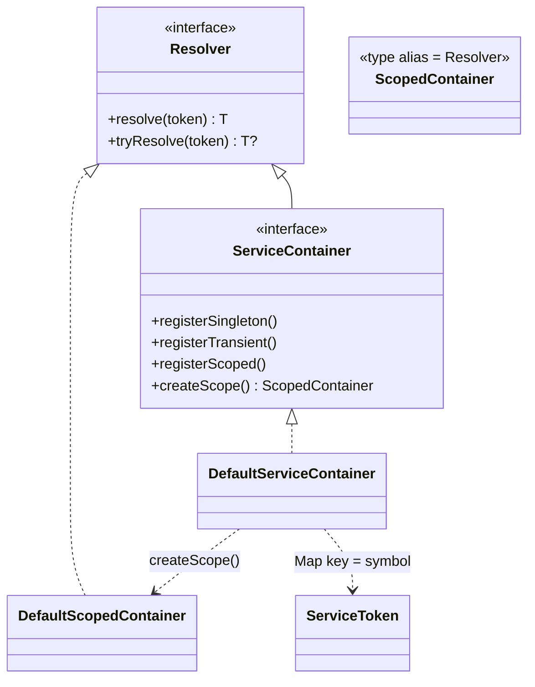
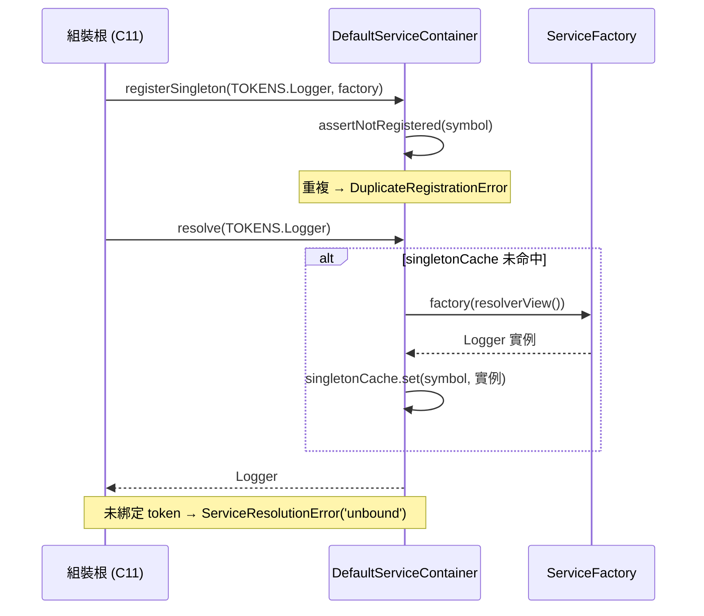

# C2 — IoC Container 詳細設計

> 路徑：`src/core/ioc/`（`container.ts`、`tokens.ts`、`index.ts`，共 ~396 行）
> 對應 HLD：§5 C2 ｜對應需求：REQ-A2

---

## 1. 元件職責與邊界

C2 以**約 280 行的手寫 IoC 容器**管理依賴生命週期，取代重構前的 Service Locator。型別安全由 `ServiceToken<T>` 保證——容器是型別化的 `Map`，不靠反射，不依賴 `reflect-metadata` 或任何 DI 框架。

**邊界規則**：

- `container.ts` **零 import**——完全自足。
- `tokens.ts` 依賴 C1 型別（`Clock`、`Env`、`Logger`、`Translator`、`GuildRegistry`、`GuildId`）與 `infra`／`persistence` 型別（均 type-only）。
- ESLint `no-restricted-imports` 規則禁止 `application`／`domain`／`handlers`／`plugins`／`infra`／`persistence`／`utils` 等層 import 本模組；唯有**組裝根（C11）與測試**可觸及容器。分層程式碼一律經建構子參數取得依賴。

---

## 2. 類別／介面詳細設計

### 2.1 `ServiceToken<T>` 與 capability 分離

```ts
interface ServiceToken<T> {
  readonly symbol: symbol;
  readonly description: string;
  readonly __brand?: (value: T) => T; // phantom 置於函式位置 → T 不變（invariant）
}
const token: <T>(description: string) => ServiceToken<T>; // 鑄造唯一 Symbol

type ServiceFactory<T> = (resolver: Resolver) => T;

interface Resolver {
  // 唯讀面 — 交給 factory
  resolve<T>(t: ServiceToken<T>): T;
  tryResolve<T>(t: ServiceToken<T>): T | undefined;
}
interface ServiceContainer extends Resolver {
  // 讀+註冊 — 交給組裝根
  registerSingleton<T>(t: ServiceToken<T>, factory: ServiceFactory<T>): void;
  registerTransient<T>(t: ServiceToken<T>, factory: ServiceFactory<T>): void;
  registerScoped<T>(t: ServiceToken<T>, factory: ServiceFactory<T>): void;
  createScope(): ScopedContainer;
}
type ScopedContainer = Resolver; // 唯讀，無 register*
```

三介面為**介面分離（ISP）**：factory 只拿到 `Resolver`（不能註冊），組裝根拿到 `ServiceContainer`，scope 拿到 `ScopedContainer`。`__brand` 置於**函式參數位置**使 `T` 為 invariant——`ServiceToken<Sub>` 不可賦值給 `ServiceToken<Super>`，杜絕誤解析。

### 2.2 容器實作

```ts
class DefaultServiceContainer implements ServiceContainer {
  private bindings: Map<symbol, Binding>;
  private singletonCache: Map<symbol, unknown>;
  private resolverView(): Resolver; // runtime 剝除 register*，防 @ts-ignore 的 factory
  private assertNotRegistered(t): void; // 重複註冊擲 DuplicateRegistrationError
}
class DefaultScopedContainer implements ScopedContainer {
  // 不 export
  private scopedCache: Map<symbol, unknown>;
  // 建構子捕捉 root 的 getBinding / delegateTryResolve 閉包
}
const createContainer: () => ServiceContainer;
```

**生命週期策略**（以 `switch(Binding.lifetime)` 分派）：

| 生命週期    | factory 執行頻率          | 解析行為                                                                |
| ----------- | ------------------------- | ----------------------------------------------------------------------- |
| `singleton` | 每容器至多一次            | 結果快取於 root `singletonCache`                                        |
| `transient` | 每次 `resolve()`          | 不快取                                                                  |
| `scoped`    | 每 `ScopedContainer` 一次 | 於 root 解析 scoped token 擲 `ServiceResolutionError('scoped-at-root')` |

`createScope()` 產生子 resolver；其 singleton／transient 解析**委派回 parent**，使 logger／clock 跨 scope 共用。實作以閉包捕捉 root 私有狀態（`getBinding`、`delegateTryResolve`），root 因此無需公開 binding accessor。

### 2.3 `TOKENS` 表

```ts
type ReposFactory = (guildId: GuildId) => Promise<Repos>;
const TOKENS: Tokens; // 9 項
```

| Token               | 服務型別                      | 生命週期說明                           |
| ------------------- | ----------------------------- | -------------------------------------- |
| `ConnectionManager` | `ConnectionManager`           | singleton                              |
| `ReposFactory`      | `(GuildId) => Promise<Repos>` | singleton（factory 本身）              |
| `Logger`            | `Logger`                      | bot-scoped root，預綁 `{bot:clientId}` |
| `Translator`        | `Translator`                  | singleton                              |
| `Clock`             | `Clock`                       | singleton                              |
| `GuildRegistry`     | `GuildRegistry`               | singleton                              |
| `DiscordClient`     | `Client`（discord.js 實例）   | singleton                              |
| `Env`               | `Env`                         | singleton                              |
| `JobMap`            | `Map<string, Job>`            | bot-scoped（node-schedule jobs）       |

---

## 3. 類別圖



---

## 4. 關鍵流程序列圖



---

## 5. 採用的 Design Pattern

| Pattern                | 位置                                                | 理由                                           |
| ---------------------- | --------------------------------------------------- | ---------------------------------------------- |
| IoC Container          | 整個模組                                            | 顯式依賴管理，取代 Service Locator             |
| Interface Segregation  | `Resolver` / `ServiceContainer` / `ScopedContainer` | factory 拿不到 register，編譯期+執行期雙重保護 |
| Branded / phantom type | `ServiceToken<T>`                                   | token 型別不變，杜絕誤解析                     |
| Factory                | `token()`、`createContainer()`、`ServiceFactory<T>` | 延遲建構、可注入 resolver                      |
| Strategy（生命週期）   | `Binding.lifetime` switch                           | singleton / transient / scoped 可互換          |

> 刻意**不**用 GoF Singleton class：容器本身每個組裝根各建一個，非全域單例。

---

## 6. 獨立性與測試策略

- `container.ts` 零 import，可完全孤立做單元測試。
- 測試以 `createContainer()` 建容器、`token<T>(desc)` 鑄測試 token、`registerSingleton/Transient/Scoped` 注入 fake，再驗證 `resolve` / `tryResolve` 行為與生命週期語意（singleton 快取、transient 每次新建、scoped 跨 scope 隔離）。
- `tryResolve` 永不擲——unbound 與 scoped-at-root 皆回 `undefined`，方便測試斷言「未綁定」而不需 try/catch。
- C2 屬 `src/core/**` 高覆蓋門檻範圍，REQ-G6 要求 `container.ts` 補齊 unit test。

---

## 7. 錯誤處理與邊界契約

```ts
class ServiceResolutionError extends Error {
  constructor(tokenDescription: string, reason: 'unbound' | 'scoped-at-root');
}
class DuplicateRegistrationError extends Error {
  constructor(tokenDescription: string);
}
```

- `resolve()` 對未綁定 token 擲 `ServiceResolutionError('unbound')`；對 root 解析 scoped token 擲 `('scoped-at-root')`。訊息內嵌 `tokenDescription`，使缺綁定可診斷（不會只印 `Symbol()`）。
- 任一 `register*` 對同一 token symbol 呼叫兩次 → `DuplicateRegistrationError`（重複註冊視為程式員錯誤，fail loud）。
- `tryResolve()` 為非擲版本。

**不變式**：token 身分以 `symbol` 為準（`description` 僅標籤、可重複）；factory 收到的 `Resolver` 在 runtime 已被剝除 `register*`／`createScope`，即使 factory 用 `@ts-ignore` 也無法回頭註冊。

### 與 HLD 的偏差

無偏差。HLD §5 C2 的「raw container 不對 plugin 暴露、runtime hook 內禁 Service Locator」由 ESLint 規則 + `Resolver` 介面分離雙重落實（C3 的 plugin 只拿到 `TypedResolver`）。
