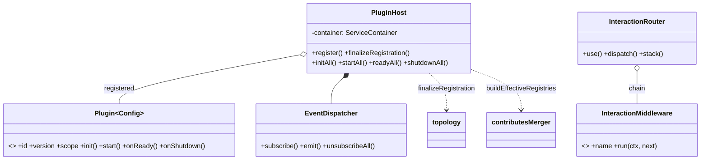
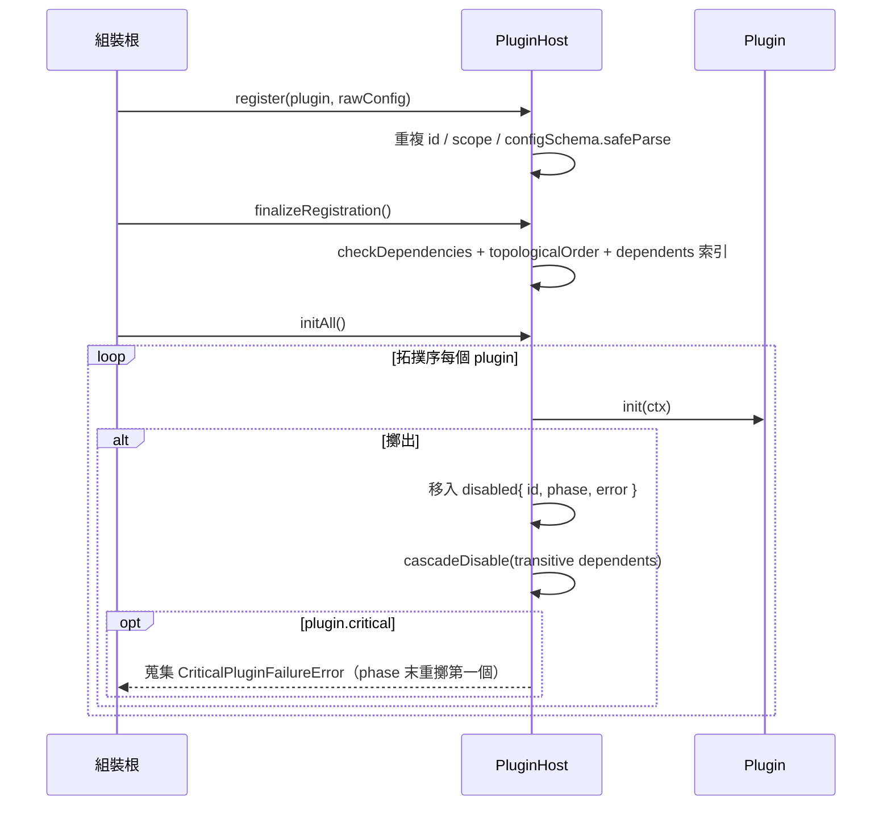

# C3 — Plugin Runtime 詳細設計

> 路徑：`src/core/plugin/`（含 `host/` 子目錄，共 9 檔 ~1283 行）
> 對應 HLD：§5 C3 ｜對應需求：REQ-A3、REQ-A4、REQ-G1

---

## 1. 元件職責與邊界

C3 是 plugin 架構的**微核心（microkernel）**：定義 `Plugin<Config>` 契約並驅動其生命週期、事件分派與 interaction 路由。它把「業務功能」與「核心」解耦——核心只認契約，不認個別 plugin。

**邊界規則**：C3 外部僅相依 `discord.js`（型別）與 `zod`，加上 sibling core 模組（`logger`、`i18n`、`time`、`ioc`）。**不**相依 `persistence`、`infra`，也不持有 Discord `Client` 實例——`PluginHost` 與 `EventDispatcher` 在無 discord.js 連線下即可完整建構與驅動，這是可測試性的關鍵設計決策。

檔案組成：`types.ts`、`host.ts`、`index.ts`、`event-dispatcher.ts`、`interaction-router.ts`、`registries.ts`，加 `host/{errors,topology,contributes-merger}.ts`。

---

## 2. 類別／介面詳細設計

### 2.1 `Plugin<Config>` 契約（`types.ts`）

```ts
interface Plugin<Config = void> {
  readonly id: PluginId; // string
  readonly version: PluginVersion; // SemVer string
  readonly scope: 'bot' | 'guild'; // 'guild' 目前 register 期被拒
  readonly dependencies?: readonly PluginDependency[];
  readonly configSchema?: z.ZodType<Config>;
  readonly critical?: boolean; // 預設 false

  init?(ctx: PluginInitContext<Config>): Promise<void>;
  start?(ctx: PluginStartContext): Promise<void>;
  onReady?(ctx: PluginRuntimeContext): Promise<void>;
  onShutdown?(ctx: PluginRuntimeContext): Promise<void>;

  readonly events?: PluginEventSubscriptions; // 映射型別 over ClientEvents
  readonly contributes?: PluginContributions; // commands/buttons/.../jobs/localeNamespaces
}
interface PluginDependency {
  readonly id: PluginId;
  readonly versionRange: string;
}
```

> `versionRange` 已被契約捕捉但 Phase 4a **尚未強制**——host 僅檢查 dependency `id` 是否已註冊。

### 2.2 執行時 context（Service Locator 防護）

```ts
interface PluginRuntimeServices {
  readonly logger: Logger; // 預先 child({ plugin: id })
  readonly translator: Translator;
  readonly clock: Clock;
  readonly resolve: TypedResolver; // <T>(token: ServiceToken<T>) => T
}
type PluginRuntimeContext = PluginRuntimeServices; // onReady / onShutdown
type PluginStartContext = PluginRuntimeServices;
interface PluginInitContext<Config> extends PluginRuntimeServices {
  config: Config;
}
interface PluginEventContext extends PluginRuntimeServices {
  eventName: keyof ClientEvents;
}
```

plugin 只拿到 `TypedResolver`（型別化的 `ServiceToken<T>` accessor），**永遠拿不到 raw `ServiceContainer`**——host 把容器設為私有並以 `buildResolver()` 閉包之。runtime hook 內無法 Service Locate（搭配 ESLint 規則，見 C2）。

### 2.3 `PluginHost`（`host.ts`）

```ts
interface PluginHostOptions {
  container: ServiceContainer;
  logger: Logger;
  translator: Translator;
  clock: Clock;
  coreRegistries: CoreRegistries;
}
class PluginHost {
  register<C>(plugin: Plugin<C>, rawConfig?: unknown): void; // 重複 id / scope / config 檢查
  finalizeRegistration(): void; // checkDependencies + 拓撲排序 + dependents 索引
  buildEffectiveRegistries(): EffectiveRegistries;
  getEventDispatcher(): EventDispatcher;
  getDisabledPlugins(): readonly DisabledPlugin[];
  getOrder(): readonly PluginId[];
  initAll(): Promise<void>; // 拓撲序執行 init
  startAll(): Promise<void>; // 執行 start，再 attachEventSubscriptions（事件此後才流動）
  readyAll(): Promise<void>;
  shutdownAll(): Promise<void>; // 反拓撲序，永遠 unsubscribeAll
}
```

生命週期順序：`init → start → onReady` 為拓撲序；`onShutdown` 為**反拓撲序**。lifecycle 迴圈位於私有 `runLifecycle` 方法。

`host/` 三個 sub-module 為 audit「C-8 split」抽出的**純函式 / 純錯誤定義**，使其可不建 host 即單元測試：

- `errors.ts` — `PluginRegistrationError`（`reason`：`DUPLICATE_ID|INVALID_CONFIG|UNSUPPORTED_SCOPE|MISSING_DEPENDENCY|CIRCULAR_DEPENDENCY`）、`CriticalPluginFailureError`、`DependencyDisabledError`。
- `topology.ts` — `topologicalOrder()`（Kahn 演算法，以 Map 插入序 tie-break，cycle 擲 `CIRCULAR_DEPENDENCY`）、`buildDependentsIndex()`。
- `contributes-merger.ts` — 純函式 `buildEffectiveRegistries(order, registered, coreRegistries)`，合併 codegen registry + 各 plugin contributes。

### 2.4 `InteractionRouter`（Chain of Responsibility）

```ts
interface InteractionMiddleware {
  readonly name: string; // 必填，供觀測
  run(ctx: InteractionContext, next: () => Promise<void>): Promise<void>;
}
class InteractionRouter {
  use(mw: InteractionMiddleware): this; // 流暢追加
  stack(): readonly InteractionMiddleware[]; // 凍結快照，供診斷/測試
  dispatch(ctx: InteractionContext): Promise<void>;
}
```

`dispatch()` 進入時對 middleware 陣列取快照（`[...]`），遞迴 `runAt(i)` 呼叫 `stack[i].run(ctx, next)`。失敗語意：middleware 擲出 → 中止整條鏈、錯誤上拋；middleware 不呼叫 `next()` 直接返回 → 乾淨結束（權限閘、rate limiter）。`next()` 重複呼叫擲 `DoubleNextError`。

### 2.5 `EventDispatcher`（Observer / event-bus）

```ts
class EventDispatcher {
  constructor(logger: Logger); // 不持有 Discord Client
  subscribe(pluginId, services, subscriptions): void;
  unsubscribeAll(pluginId): void;
  emit<K>(event: K, ...args: ClientEvents[K]): void;
  listenerCount(event): number;
  subscribedEvents(): readonly string[];
}
```

`emit` 對每個訂閱者以 `Promise.resolve().then(() => handler(...))` 包裹，rejection 經 `Promise.allSettled` 隔離並記 log——一個訂閱者擲出不影響其他訂閱者。

---

## 3. 類別圖



---

## 4. 關鍵流程序列圖

plugin 生命週期 + 錯誤隔離 + cascade disable：



---

## 5. 採用的 Design Pattern

| Pattern                  | 位置                                     | 理由                                      |
| ------------------------ | ---------------------------------------- | ----------------------------------------- |
| Microkernel / Plugin     | `PluginHost` + `Plugin` 契約             | 核心與業務功能解耦，bot 以組合挑功能      |
| Chain of Responsibility  | `InteractionRouter`                      | 橫切邏輯（權限/log）抽為可組裝 middleware |
| Observer / event-bus     | `EventDispatcher`                        | gateway 事件解耦 fan-out，含錯誤隔離      |
| Strategy（token DI）     | `TypedResolver` over `ServiceToken<T>`   | plugin 不碰 raw container                 |
| Topological sort（Kahn） | `host/topology.ts`                       | 依宣告依賴決定 lifecycle 順序             |
| Factory                  | `buildRuntimeContext` 等 context builder | 產生凍結的 per-plugin context             |

---

## 6. 獨立性與測試策略

- **無 Discord Client 相依**：`PluginHost`／`EventDispatcher` 可在無 discord.js 連線下建構；測試直接呼叫 `dispatcher.emit()` 驗證 fan-out。
- **純函式抽出**：`topologicalOrder`、`buildDependentsIndex`、`buildEffectiveRegistries`、`mergeRegistries` 為 stateless 純函式，以小 fixture（`Pick<Plugin, 'dependencies'>`）即可測，不需建 host。
- **Token DI**：plugin 依賴經 `TypedResolver` 解析，測試以 `ServiceContainer` 注入 fake。
- **診斷 accessor**：`getOrder()`、`getDisabledPlugins()`、`listenerCount()`、`subscribedEvents()`、`stack()` 唯讀暴露內部狀態供斷言。
- **決定性順序**：Kahn 以 Map 插入序 tie-break，測試輸出可重現。

---

## 7. 錯誤處理與邊界契約

| 階段                 | 失敗處理                                                                                                                                                                         |
| -------------------- | -------------------------------------------------------------------------------------------------------------------------------------------------------------------------------- |
| register             | 同步 fail-fast：擲 `PluginRegistrationError`（重複 id / scope / config）                                                                                                         |
| finalizeRegistration | 擲 `PluginRegistrationError`（`MISSING_DEPENDENCY` / `CIRCULAR_DEPENDENCY`）                                                                                                     |
| init/start/onReady   | `runLifecycle` try/catch：失敗 plugin 移入 `disabled` map、記結構化 log、`cascadeDisable` BFS 停用所有 transitive dependent（各帶 `DependencyDisabledError`，`cause` 指向 root） |
| critical 升級        | 失敗 plugin（或 cascade 受害者）`critical===true` → 蒐集 `CriticalPluginFailureError`，phase 末重擲第一個（保留 `cause`），其餘仍見於 `getDisabledPlugins()`                     |
| onShutdown           | 永遠非致命：catch + warn log，shutdown 續行；`unsubscribeAll(id)` 必呼叫                                                                                                         |
| 事件分派             | `emit` 用 `Promise.allSettled`，單一訂閱者擲出僅記 log，永不升級為 critical                                                                                                      |
| interaction 分派     | `dispatch` 不 catch——middleware 擲出中止鏈並上拋呼叫端；`DoubleNextError` 防 `next()` 重複呼叫                                                                                   |

**不變式**：`startAll()` resolve 前事件不流動（`attachEventSubscriptions` 在 `start` hook 後才執行）；非 critical 失敗永不中止 phase。

### 與 HLD 的偏差（對應索引 D1、D6）

- **D6 — `host/` 無 `lifecycle.ts`**：HLD §5 C3 寫 `host/{lifecycle,topology,contributes-merger}.ts`，實際 `host/` 僅 3 檔（`errors.ts`、`topology.ts`、`contributes-merger.ts`）。lifecycle 邏輯內聯於 `host.ts` 的私有 `runLifecycle` 方法，未抽成獨立檔。REQ-G1 的「拆 `host/{lifecycle,...}`」就 lifecycle 一項而言**未落地**。
- **D1 — 無 guild-onboarding port**：HLD §5 C3 對外介面列出「guild-onboarding port（typed 介面）」，HLD §9.4 詳述其用途。實際 codebase **不存在**此 port（全 `src/` 無 `onboard` 字樣）。`guildCreate` 仍由 legacy `src/events/guild_event.ts` 的 `detectGuildCreate` 處理。此為 proposal/HLD 目標設計未落地處。
