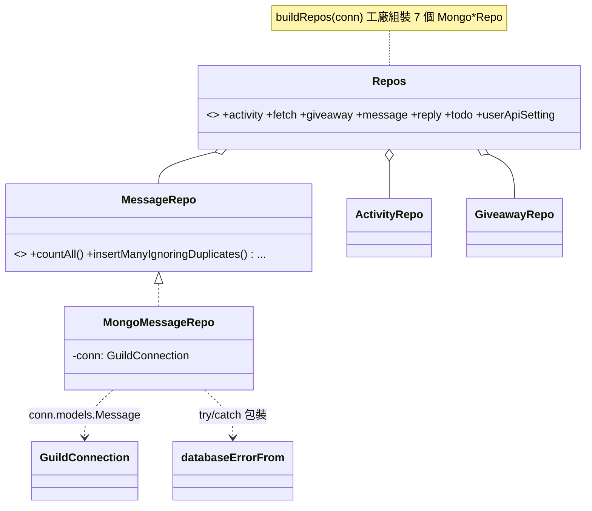
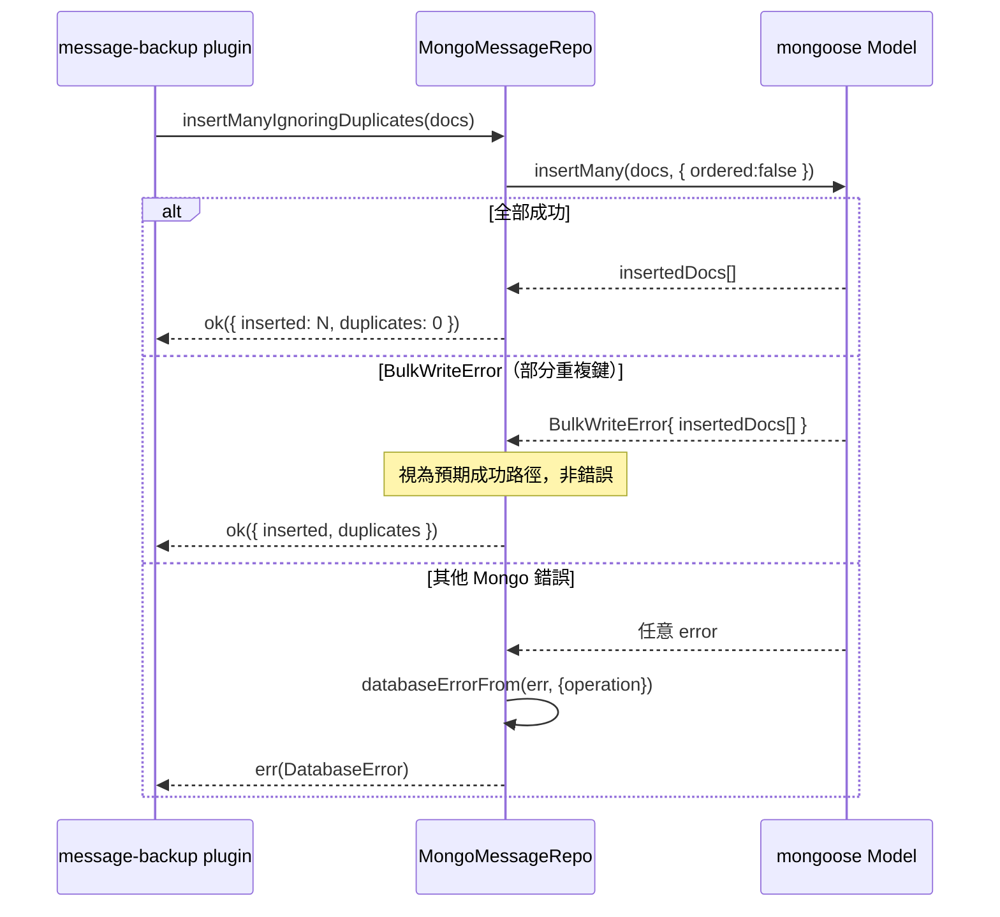

# C4 — Persistence 詳細設計

> 路徑：`src/persistence/`（`schemas/`、`repositories/`，共 ~1002 行 / 16 檔）
> 對應 HLD：§5 C4 ｜對應需求：REQ-B1

---

## 1. 元件職責與邊界

C4 以 **Repository pattern** 封裝 MongoDB 存取，取代重構前的 `db.models["X"]` 字串查表。每個資料領域一組「介面 + `Mongo<X>Repo` 實作」；消費端（plugin / handler）一律依賴介面，測試注入 in-memory fake。

**邊界規則**：

- `repositories/*.repo.ts` 只 import：對應 schema 的 doc 型別、`GuildConnection`（來自 `infra/mongo`）、`@core/ids`（僅 `message.repo`）、`core/result` 的 `Result`/`ok`/`err`、`core/errors` 的 `DatabaseError` 型別、同層 `error-translator` 的 `databaseErrorFrom`（全部七個 repo，G-2）。**不直接 import `mongoose`**。
- `error-translator.ts` 同層放置（G-2 自 `infra/mongo/` 搬遷），import `core/errors`；不 import mongoose。
- `schemas/*.schema.ts` import `mongoose`（`Schema`、`InferSchemaType`、`Types`）。
- `buildRepos` 刻意置於 `persistence/`（非 `core/ioc`），使 IoC 層不沾 persistence import。

---

## 2. 類別／介面詳細設計

### 2.1 共同形狀

七個 repo 形狀一致：`interface XRepo` + `class MongoXRepo implements XRepo`，後者唯一建構子參數為 `private readonly conn: GuildConnection`，透過 `conn.models.<Name>` 存取、讀取用 `.lean().exec()`。「不存在」一律以 `undefined` 表達（`noUncheckedIndexedAccess` 慣例），布林回傳值由 `matchedCount` / `deletedCount` 導出。

### 2.2 `Repos` bundle 與 `buildRepos`

```ts
interface Repos {
  readonly activity: ActivityRepo;
  readonly fetch: FetchRepo;
  readonly giveaway: GiveawayRepo;
  readonly message: MessageRepo;
  readonly reply: ReplyRepo;
  readonly todo: TodoRepo;
  readonly userApiSetting: UserApiSettingRepo;
}
const buildRepos: (conn: GuildConnection) => Repos; // 每個 Mongo*Repo new 一次
```

### 2.3 各 repository 介面

> 缺口 G-2 收斂後，七個 repo 的每個方法皆回 `Promise<Result<T, DatabaseError>>`，`T` 為下列簽章標示的原型別（含 not-found 的 `XDoc | undefined`、布林、`InsertResult` 等）。下列簽章為求精簡省略外層 `Result` 包裝；實際邊界以 `repositories/*.repo.ts` 為準。

```ts
interface ActivityRepo {
  listAll(): Promise<readonly ActivityDoc[]>;
  findByActivityId(id: string): Promise<ActivityDoc | undefined>;
  create(input: ActivityInput): Promise<ActivityDoc>;
  setParticipants(id: string, p: readonly string[]): Promise<boolean>;
  deleteByActivityId(id: string): Promise<boolean>;
}
interface GiveawayRepo {
  listAll(): Promise<readonly GiveawayDoc[]>;
  findByMessageId(id: string): Promise<GiveawayDoc | undefined>;
  create(input: GiveawayInput): Promise<GiveawayDoc>;
  deleteByMessageId(id: string): Promise<boolean>;
}
interface FetchRepo {           // msg-archive 備份游標
  listChannelIds(): Promise<readonly string[]>;
  findByChannelId(id: string): Promise<FetchDoc | undefined>;
  create(channel, channelID, lastMessageID): Promise<FetchDoc>;
  setLastMessageID(id, last): Promise<boolean>;
  deleteByChannelId(id): Promise<boolean>;
  upsertLastMessageID(channel, channelID, last): Promise<void>;
}
interface MessageRepo {         // 七個 repo 之一，全部回 Result<T, DatabaseError>（G-2）
  countAll(): Promise<number>;
  findRecentByChannel(channelId: ChannelId, limit: number): Promise<readonly MessageDoc[]>;
  findByMessageId(id: string): Promise<MessageDoc | undefined>;
  insertManyIgnoringDuplicates(docs: readonly MessageDoc[]): Promise<InsertResult>;
  findByTimestampRange(startMs, endMs): Promise<readonly MessageDoc[]>;
  findByChannelAndTimestampRange(channelId, startMs, endMs): Promise<readonly MessageDoc[]>;
  findExistingMessageIds(ids: readonly string[]): Promise<ReadonlySet<string>>;
}
interface ReplyRepo { findExactPair / findByInput / findById / create / deleteById }
interface TodoRepo  { listAll / findByContent / create / deleteByContent }
interface UserApiSettingRepo { findByUserId / listAll / create / update / deleteByUserId }
```

`InsertResult = { inserted: number; duplicates: number }`。

### 2.4 Schemas

每個 `*.schema.ts` 匯出 mongoose `Schema` + `type XDoc = InferSchemaType<typeof xSchema> & { readonly _id: Types.ObjectId }`。`schemas/index.ts` 為 registry：`SCHEMAS` const map、`SchemaName = keyof typeof SCHEMAS` union、`DocByName` 介面（name → doc type）。唯一性約束：`messageSchema.messageId`（unique）、`userApiSettingSchema.userId`（unique + index）。

---

## 3. 類別圖



---

## 4. 關鍵流程序列圖

`insertManyIgnoringDuplicates` 的重複鍵容忍：



---

## 5. 採用的 Design Pattern

| Pattern               | 位置                              | 理由                                     |
| --------------------- | --------------------------------- | ---------------------------------------- |
| Repository            | 7 組 `XRepo` + `MongoXRepo`       | 抽象資料存取，意圖命名方法，取代字串查表 |
| Factory               | `buildRepos(conn)`、`buildModels` | 依 guild 連線組裝 repo bundle            |
| Registry              | `schemas/index.ts` `SCHEMAS` map  | schema 集中註冊，型別由 `DocByName` 串接 |
| Anti-corruption layer | `databaseErrorFrom`（見 C5）      | mongoose 錯誤轉 `DatabaseError`          |

---

## 6. 獨立性與測試策略

- **介面優先**：每個 repo 為介面；消費端依賴介面，因此測試可注入 in-memory fake（純 `Map` 實作介面，不碰 Mongo）。
- **integration test**：以 `mongodb-memory-server` 起真實 Mongo，搭配 C5 的 `StaticConnectionManager` 包裝其 `Connection`，驗證 `Mongo*Repo` 真實行為（含 unique-index 競態——`StaticConnectionManager` 以阻塞式 `model.init()` 確保索引就緒）。
- **與其他元件解耦**：C4 只認 `GuildConnection` 介面，不認 `MongoConnectionManager` 具體類別；測試以任意 `Connection` 餵入即可。
- REQ-B1 驗收要求每個 repo 有 mongodb-memory-server integration test；REQ-G6 要求 `*.repo.ts` 補 unit test 達 core 門檻。

---

## 7. 錯誤處理與邊界契約

> 缺口 G-2 已收斂（DECIDED 方案 Y）。下列為收斂後的契約。

- **七個 repository 邊界統一回 `Result<T, DatabaseError>`**：每個 `MongoXRepo` 方法以 try/catch 包裹 mongoose 呼叫，mongoose 錯誤經 `databaseErrorFrom(err, { operation: 'MongoXRepo.<method>' })` 轉譯為 `DatabaseError` 後以 `err(...)` 回傳；成功路徑回 `ok(...)`。不再有「僅 message repo 包錯誤、其餘 raw propagate」的不一致。
- **查無資料為 `ok(undefined)`**：`findByX` 查無資料維持回 `undefined`，包成 `ok(undefined)`，**不是** `err`；只有 DB 查詢真的失敗才 `err`。
- **程式員錯誤走原生 `TypeError`**：`MongoMessageRepo` 對 `limit` 非正整數、無效 timestamp 區間刻意擲 `TypeError`——契約違反不視為 domain 失敗，**不包進 `Result`**。改造後的 repo 同時有 `err(DatabaseError)`（domain 失敗）與擲 `TypeError`（程式員錯誤）兩個出口。
- **重複鍵為預期成功路徑**：`insertManyIgnoringDuplicates` 把帶 `insertedDocs` 的 `BulkWriteError` 當成功處理，回 `ok({ inserted, duplicates })` 而非 `err`；僅其他 Mongo 錯誤回 `err`。
- **error-translator 落點**：mongoose 錯誤轉譯器 `databaseErrorFrom`（含私有 `classify`、`__classifyMongoErrorForTests` 測試 export）位於 `src/persistence/error-translator.ts`——置於 `persistence/` 而非 `infra/mongo/`，使七個 repo 無須反向 import `infra/mongo`（G-2）。該檔不 import mongoose，僅做字串形狀比對。

**前置條件**：呼叫端須保證 `MessageRepo.findRecentByChannel` 的 `limit` 為正整數、timestamp 區間 `start <= end`；違反即 `TypeError`。

**不變式**：repo 方法回傳的 doc 均為 `.lean()` 之 plain object（非 mongoose Document），呼叫端不得依賴 mongoose 實例方法。

### 與 HLD 的偏差

無偏差。HLD §5 C4 列出 7 個 repo（activity/fetch/giveaway/message/reply/todo/user-api-setting）與現況完全一致。HLD §7.2 稱「use case 邊界（repository）以 `Result` 傳遞」——缺口 G-2 收斂後此敘述與實作一致：七個 repository 邊界皆回 `Result<T, DatabaseError>`，先前「僅 message repo 擲 `DatabaseError`、其餘 raw propagate」的風格差異已消失。
