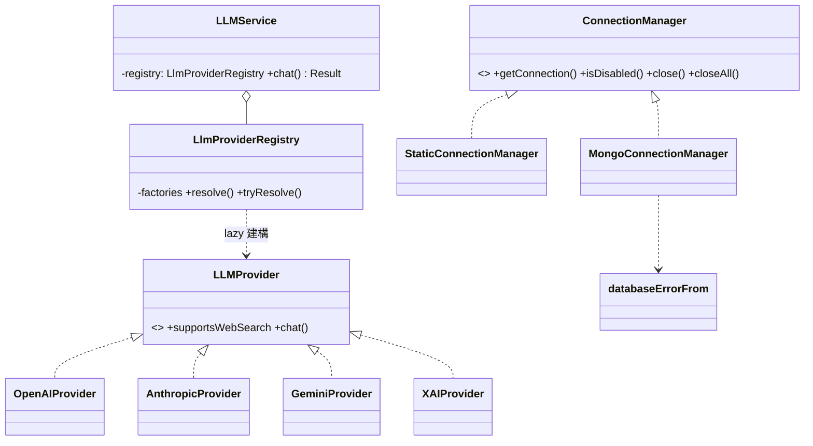
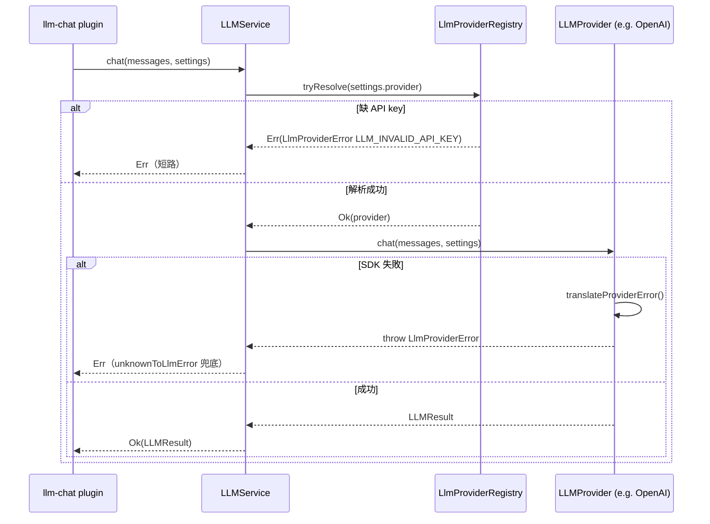

# C5 — Infra Adapters 詳細設計

> 路徑：`src/infra/`（`mongo/`、`llm/`、`discord/`，共 ~1547 行 / 19 檔）
> 對應 HLD：§5 C5 ｜對應需求：REQ-C3、REQ-D1

---

## 1. 元件職責與邊界

C5 把外部世界的 SDK 隔離在 typed adapter 之後。三個子模組：

| 子模組     | 職責                                                                              |
| ---------- | --------------------------------------------------------------------------------- |
| `mongo/`   | `ConnectionManager`：每 guild Mongo 連線生命週期；mongoose 錯誤轉 `DatabaseError` |
| `llm/`     | LLM Provider Strategy + Registry：四家 SDK 藏於 `LLMService` 抽象之後             |
| `discord/` | Discord 周邊 adapter（`channel-log`、`attachment-archive`）                       |

**邊界規則**：infra 僅丟 `DomainError` 子類，不丟 raw `Error`／`TypeError`（程式員錯誤除外）。`infra/mongo/connection-manager.ts` import `persistence/schemas` 以建構 model registry——這是真實存在、HLD 依賴圖未顯示的 `C5 → C4` 邊。`infra/llm` 不存取 `process.env`，API key 一律經 typed `Env` 傳入。

---

## 2. 類別／介面詳細設計

### 2.1 `mongo/` — ConnectionManager

```ts
type Models = { readonly [K in SchemaName]: Model<DocByName[K]> };
interface GuildConnection {
  readonly guildId: GuildId;
  readonly connection: Connection;
  readonly models: Models;
}
interface ConnectionManager {
  getConnection(guildId: GuildId): Promise<GuildConnection>;
  close(guildId: GuildId): Promise<void>;
  closeAll(): Promise<void>;
}
const buildGuildMongoUri: (baseUri: string, guildId: string) => string; // guildId 須 /^\d+$/
```

兩個實作：

- **`MongoConnectionManager`**（production，建構子 `(baseUri: string)`）：每 `GuildId` 快取 `GuildConnection`；另一 `pending` Map 以 in-flight promise **去重併發 `getConnection`**。`open()` 呼叫 `mongoose.createConnection(uri).asPromise()`，建 model registry，再 `Promise.allSettled` 跑各 `model.init()`。**index-init 失敗策略**：被拒的 `init()` 只寫一行 stderr，連線**保持開啟並服務**——「無法用的 bot 比缺索引更糟」。
- **`StaticConnectionManager`**（測試 adapter，建構子 `(underlying: Connection)`）：包裝外部管理的 mongoose `Connection`（mongodb-memory-server）；`getConnection` 以阻塞式 `Promise.all(model.init())` 確保索引競態在測試中收斂。

`persistence/error-translator.ts` 的 `databaseErrorFrom(raw, context): DatabaseError`：私有 `classify()` 以 duck-typing（`name`/`code`/`message`，非 `instanceof`，以撐過 mongoose 版本升級）映射至 `DatabaseErrorCode`（`DUPLICATE_KEY` code 11000、`VALIDATION`、`TIMEOUT`、`NETWORK`、`UNKNOWN`），各對應一個 i18n key。同檔的 `isTransient(error: DatabaseError): boolean` 依 `DATABASE_TIMEOUT` / `DATABASE_NETWORK` sub-code 判定失敗是否可重試（G-2 把此檔自 `infra/mongo/` 搬至 `persistence/`，D5 在新位置補 `isTransient`；`infra/mongo/connection-manager.ts` 由 `persistence/` import 之，`infra → persistence` 為合法依賴方向）。

**D5 retry / 降級分類**：`MongoConnectionManager` 與 `StaticConnectionManager` 內部各持 `disabled: Map<GuildId, DisabledGuildState>`。`getConnection` 對 transient 失敗（`isTransient` 為真）做**有上限的指數退避重試**（`RetryPolicy`：預設 3 次嘗試、初始 200ms、上限 2s，建構子可注入；`SleepFn` 亦可注入使測試零等待）。重試耗盡或 persistent 失敗時把該 `guildId` 標記 disabled，**自行生成 `traceId`**（原由 `BaseBot` boot 時 per-bot 產生），並寫一行 operator-facing stderr。對外暴露 `isDisabled(guildId): DisabledGuildState | undefined`（回傳 `traceId` 與分類後的 `DatabaseError`）；disabled 後續 `getConnection` 直接短路丟同一 `DatabaseError`，`close` / `closeAll` 清除 marker。`StaticConnectionManager` 另提供 `openOverride` 注入孔供測試以注入失敗驗證 retry / disable 行為。

**per-URI 共用範圍**：`MongoConnectionManager` 由組裝根（`BaseBot.sharedConnectionManagers`）以 base URI 為 key 共用。`disabledGuilds` 成為 `ConnectionManager` 內部狀態後，**共用同一 base URI 的兩個 bot 也共用同一 `disabled` set**——對其中一個 bot disabled 的 guild，對另一個亦 disabled。此為刻意設計：兩 bot 指向同一實體資料庫，失敗是同一個失敗。

### 2.2 `llm/` — Provider Strategy + Registry

```ts
interface LLMProvider {                          // Strategy 介面
  readonly supportsWebSearch: boolean;
  chat(messages: readonly LLMMessage[], settings: LLMSettings): Promise<LLMResult>;
}
class LLMService {
  constructor(private readonly registry: LlmProviderRegistry);
  chat(messages, settings): Promise<Result<LLMResult, AnyLlmProviderError>>;
}
type LlmProviderFactory = () => LLMProvider;
class LlmProviderRegistry {
  constructor(factories: Iterable<[LLMProviderName, LlmProviderFactory]>, apiKeys: LlmProviderApiKeys);
  resolve(name): LLMProvider;                              // 缺 key 擲 MissingApiKeyError
  tryResolve(name): Result<LLMProvider, AnyLlmProviderError>;  // 缺 key 回 Err
  has(name): boolean;  names(): LLMProviderName[];
}
const createDefaultRegistry: (env: Env) => LlmProviderRegistry;
```

四家 provider（`OpenAIProvider`、`AnthropicProvider`、`GeminiProvider`、`XAIProvider`）均 `implements LLMProvider`、`supportsWebSearch = true`，建構子 `(apiKey?, client?)`——`client` 注入孔供 nock contract test。`chat()` 以 try/catch 包裹 SDK 呼叫，經 `translateProviderError()` 重擲 `LlmProviderError`；空 HTTP-200 回應擲 `emptyResponseError()`。

`registry` 持有 **factory 而非實例**——缺某家 key 不會在啟動時崩潰，實例 lazy 建構並快取。`models-catalog.ts` 的 `ModelCatalog.list(provider)` 同步回傳（快取命中回 live list，未命中回 `[]` 並背景 fetch，TTL 15 分、上限 25）。`pricing.ts` 的 `calculateCost` / `formatUsageFooter` 估算 token 成本。

### 2.3 `discord/`

- `sendChannelLog(logger, channel, embed?, log?)`：以 `channel?.isSendable()` 守衛送訊息至 Discord channel，送失敗吞進 `logger.error`。
- `archiveDeletedAttachment(logger, guildId, attachment)`：以 axios streaming 下載已刪除附件，寫入 `./data/deleted_attachments/<guildId>/`。

---

## 3. 類別圖



---

## 4. 關鍵流程序列圖

`LLMService.chat` 的 Result 邊界：



---

## 5. 採用的 Design Pattern

| Pattern               | 位置                                                                  | 理由                                 |
| --------------------- | --------------------------------------------------------------------- | ------------------------------------ |
| Strategy              | `LLMProvider` + 四家 provider                                         | provider 可互換，`LLMService` 不分支 |
| Registry              | `LlmProviderRegistry`（name → factory）                               | 缺 key 不崩潰，實例 lazy 快取        |
| Adapter               | 四家 provider 適配 SDK；`StaticConnectionManager` 適配外部 Connection | 隔離外部 SDK                         |
| Factory               | `buildRepos`、`createDefaultRegistry`、`LlmProviderFactory` 閉包      | 延遲建構                             |
| Anti-corruption layer | `persistence/error-translator`、`llm/error-translator`                | vendor 錯誤轉 `DomainError` taxonomy |

---

## 6. 獨立性與測試策略

- **介面優先**：`ConnectionManager`、`LLMProvider` 皆介面化；消費端依賴介面。
- **SDK client 注入孔**：每個 LLM provider 建構子收 optional `client`，nock contract test（`test/contract/llm/*`）以自訂 `baseURL` 綁定，pin 住 provider 錯誤契約。
- **`StaticConnectionManager`**：把 mongodb-memory-server 的 `Connection` 包成同一 `ConnectionManager` 契約，使 C4 integration test 不需 production 連線管理器。
- **registry-of-factories**：測試可建空／部分 `LlmProviderRegistry`，不付 SDK 建構子成本。
- **test-only export**：`__classifyMongoErrorForTests`、llm error-translator 的 `__test`。
- `ModelCatalog` 為 exported class，測試自建實例，不碰 module-level holder。
- REQ-D1 驗收要求每家 provider 有 nock contract test。

---

## 7. 錯誤處理與邊界契約

- **`DatabaseError`**：`databaseErrorFrom` 產生，僅用於 `MongoMessageRepo`；帶 `code` / `messageKey` / `context.operation` / `cause`。
- **`LlmProviderError`**：`translateProviderError` / `emptyResponseError` 於各 provider 產生；`LlmProviderRegistry.tryResolve` 產 `LLM_INVALID_API_KEY`；`LLMService` 以 `unknownToLlmError` 兜底成 `LLM_UNKNOWN`。經 `Result.err` 由 `LLMService.chat` 回傳。
- **`MissingApiKeyError`**（純 `Error`，非 `DomainError`）：`LlmProviderRegistry.resolve`（非 try 版）對未設 key 擲出。
- **原生 `TypeError`**：程式員錯誤——`GeminiProvider` 空 messages、registry 未知 provider 名、`buildGuildMongoUri` 非法 guildId。

**邊界契約**：`LLMService.chat` 對「不支援 web search 的 provider 卻請求 web search」**擲出**（視為 UI/程式員 bug），非回 `Result`——呼叫端須在送出前確認 provider 能力。

### 與 HLD 的偏差（對應索引 D5）— 已收斂

**D5 — `ConnectionManager` retry / 降級分類**：HLD §5 C5 與 §7.4 稱 `ConnectionManager` 「區分 transient（可重試）與 persistent 失敗；持續失敗的 guild 進入 `disabledGuilds`」。此偏差已依 gaps.md 方案 A 收斂：

- 失敗分類由 `persistence/error-translator.ts` 的 `isTransient(error: DatabaseError)` 提供（`DATABASE_TIMEOUT` / `DATABASE_NETWORK` 為 transient，其餘為 persistent）。
- retry、`disabled` set、`isDisabled(guildId)` 全部移入 `ConnectionManager`（`MongoConnectionManager` 與 `StaticConnectionManager` 皆然）。`getConnection` 對 transient 失敗做有上限的指數退避重試（`RetryPolicy`），耗盡或 persistent 失敗則把 guild 標記 disabled 並自行生成 `traceId`。
- `BaseBot` 退化為查詢端：不再自持 `disabledGuilds` map，`connectOneGuild` 不再 catch-記錄並寫入自有 map；`BaseBot.disabledGuilds` 改為投影 `ConnectionManager.isDisabled` 的唯讀 getter（供 `requireGuildRepos` 沿用既有讀取形狀，C6 D5 再切換為直接讀 `ConnectionManager`）。

REQ-C3「transient vs persistent 降級」就 `ConnectionManager` 而言**已落地**：故意設壞測試 guild 的 Mongo URI 會經分類、（transient 時）重試、最終 disable 該 guild，handler 經 `requireGuildRepos` 回 `errors:db.guild_disabled` 附 `ConnectionManager` 生成的 `traceId`。
