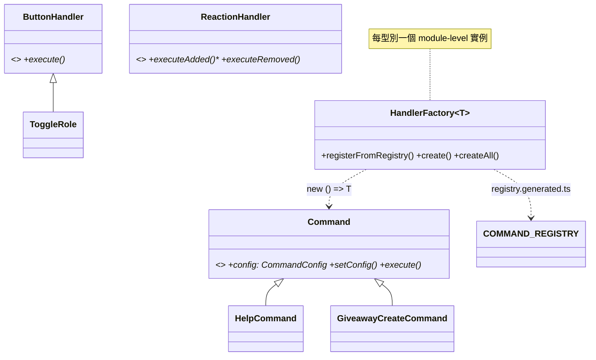
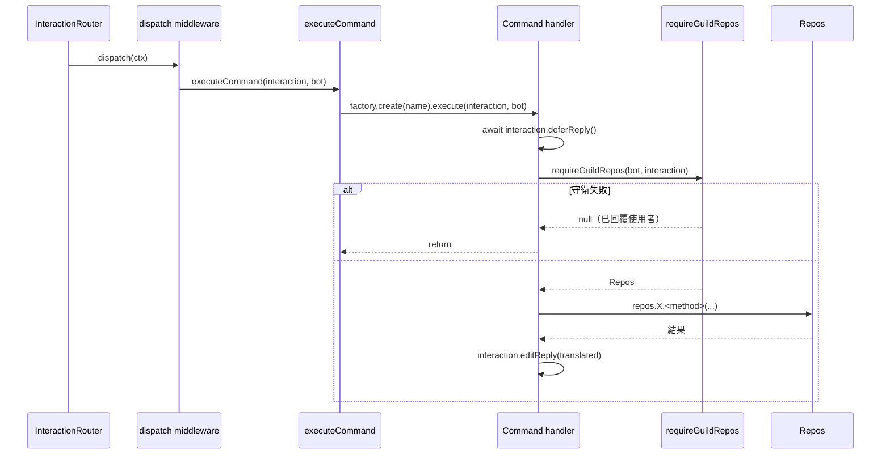

# C6 — Handlers 詳細設計

> 路徑：`src/handlers/`（`commands/`、`buttons/`、`modals/`、`select-menus/`、`reactions/`）
> 對應 HLD：§5 C6 ｜對應需求：REQ-C4、REQ-E1、REQ-F4、REQ-G7

---

## 1. 元件職責與邊界

C6 是 Discord interaction 的進入點。一個資料夾對應一個 slash command / button / modal / select-menu / reaction。handler 為 class-based，經 codegen（C9）註冊。

**檔案規模**：commands 40 個 handler 子目錄；buttons / modals / select-menus / reactions 各 1 個。

**邊界規則**：handler import `discord.js` interaction 型別、`@bot`（`BaseBot`，type-only）、handler-type alias（`@cmd` 等）、`@core/logger`、`@core/i18n`、`Repos`（type-only）。委派業務邏輯給 plugin 的 handler 會 import 該 plugin 的 `internal` barrel。

---

## 2. 類別／介面詳細設計

### 2.1 各 handler 型別的抽象基底

**無單一基底類別**。每個 handler 型別在其 `index.ts` 宣告自己的抽象基底：

```ts
abstract class Command {
  // src/handlers/commands/index.ts
  public config: CommandConfig; // 自描述 metadata（有狀態）
  constructor(); // 初始化 config = { name:'', description:'' }
  setConfig(config: CommandConfig): void;
  abstract execute(
    interaction: ChatInputCommandInteraction | ContextMenuCommandInteraction,
    bot: BaseBot,
  ): Promise<void>;
}
abstract class ButtonHandler {
  abstract execute(i: ButtonInteraction, bot: BaseBot): Promise<void>;
}
abstract class ModalHandler {
  abstract execute(i: ModalSubmitInteraction, bot: BaseBot): Promise<void>;
}
abstract class SSMHandler {
  abstract execute(i: StringSelectMenuInteraction, bot: BaseBot): Promise<void>;
}
abstract class ReactionHandler {
  abstract executeAdded(reaction, user, bot): Promise<void>;
  abstract executeRemoved(reaction, user, bot): Promise<void>;
}
```

`Command` 是最豐富的基底——**有狀態**，攜帶 `config: CommandConfig`（用於建 Discord command JSON）。子類於建構子 `super()` 後 `this.setConfig({...})`，再 `override execute(...)`。其餘型別無狀態。每個具體 handler 為 `export default class <snake_case 目錄名> extends <Base>`。

### 2.2 `HandlerFactory<T>`（泛型工廠）

```ts
class HandlerFactory<T> {
  // src/handlers/index.ts
  registerFromRegistry(registry: Readonly<Record<string, new () => T>>): void; // 重複鍵擲出
  create(name: string): T;
  getConstructor(name: string): new () => T;
  createAll(): T[];
}
```

每個型別的 `index.ts` 建一個 module-level `HandlerFactory<T>`、呼叫 `registerFromRegistry(<TYPE>_REGISTRY)`，並匯出 `register<Type>(bot)` / `execute<Type>(interaction, bot)` dispatcher。

### 2.3 `requireGuildRepos` helper（REQ-C4）

```ts
const requireGuildRepos: (
  bot: BaseBot,
  interaction: RepliableHandlerInteraction,
) => Promise<Repos | null>;
```

三道守衛，每道對使用者回覆並回 `null`：

1. 無 `interaction.guild?.id` → 回 `errors:command.guild_only`
2. guild 在 `bot.disabledGuilds` → 回 `errors:db.guild_disabled`（附 boot 時 `traceId`）
3. `bot.guildInfo[guildId]?.repos` undefined → 回 `errors:db.not_found`

否則回 `Repos`。回 `null`（非 `undefined`）使呼叫端用 `if (repos === null) return;`。私有 `replyOrEdit` 依 `deferred`/`replied` 選 `editReply` vs `reply({flags:Ephemeral})`，並**吞掉過期 interaction 的 Discord error code `10062`／`40060`**（記一行 `ops.router.replySkipped`）。

### 2.4 `replyTranslated`

```ts
const replyTranslated: (interaction, translator: Translator, key: string, params?) => Promise<void>;
```

translate-then-ephemeral-reply，dispatcher 用於 handler-not-found / not-initialised 等情況。

---

## 3. 類別圖



---

## 4. 關鍵流程序列圖

interaction → handler → plugin use case → repo：



---

## 5. 採用的 Design Pattern

| Pattern                   | 位置                         | 理由                                                                  |
| ------------------------- | ---------------------------- | --------------------------------------------------------------------- |
| Command                   | 每個 handler 為 command 物件 | 統一 `execute()`，dispatcher 多型呼叫                                 |
| Factory                   | `HandlerFactory<T>`          | 持有建構子、依名產生實例                                              |
| Codegen / static registry | `registry.generated.ts`      | 取代退場的 runtime `readdirSync + require()`，型別由 `satisfies` 強制 |
| Builder（小型）           | `Command.setConfig`          | command 自描述其 Discord metadata                                     |

---

## 6. 獨立性與測試策略

- handler 依賴 `Repos` **介面** bundle（經 `requireGuildRepos` 取得），不直接碰 Mongo——測試注入 in-memory fake repo。
- `test/fixtures/discord/` 提供 builder-pattern 替身：`client-fake.ts`、`guild-builder.ts`、`member-builder.ts`、`interaction-builder.ts`、`message-builder.ts`，使 handler 可在無 gateway 下被驅動（REQ-G5）。
- integration test：`test/integration/interaction-router/router-dispatch.int.test.ts` 驗證 dispatch 路徑。
- **現況**：未見逐 handler 的 unit test；handler 覆蓋主要靠 router integration test + Discord fixtures。

---

## 7. 錯誤處理與邊界契約

handler 邊界錯誤處理為**三層**：

1. **dispatcher**（`executeCommand` 等）：handler-not-found / config-missing → `replyTranslated(...'errors:command.not_found' / 'config_missing' / 'handler_not_initialised')`。
2. **handler 內**：`await interaction.deferReply()` 後 `try { ... } catch (error) { logError(...); await interaction.editReply({ content: translator.t('replies:<feature>.failed') }) }`。
3. **`BaseBot` interaction listener**：把每個 `*Listener` 包進 `.catch(...)` 作最後防線。

`register*` 註冊期包 try/catch 但**不擲出**——啟動具韌性。`requireGuildRepos`／`replyOrEdit` 額外吞過期 interaction code。

### 與 HLD 的偏差（對應索引 D9）

**D9 — handler 不直接 catch `DomainError`**：HLD §5 C6 設計約束寫「catch `DomainError` 後依 taxonomy 決定回覆 `messageKey`」。實際全 `src/handlers/` **零** `instanceof DomainError` / `.messageKey` 用例——handler 採「try/catch 包 `execute()` body + 記 log + `editReply` 一個**硬編碼** i18n key」（如 `replies:help.failed`）。`DomainError.messageKey` 的 taxonomy-driven 回覆機制實際由 **plugin 層消費**（`llm-chat/plugin.ts` 把 `llmErr.messageKey` + `messageParams` 餵 translator）。就 handler 而言此設計約束未落地——錯誤回覆是 per-handler 固定 key，非依錯誤 taxonomy 動態決定。
