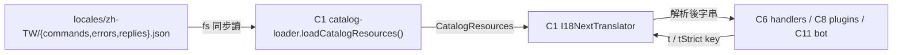
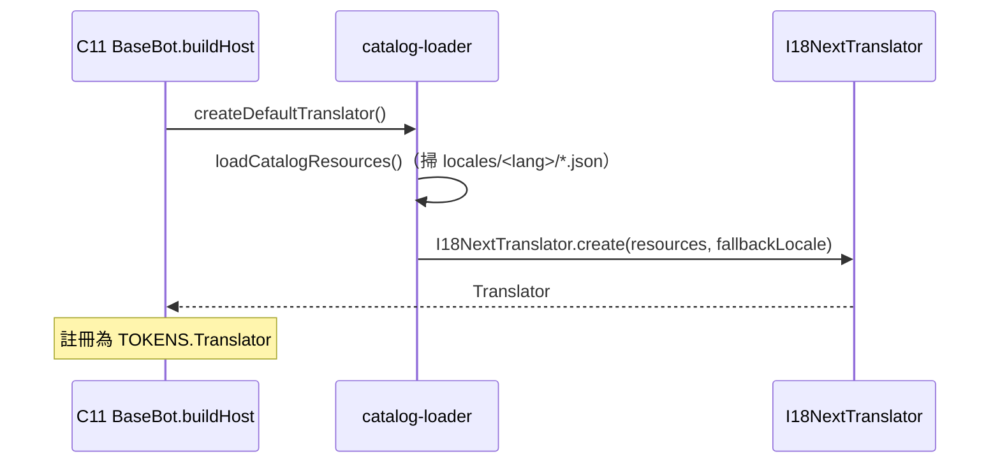

# C7 — i18n Catalog 詳細設計

> 路徑：`src/interface/locales/`
> 對應 HLD：§5 C7 ｜對應需求：REQ-E1

---

## 1. 元件職責與邊界

C7 是純資料元件——存放 user-facing 文案目錄。它不含程式邏輯；catalog 由 C1 的 `Translator`（`I18NextTranslator`，i18next-backed）載入。C7 的存在使 `src/handlers`／`src/plugins`／`src/bot` 達成「零 CJK literal」。

**邊界規則**：C7 無任何相依（純 JSON）。被 C1 的 `catalog-loader.ts` 以 `fs` 同步讀入。

---

## 2. 結構詳細設計

### 2.1 目錄與命名空間

```
src/interface/locales/
└── <lang>/
    ├── commands.json     # 指令名稱 / 描述（namespace: commands）
    ├── errors.json       # 錯誤訊息（namespace: errors）
    ├── replies.json      # 回覆文案（namespace: replies）
    └── README.md
```

每個語系三個命名空間檔。

### 2.2 Key 格式

呼叫端使用 `<namespace>:<feature>.<purpose>`，例如 `errors:command.not_found`、`replies:help.commands_header`。JSON 檔內因 namespace 即檔名，故 key 為 `<feature>.<purpose>`。

| 命名空間   | key 形狀                 | 範例                                                       |
| ---------- | ------------------------ | ---------------------------------------------------------- |
| `errors`   | `<error_class>.<reason>` | `llm.rate_limited`、`db.guild_disabled`                    |
| `replies`  | `<feature>.<outcome>`    | `help.failed`、`add_reply.added`、`base_bot.reboot_notice` |
| `commands` | `<command>.<field>`      | （目前為空 `{}`）                                          |

`errors.json` 的 key 對應 `DomainError.messageKey`，頂層群組：`command`、`validation`、`permission`、`ai`、`db`、`llm`、`configuration`，加扁平的 `unexpected`。

### 2.3 內插與複數

內插採 i18next 雙大括號 `{{placeholder}}`（如 `{{name}}`、`{{traceId}}`、`{{provider}}`）；複數採 `_one` / `_other` 後綴。

---

## 3. 元件關係圖



---

## 4. 載入流程序列圖



---

## 5. 採用的 Design Pattern

C7 為純資料，無 OO pattern。設計上的要點是**外部化文案**——把 user-facing 字串從程式碼抽離為資料，使翻譯、審查、scanner 強制（C10 的 CJK literal scanner）成為可能。Key 的 `<namespace>:<feature>.<purpose>` 命名規約本身即一種「命名 convention as contract」。

---

## 6. 獨立性與測試策略

- C7 與所有程式碼元件解耦——它只是 JSON，可被任何 `Translator` 實作載入。
- **catalog-completeness 測試**（`yarn test:i18n`，vitest project `i18n`）：若某 key 存在於一個語系卻缺於其他語系即 fail。
- C1 的 `Translator.listMissingKeys(reference)` 提供以某語系為基準的缺 key 報告，供測試斷言。
- `tStrict` 對缺 key 擲 `MissingTranslationError`，使測試可主動偵測未翻譯 key。

---

## 7. 錯誤處理與邊界契約

- C7 本身不處理錯誤；缺 key 的處理在 C1 `Translator`：`t()` 回退（回 key 本身或 fallback locale），`tStrict()` 擲 `MissingTranslationError`。
- **不變式**：`errors.json` 內每個 key 必須是某個 `DomainError.messageKey` 的合法目標；新增 `DomainError` code 時須同步補 catalog key，否則 catalog-completeness / `tStrict` 測試會攔下。

### 與 HLD 的偏差（對應索引 D7）

**D7 — 僅 `zh-TW` 一個語系，`commands.json` 為空**：

- HLD §5 C7 與 §7.1 描述 `<lang>/{commands,errors,replies}.json` 多語系結構，C1 `translator.ts` 也定義 `Locale = 'zh-TW' | 'en'`。實際磁碟上**只有 `zh-TW/`**——`en/` 不存在。多語系為設計就緒但資料未補。
- `commands.json` 目前是空物件 `{}`（依 README 待 PR 6-3 補 `name_localizations`）。指令名稱／選項描述目前仍是 handler 內的 CJK literal，以 `// i18n-ignore` 註記豁免。
- 因此 REQ-E1「`Translator` 統一 user-facing 文案」就 `errors`／`replies` 已落地，就 `commands` 命名空間**尚未落地**；catalog-completeness 測試因只有單一語系，目前實質上無跨語系比對對象。
