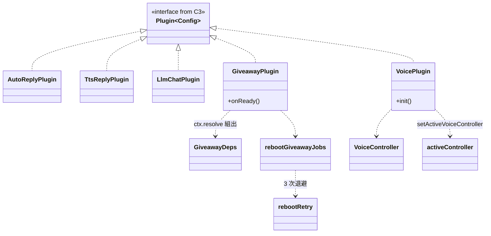
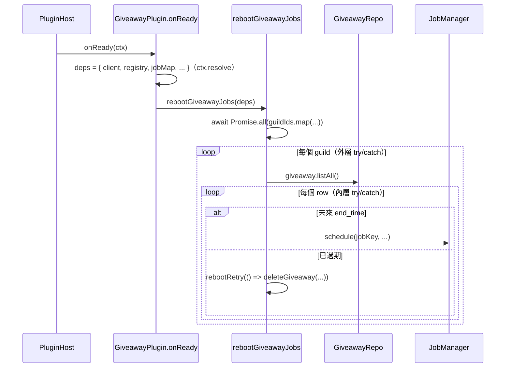

# C8 — Plugins 詳細設計

> 路徑：`src/plugins/`（8 個 plugin，共 ~2803 行）
> 對應 HLD：§5 C8 ｜對應需求：REQ-A6、REQ-B3、REQ-C5、REQ-G1、REQ-G3

---

## 1. 元件職責與邊界

C8 是自足的業務功能模組——**所有業務行為皆歸此元件**。每個 plugin 一個資料夾，符合 C3 的 `Plugin<Config>` 契約，業務 use case 內聚於此（不另立 domain／application 層，見 HLD §9.1）。

現存 **8 個 plugin**：`auto-reply`、`tts-reply`、`llm-chat`、`message-backup`、`giveaway`、`activity`、`guild-events`、`voice`。

**邊界規則**：plugin 經 `ctx.resolve(TOKENS.X)` 取依賴，永不碰 raw container；經 `contributes` 區塊（或 codegen registry）貢獻 handler。委派至 plugin 的 handler import 其 `internal/` barrel。

| Plugin         | 主要檔案                                                                                              | `internal/`         |
| -------------- | ----------------------------------------------------------------------------------------------------- | ------------------- |
| auto-reply     | `plugin.ts`                                                                                           | —                   |
| tts-reply      | `plugin.ts`、`tts-api.ts`                                                                             | —（`tts-api` 同層） |
| llm-chat       | `plugin.ts`、`internal/session-manager.ts`                                                            | `SessionManager`    |
| message-backup | `plugin.ts` + `internal/{backup-channel,backup-log,collect-channels,perform-backup,retry,save-batch}` | 6 模組              |
| giveaway       | `plugin.ts` + `internal/{deps-from-bot,giveaway,handlers}`                                            | 3 模組              |
| activity       | `plugin.ts` + `internal/{deps-from-bot,activity,handlers}`                                            | 3 模組              |
| guild-events   | `plugin.ts`                                                                                           | —                   |
| voice          | `plugin.ts` + `internal/{active-controller,voice-controller}`                                         | 2 模組              |

---

## 2. 類別／介面詳細設計

### 2.1 Plugin 定義形式

| Plugin         | 定義形式                                       | 生命週期 hook           | 事件訂閱                                              |
| -------------- | ---------------------------------------------- | ----------------------- | ----------------------------------------------------- |
| auto-reply     | `const AutoReplyPlugin: Plugin`（純物件）      | 無                      | `messageCreate`                                       |
| tts-reply      | `const TtsReplyPlugin: Plugin`（純物件）       | 無                      | `messageCreate`                                       |
| llm-chat       | `createLlmChatPlugin(config: { clientId })`    | `init`                  | `messageCreate`                                       |
| message-backup | `createMessageBackupPlugin({ backupServers })` | `onReady`、`onShutdown` | 無                                                    |
| giveaway       | `createGiveawayPlugin()`                       | `onReady`               | 無                                                    |
| activity       | `createActivityPlugin()`                       | `onReady`               | 無                                                    |
| guild-events   | `createGuildEventsPlugin(rawConfig)`           | 無                      | `messageUpdate`、`messageDelete`、`guildMemberUpdate` |
| voice          | `createVoicePlugin()`                          | `init`                  | 無                                                    |

全部 `scope='bot'`、`critical:false`、`version='1.0.0'`。**無任何 plugin 使用 `configSchema` 欄位、`dependencies`、`contributes`、`start` hook。** `guild-events` 雖在工廠內定義了 zod `ConfigSchema` 並 `.parse(rawConfig)`，但**不**指派給 `configSchema` 欄位（JSDoc 說明此舉避開 `.default()` 造成的 `ZodObject`/`ZodType` invariance 陷阱）。

### 2.2 reboot self-ownership（REQ-A6 / REQ-C5）

`giveaway` 與 `activity` 形狀相同。`onReady` 經 `ctx.resolve` 組出 typed deps bundle 並呼叫 `rebootGiveawayJobs(deps)` / `rebootActivityJobs(deps)`——取代重構前由組裝根驅動的 callback。

```ts
interface GiveawayDeps {
  // ActivityDeps 同形
  client: Client;
  registry: GuildRegistry;
  jobMap: Map<string, Job>;
  logger: Logger;
  clientId: string;
  translator: Translator | undefined;
}
```

reboot 迴圈：`await Promise.all(registry.listGuildIds().map(async guildId => { ... }))`——逐 guild task 有外層 try/catch（記 log + 送 debug channel），內層逐 row 有自己的 try/catch；過期 row 走 `rebootRetry`（3 次指數退避 250→500→1000ms），未來 row 走 `jobManager.schedule(...)`。`onReady` 本身另有頂層 try/catch。此設計滿足 REQ-C5「`await Promise.all` + 逐項 try/catch、不 fire-and-forget」。

### 2.3 `VoiceController`（REQ-G3）

```ts
class VoiceController {
  private connection: VoiceConnection | null;
  public recorder: VoiceRecorder;
  isRecording(): boolean;
  start(guildId, channelId, adapterCreator): void;
  stop(): void;
  save(guildId, durationMinutes, voiceStream: Writable): Promise<VoiceSaveResult>;
}
```

`VoicePlugin` 的 `init` 建 `VoiceController` 並 `setActiveVoiceController(...)`（module-holder pattern）；`BaseBot.run()` 於 `host.initAll()` 後讀 `getActiveVoiceController()` 並掛上 `bot.voice`。取代 audit-3.10 的 handler 端 `bot.voice = {...}` 跨層 mutation。`VoiceController` 不依賴 `fs`，由呼叫端供 `Writable` stream。

---

## 3. 類別圖



---

## 4. 關鍵流程序列圖

giveaway reboot self-ownership（REQ-A6 + REQ-C5）：



---

## 5. 採用的 Design Pattern

| Pattern                 | 位置                                                        | 理由                                                               |
| ----------------------- | ----------------------------------------------------------- | ------------------------------------------------------------------ |
| Factory                 | `create*Plugin()` 工廠（6 個 plugin）                       | 閉包封裝 config/狀態，每次產生獨立實例                             |
| Strategy                | llm-chat 消費 `LLMService` provider Strategy                | 切換 LLM provider 不改 plugin                                      |
| Repository（消費端）    | 全資料 plugin 經 `registry.getRepos(guildId)`               | 依賴 `Repos` 介面，可注入 fake                                     |
| Module-holder / ambient | voice `active-controller`、llm-chat `setActiveModelCatalog` | plugin 契約禁 container register，folder-private holder 為受控折衷 |
| Adapter / Bridge        | `deps-from-bot.ts`（giveaway/activity）                     | 把 legacy `BaseBot` 橋接成 typed deps                              |
| Retry / 指數退避        | `rebootRetry`、message-backup `retryFetch`                  | boot 期 transient Mongo 失敗不致 job 漏建                          |
| DTO / snapshot          | `VoiceSaveResult`、`TtsResult`、`ChannelBackupStats`        | 跨邊界傳結構化結果                                                 |

---

## 6. 獨立性與測試策略

- **工廠回傳獨立實例**：`create*Plugin()` 每次回新 `Plugin` 與獨立閉包狀態（`SessionManager`、`running` set、`loopHandle`），測試間互不污染。
- **typed deps bundle**：`GiveawayDeps`／`ActivityDeps`／`PluginRuntimeServices` 使測試注入 fake，不需真 `BaseBot`。`deps-from-bot.ts` 刻意獨立成檔，避免 strict 測試編譯透過 `src/plugins/giveaway` 傳遞性拉進 `BaseBot` 與其 `@cmd`/`@button` alias 鏈。
- **`GuildRegistry` 介面簡單**（`getRepos`/`getChannel`/`getRole`/`listGuildIds`），可用 inline object literal 滿足，便於注入 in-memory fake。
- **`__test` export**：`guild-events` 暴露 `safeSendEmbed` 供單元測試。
- **純 helper 獨立 export**：`rollDice`、`lookupReply`、`ttsApi`、`isRetryableError`、`giveawayJobKey`/`isGiveawayJobKey` 等可直接單元測試。

---

## 7. 錯誤處理與邊界契約

| Plugin            | 錯誤處理                                                                                                                                                  |
| ----------------- | --------------------------------------------------------------------------------------------------------------------------------------------------------- |
| auto-reply        | `safeLookup` 包 `ReplyRepo.findByInput`，catch + 記 log，回 `null` 使靜態行為續行                                                                         |
| tts-reply         | `ttsApi` 回 `TtsResult { attachment, error }`（Result-style），永不擲出                                                                                   |
| llm-chat          | `LLMService.chat` 回 `Result`；`handleChatError` 讀 `messageKey`/`messageParams` 餵 translator，編輯 placeholder，巢狀 try/catch 兜底 `channel.send`      |
| giveaway/activity | 分層：`onReady` 頂層 catch；reboot 外層逐 guild catch、內層逐 row catch；`rebootRetry` 3 次退避；handler body 全包 try/catch + `editReply` 翻譯後失敗訊息 |
| guild-events      | `safeSendEmbed` 吞 Discord 送訊息失敗（記結構化 log），使 audit-log side-effect 必執行                                                                    |
| message-backup    | `performBackup` try/catch/finally——catch 寫 `FATAL ERROR` log + `logError`，finally 必 `log.close()`；逐 channel 記 `stats.error` 不中止 guild loop       |

> **已知不一致**：`giveaway.ts`／`activity.ts` 的 `msgReact` 用 raw `console.error` 而非結構化 logger（應收斂）。

### 與 HLD 的偏差（對應索引 D1、D2、D3、D4）

- **D1 — guild-events 不訂閱 `guildCreate`**：HLD §5 C8 與 §9.4 稱 `guild-events` 訂閱 `guildCreate` 並經 guild-onboarding port 初始化新 guild。實際 `guild-events` 只訂閱 `messageUpdate`/`messageDelete`/`guildMemberUpdate`。`guildCreate` 邏輯仍是 legacy `src/events/guild_event.ts` 的 `detectGuildCreate(guild, bot)`——其 header 自述因需穿透 `BaseBot.connectOneGuild` + `commandHandlers`（plugin 層尚未以 port 暴露之）而未 plugin 化。**guild-onboarding port 不存在。**
- **D2 — `earthquake` plugin 不存在**：HLD §5 C8 列出 bot-scoped `earthquake` plugin。實際**無** `src/plugins/earthquake/`，地震速報仍是 `src/events/earthquake.ts` 的 free function `earthquake_warning(...)`，由 `nijika/index.ts` inline 接上 Express 路由（見 C11）。HLD §9.4 的「`earthquake.ts` 併入 earthquake plugin」未落地。
- **D3 — `src/events/` 仍存在**：3 檔（`earthquake.ts`、`guild_event.ts`、`index.ts`）。HLD §2.2 原則 5 與 §9.4 宣稱目標設計「無過渡層、`src/events/` 已消除」——現況尚未達成。
- **D4 — `src/utils/` 仍存在**：4 檔（`bot_cmd.ts`、`job_manager.ts`、`misc.ts`、`index.ts`）。giveaway/activity 的 internal 仍 import `JobManager`（`../../../utils/job_manager`）與 `misc`。CLAUDE.md 稱「`utils/` 僅 `logger.ts` strict」已過時——`utils/logger.ts` 已不存在（logging 已遷 `@core/logger`），但其餘 `utils/` 檔仍在使用中。
