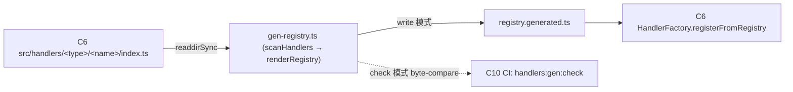
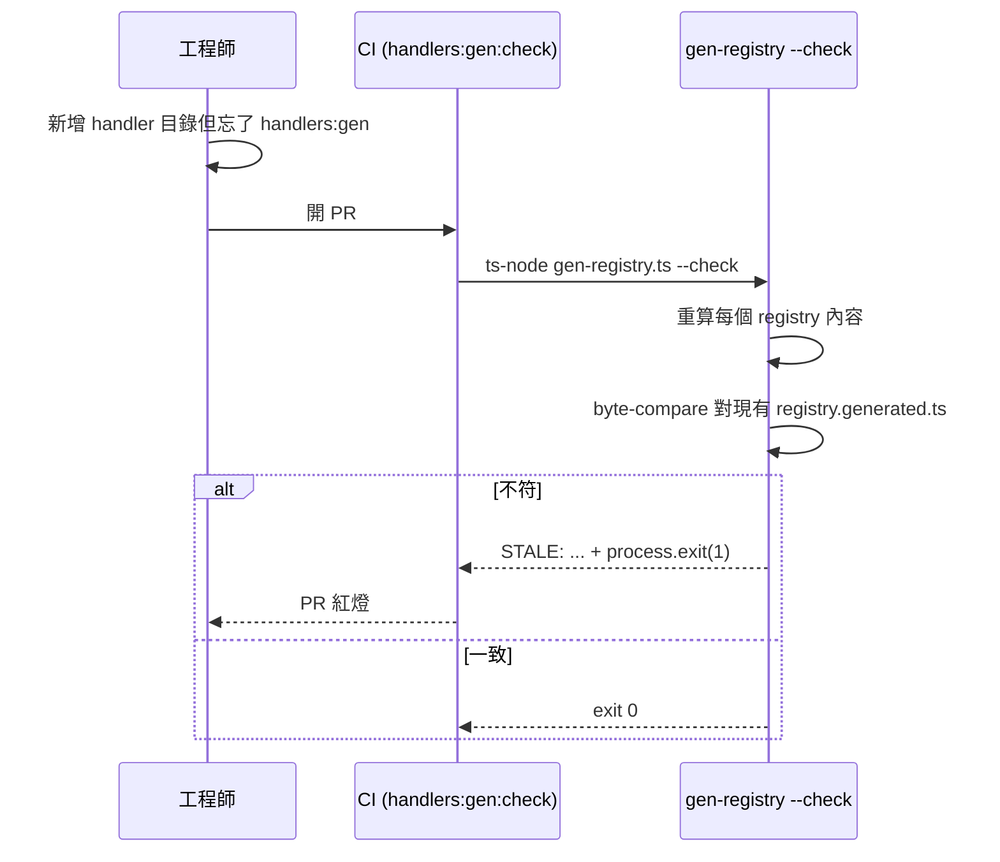

# C9 — Codegen & Scripts 詳細設計

> 路徑：`scripts/`（`gen-registry.ts`、`smoke.ts`）
> 對應 HLD：§5 C9 ｜對應需求：REQ-F4

---

## 1. 元件職責與邊界

C9 是建置期工具，不參與 runtime。核心是 `gen-registry.ts`——掃描 `src/handlers/<type>/` 產生 `registry.generated.ts`（顯式 import + typed registry 陣列），使 runtime 無需反射檔案系統。`scripts/` 另含 `smoke.ts`（C10 的 pre-deploy 探針，於 C10 詳述）。

**邊界規則**：`gen-registry.ts` 只相依 Node `fs`／`path`，**無任何專案 import**——它讀 C6 的目錄結構作為輸入，產出純文字檔。

---

## 2. 類別／介面詳細設計

### 2.1 `gen-registry.ts` 結構

```ts
interface RegistryTarget {
  dir: string; // handler 型別目錄
  typeImportPath: '.'; // 型別來自該型別的 index.ts
  typeName: string; // Command / ButtonHandler / ...
  exportName: string; // COMMAND_REGISTRY / BUTTON_REGISTRY / ...
}
interface HandlerEntry {
  name: string;
  importPath: string;
} // './<name>'

const TARGETS: RegistryTarget[]; // 5 個（每 handler 型別一個）
const scanHandlers: (absDir: string) => HandlerEntry[]; // 含 index.ts 的子目錄，ASCII 排序
const renderRegistry: (target, entries) => string;
const quoteKey: (name: string) => string; // 非合法 identifier 才加引號（為未來 kebab-case 準備）
```

`main()` 流程：

1. 解析 repo root 與 `--check` flag。
2. 對每個 `TARGET`：`scanHandlers` 以 `fs.readdirSync({ withFileTypes:true })` 取含 `index.ts` 的子目錄，建 `HandlerEntry`，**ASCII 排序**確保決定性。
3. `renderRegistry` 產出固定 AUTO-GENERATED header、`import type { <Type> } from '.'`、`import { default as Handler_N } from '<path>'`、`export const <EXPORT> = { ... } as const satisfies Readonly<Record<string, new () => <Type>>>`。
4. **write 模式**：`fs.writeFileSync` 寫入 registry 檔。**check 模式**（`--check`）：讀現有檔、與新算內容 byte-compare，不符印 `STALE:` 至 stderr、`staleCount++`；`staleCount > 0` 則 `process.exit(1)`。

**決定性契約**（檔頭記載）：ASCII 排序、LF 結尾、結尾換行、固定 header、單引號字串。`require.main === module` 守衛使測試 import 只拿到 exported helper（`quoteKey`）。

### 2.2 產出範例

```ts
// AUTO-GENERATED — do not edit. Source: scripts/gen-registry.ts
import type { ButtonHandler } from '.';
import { default as Handler_0 } from './toggle_role';
export const BUTTON_REGISTRY = {
  toggle_role: Handler_0,
} as const satisfies Readonly<Record<string, new () => ButtonHandler>>;
```

---

## 3. 元件關係圖



---

## 4. drift 偵測序列圖



---

## 5. 採用的 Design Pattern

| Pattern                   | 位置                          | 理由                                                                       |
| ------------------------- | ----------------------------- | -------------------------------------------------------------------------- |
| Code generation           | `gen-registry.ts`             | 取代退場的 runtime `readdirSync + require()`（audit C-5），改為靜態 import |
| Drift check（生成物校驗） | `--check` 模式 byte-compare   | CI gate，確保生成物與來源同步                                              |
| `satisfies` 型別約束      | 產出檔的 `as const satisfies` | 編譯期強制 registry 形狀                                                   |

---

## 6. 獨立性與測試策略

- `gen-registry.ts` 零專案相依，可完全孤立測試。
- `require.main === module` 守衛使 `test/unit/scripts/gen-registry.test.ts` 可 import 純函式（`quoteKey`）而不觸發 CLI。
- 決定性契約（ASCII 排序、固定格式）使測試可斷言確切輸出字串。

---

## 7. 錯誤處理與邊界契約

- write 模式失敗（fs 寫入錯誤）直接 propagate，CLI 退出非 0。
- check 模式對任一 stale registry 累積 `staleCount`，最終 `process.exit(1)`，並印 `STALE:` 含檔名至 stderr，使工程師可定位。
- **前置條件**：`src/handlers/<type>/<name>/` 子目錄必須含 `index.ts`（含 `export default` 的 handler class），否則該目錄不被掃入 registry。
- **不變式**：`registry.generated.ts` 為純生成物，禁止手改（檔頭明示、ESLint 以 `**/*.generated.ts` ignore，C10 的 `handlers:gen:check` 攔截 drift）。

### 與 HLD 的偏差

無偏差。HLD §5 C9 描述與現況一致。`smoke.ts` 雖也位於 `scripts/`，HLD 將其歸於 C10（pre-deploy 探針），本文件依此於 C10 詳述。
