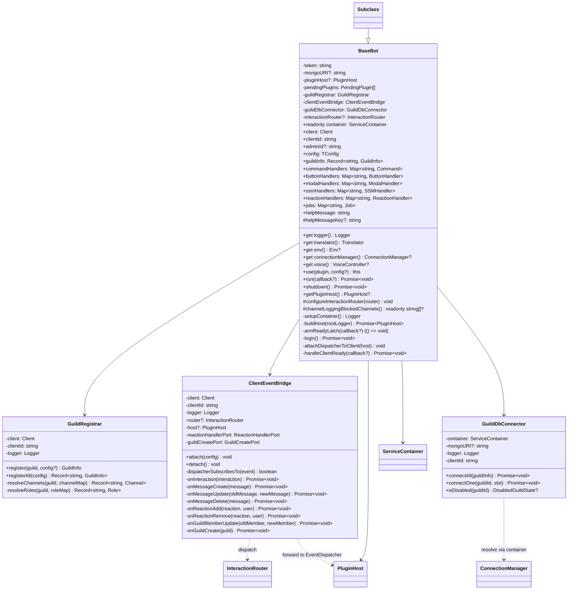
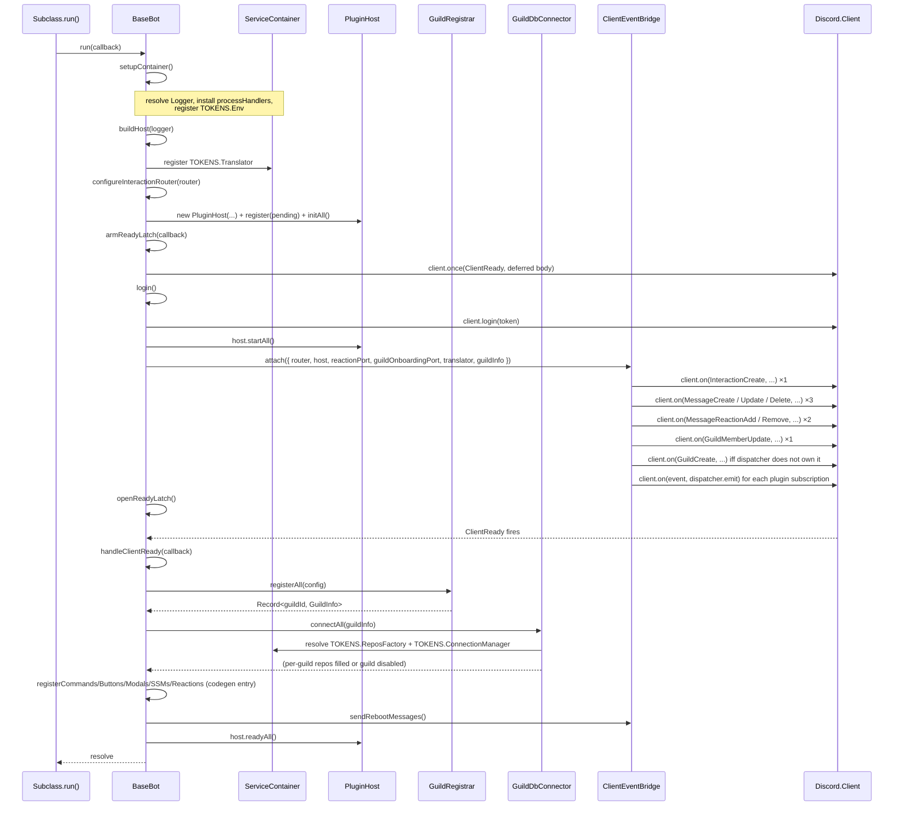

# R1 詳細設計 — 拆解 `BaseBot` 為 thin lifecycle owner

| 欄位     | 內容                                                                                          |
| -------- | --------------------------------------------------------------------------------------------- |
| 對應需求 | [docs/proposal.md §4](../proposal.md#4-r1--拆解-basebot)                                      |
| 對應概要 | [docs/high-level-design.md §4](../high-level-design.md#4-r1--拆解-basebot)                    |
| 文件層級 | Per-R 詳細設計（TypeScript 介面骨架 + class 骨架 + pattern 採用理由 + 測試驗收點）            |
| 共通契約 | 沿用 [docs/design.md §2](../design.md#2-共通設計原則)（命名、可測性、Result/Error、測試結構） |

---

## 1. 概要

`src/bot/index.ts` 目前約 1,018 行、25 個 public 成員，同時擔任生命週期編排、IoC 接線、Guild 註冊、per-guild Mongo 連線、reboot 訊息、8 個原生 `client.on` listener、reaction 抓取與 InteractionRouter 組裝；docstring 自稱「Thin lifecycle owner」與現況背離。R1 把這個肥大檔案拆成 **1 個薄殼 + 3 個 single-purpose collaborator**，使 BaseBot 回到生命週期編排的本職，其他職責由 `GuildRegistrar` / `ClientEventBridge` / `GuildDbConnector` 各自承擔。範圍依 [proposal §4.2](../proposal.md) 與 [HLD §4.3](../high-level-design.md)。

R1 是本輪重構的基礎；R2 的 `bot.voice` getter、R5 的 `localesDir` 注入、R6.4 命名一致化、R6.5 import 排序皆建立於 R1 收斂後的 BaseBot 形狀之上（見 §7）。

---

## 2. 設計目標

衍生自 proposal §4.5 + HLD §4.4：

- **BaseBot 退回真正的薄殼**：只負責生命週期編排（`use → run → shutdown`），不再直接觸碰 Discord raw event、不再直接解析 channel / role、不再直接觸發 Mongo 連線。任何讀過 `src/bot/index.ts` 的工程師應同意 docstring 不再說謊。
- **三個 collaborator 各自單一職責**：`GuildRegistrar` 只組裝 `GuildInfo`、`ClientEventBridge` 只做 Discord event 的 Adapter、`GuildDbConnector` 只管 per-guild Mongo 連線與失敗分類；三者互不認識、各自可獨立單元測試。
- **lifecycle 順序契約不變**：subclass（`Nijika` / `Konata` / `Tomori` / `MsgArchive`）對外 hook 順序（`use(plugin)`、`run()` 三段、`shutdown()` 反序）語意不動；breaking change 集中於欄位 / 取值方式（如 `bot.voice` 在 R2 轉 getter、handler map 在 R6.4 改複數）。
- **container 是 BaseBot 的單一狀態存放點**：R2 後的 `bot.voice`、R5 後的 translator 均由 container 解析；R1 把 `container` 確立為 BaseBot 唯一對外的 typed accessor 載體。
- **collaborator 不進 IoC**：collaborator 是 BaseBot 內部組成（Composition），不註冊新 token、不暴露給 plugin。理由：它們是 BaseBot 的私有 implementation detail，提升為 token 會擴大 IoC 表面卻無 plugin 端使用者。
- **新增 collaborator 可獨立單元測試**：對 Discord client / Mongo connection 等 SDK 邊界以 constructor 注入 seam（既有 `Logger` / `Clock` 注入模式），不依賴實機 Discord / Mongo。
- **既有 431 個測試 + 新增 contract 測試全綠**：R1 結束時 architecture-reviewer、reliability-reviewer Audit verdict 為 PASS（[proposal §10.4](../proposal.md)）。

---

## 3. 元件結構

### 3.1 類別圖



### 3.2 TypeScript 骨架

#### 3.2.1 `BaseBot`（精簡後）

```ts
// src/bot/index.ts
import type { Client } from 'discord.js';
import { createContainer, TOKENS, type ServiceContainer, type ReposFactory } from '@core/ioc';
import type { Logger } from '@core/logger';
import type { Translator } from '@core/i18n';
import type { Env } from '@core/config';
import type { ConnectionManager } from '../infra/mongo/connection-manager';
import type { Plugin, PluginHost, InteractionRouter } from '@core/plugin';
import type { VoiceController } from '../plugins/voice/internal';
import type { Job } from 'node-schedule';
import type { Command } from '@cmd';
import type { ButtonHandler } from '@button';
import type { ModalHandler } from '@modal';
import type { SSMHandler } from '@select-menu';
import type { ReactionHandler } from '@reaction';

import { GuildRegistrar } from './guild-registrar';
import { ClientEventBridge } from './client-event-bridge';
import { GuildDbConnector } from './guild-db-connector';

export interface Config {
  /* unchanged */
}
export interface GuildInfo {
  /* unchanged */
}

/**
 * Thin lifecycle owner. Wires the IoC container, stages plugins, then
 * delegates Guild registration, Discord event fan-out, and per-guild
 * Mongo lifecycle to the three injected collaborators.
 */
export abstract class BaseBot<TConfig extends Config = Config> {
  // ---- public state (handlers read these) ----
  public readonly container: ServiceContainer;
  public client: Client;
  public clientId: string;
  public adminId?: string;
  public config: TConfig;
  public guildInfo: Record<string, GuildInfo> = {};

  public commandHandlers: Map<string, Command> = new Map();
  public buttonHandlers: Map<string, ButtonHandler> = new Map();
  public modalHandlers: Map<string, ModalHandler> = new Map();
  public ssmHandlers: Map<string, SSMHandler> = new Map();
  public reactionHandlers: Map<string, ReactionHandler> = new Map();
  public jobs: Map<string, Job> = new Map();
  public helpMessage: string = '';

  // ---- protected hook fields ----
  /** Translator key for the bot's `/help` body; resolved in `run()`. */
  protected helpMessageKey?: string;

  // ---- private state ----
  private readonly token: string;
  private readonly mongoURI?: string;
  private readonly pendingPlugins: Array<{ plugin: Plugin<unknown>; config: unknown }> = [];
  private pluginHost?: PluginHost;
  /** Built inside `run()`. Subclass middleware appended via {@link configureInteractionRouter}. */
  protected interactionRouter?: InteractionRouter;

  // ---- collaborators (R1 composition) ----
  private readonly guildRegistrar: GuildRegistrar;
  private readonly clientEventBridge: ClientEventBridge;
  private readonly guildDbConnector: GuildDbConnector;

  public constructor(
    client: Client,
    token: string,
    mongoURI: string,
    clientId: string,
    config: TConfig,
  );

  // ---- typed accessors (handlers reach state through these) ----

  /** Live structured logger. Undefined only in the pre-`run()` window. */
  public get logger(): Logger | undefined;
  /** Live Translator. Undefined only in the pre-`run()` window. */
  public get translator(): Translator | undefined;
  /** Typed Env; undefined when env load failed at boot. */
  public get env(): Env | undefined;
  /** Shared ConnectionManager; undefined when bot was built without MONGO_URI. */
  public get connectionManager(): ConnectionManager | undefined;
  /** VoiceController populated by VoicePlugin (post R2). */
  public get voice(): VoiceController | undefined;

  // ---- lifecycle (public API to subclasses + tests) ----

  /** Stage a plugin for registration. Fluent for subclass constructors. */
  public use<Config>(plugin: Plugin<Config>, config?: Config): this;

  /** Expose host for tests / inspection. Undefined before `run()`. */
  public getPluginHost(): PluginHost | undefined;

  /**
   * Orchestrator. Phases (each phase is a private helper):
   *   1. setupContainer       — env, logger, process safety nets
   *   2. buildHost            — translator, router, host.initAll
   *   3. armReadyLatch        — register ClientReady listener (deferred)
   *   4. login                — Discord side
   *   5. host.startAll        — collect plugin subscriptions
   *   6. attachDispatcherToClient — wire EventDispatcher to client.on
   *   7. openReadyLatch       — unblock the deferred ClientReady body
   *   8. clientEventBridge.attach — install raw event listeners
   */
  public run(callback?: () => Promise<void>): Promise<void>;

  /** Reverse-order shutdown: pluginHost.shutdownAll → client.destroy → cm.closeAll. */
  public shutdown(): Promise<void>;

  // ---- subclass hooks ----

  /** Append middleware to the router before the terminal dispatch stage. */
  protected configureInteractionRouter(router: InteractionRouter): void;

  /** Channels whose slash-command activity is excluded from the debug feed. */
  protected channelLoggingBlockedChannels(): readonly string[] | undefined;

  // ---- private orchestration helpers ----

  private setupContainer(): Logger;
  private buildHost(rootLogger: Logger): Promise<PluginHost>;
  private armReadyLatch(callback?: () => Promise<void>): () => void;
  private login(): Promise<void>;
  private attachDispatcherToClient(host: PluginHost): void;
  private handleClientReady(callback?: () => Promise<void>): Promise<void>;
}
```

`BaseBot` 不再持有 `registerGuild` / `connectGuildDB` / `connectOneGuild` / `rebootMessage` / `messageCreateListener` 等公開方法——這些遷移到 collaborator（見 §3.2.2–§3.2.4）。`handleClientReady` 內改為調用 `this.guildRegistrar.registerAll(...)` + `this.guildDbConnector.connectAll(...)` + `this.clientEventBridge.sendRebootMessages(...)`（後者為 reboot 訊息搬遷後的新方法，歸屬 `ClientEventBridge`，因該動作本質是「對每個 guild 的 debug channel 送一條訊息」——屬 Discord I/O fan-out 範疇）。

> **R6.4 同步**：所有 Handler Map 在 R1 commit 內即套用複數命名（`buttonHandlers` 等）；`help_msg` → `helpMessage`。骨架已反映 R6.4 後形狀，避免 R1 後再二次大 diff。

#### 3.2.2 `GuildRegistrar`

```ts
// src/bot/guild-registrar.ts
import type { Client, Guild, Channel, Role } from 'discord.js';
import type { Logger } from '@core/logger';
import type { GuildInfo, Config } from './index';

/**
 * Builds `GuildInfo` records from the live Discord cache + the bot's
 * static config. Pure assembly: does not touch the Mongo connection,
 * does not call Discord I/O beyond reading the local cache.
 */
export class GuildRegistrar {
  private readonly client: Client;
  private readonly clientId: string;
  private readonly logger: Logger;

  public constructor(client: Client, clientId: string, logger: Logger);

  /**
   * Build `GuildInfo` for a single guild. Channels / roles missing
   * from the guild cache are simply omitted from the returned record
   * (never throws) — handlers null-check downstream.
   */
  public register(guild: Guild, config: Config): GuildInfo;

  /**
   * Iterate `client.guilds.cache` and produce the full keyed map.
   * Logs progress through `this.logger` (one line per guild).
   */
  public registerAll(config: Config): Record<string, GuildInfo>;

  private resolveChannels(
    guild: Guild,
    channelMap: Record<string, string> | undefined,
  ): Record<string, Channel>;

  private resolveRoles(
    guild: Guild,
    roleMap: Record<string, string> | undefined,
  ): Record<string, Role>;
}
```

#### 3.2.3 `ClientEventBridge`

```ts
// src/bot/client-event-bridge.ts
import type {
  Client,
  ClientEvents,
  Interaction,
  Message,
  PartialMessage,
  MessageReaction,
  PartialMessageReaction,
  User,
  PartialUser,
  GuildMember,
  PartialGuildMember,
  Guild,
} from 'discord.js';
import type { Logger } from '@core/logger';
import type { InteractionRouter, PluginHost, GuildOnboardingPort } from '@core/plugin';
import type { Translator } from '@core/i18n';
import type { GuildInfo } from './index';

/**
 * Port the bridge delegates reaction processing to. Lives on the bridge
 * (not on BaseBot) so reaction codegen no longer requires a BaseBot ref.
 */
export interface ReactionHandlerPort {
  handleAdded(reaction: MessageReaction, user: User): Promise<void>;
  handleRemoved(reaction: MessageReaction, user: User): Promise<void>;
}

export interface ClientEventBridgeConfig {
  readonly router: InteractionRouter;
  readonly host: PluginHost;
  readonly reactionPort: ReactionHandlerPort;
  readonly guildOnboardingPort: GuildOnboardingPort;
  readonly translator: Translator;
  /** Live view over `BaseBot.guildInfo`; read only — bridge does not mutate. */
  readonly guildInfo: () => Record<string, GuildInfo>;
}

/**
 * Adapter: converts Discord raw `client.on(...)` events into well-typed
 * domain calls (router dispatch, plugin EventDispatcher emit, reaction
 * port). Owns NO business state — every per-event branch is a thin
 * translation that hands work off elsewhere.
 *
 * Single attach point; detach reverses every listener registration so
 * tests can build a bridge per spec without leaking listeners.
 */
export class ClientEventBridge {
  private readonly client: Client;
  private readonly clientId: string;
  private readonly logger: Logger;
  private config?: ClientEventBridgeConfig;
  /** Captured (event, fn) pairs so {@link detach} can `off()` cleanly. */
  private readonly subscriptions: Array<{
    event: keyof ClientEvents;
    listener: (...args: never[]) => unknown;
  }> = [];

  public constructor(client: Client, clientId: string, logger: Logger);

  /**
   * Forwards EventDispatcher subscriptions onto `client.on` AND wires
   * the 8 raw listeners (interaction / 3× message / 2× reaction /
   * memberUpdate / guildCreate). Idempotent guard: throws
   * `ConfigurationError` if called twice without an intervening detach.
   */
  public attach(config: ClientEventBridgeConfig): void;

  /** Remove every listener installed by `attach`. Safe to call >once. */
  public detach(): void;

  /**
   * For each guild with a `debug` channel, send the localised reboot
   * notice. Best-effort fan-out — per-guild failures only log.
   * Lives here because it is Discord I/O fan-out over guildInfo —
   * structurally identical to the event handlers.
   */
  public sendRebootMessages(): Promise<void>;

  /** True when a plugin subscribes to `event` via the host dispatcher. */
  private dispatcherSubscribesTo(event: keyof ClientEvents): boolean;

  private onInteraction(interaction: Interaction): Promise<void>;
  private onMessageCreate(message: Message): Promise<void>;
  private onMessageUpdate(
    oldMsg: Message | PartialMessage,
    newMsg: Message | PartialMessage,
  ): Promise<void>;
  private onMessageDelete(message: Message | PartialMessage): Promise<void>;
  private onReactionAdd(
    r: MessageReaction | PartialMessageReaction,
    u: User | PartialUser,
  ): Promise<void>;
  private onReactionRemove(
    r: MessageReaction | PartialMessageReaction,
    u: User | PartialUser,
  ): Promise<void>;
  private onGuildMemberUpdate(
    oldM: GuildMember | PartialGuildMember,
    newM: GuildMember | PartialGuildMember,
  ): Promise<void>;
  private onGuildCreate(guild: Guild): Promise<void>;
}
```

> `interactionEventListener`、`messageReactionAddListener` 等舊 public 方法在 R1 後**不再存在於 BaseBot**。對既有測試呼叫端的 breaking change 在 R1 commit 內一併修正——測試改為「new ClientEventBridge → attach → fire fake event」直接驗 bridge，而非透過 BaseBot 公開方法。

#### 3.2.4 `GuildDbConnector`

```ts
// src/bot/guild-db-connector.ts
import type { ServiceContainer } from '@core/ioc';
import type { Logger } from '@core/logger';
import type { DisabledGuildState } from '../infra/mongo/connection-manager';
import type { GuildInfo } from './index';

/**
 * Owns per-guild Mongo connection lifecycle. The shared
 * `ConnectionManager` (resolved through the container) classifies and
 * retries failures; this class is a thin orchestration layer that
 * iterates `guildInfo`, hydrates each slot's `repos`, and surfaces
 * the manager's `traceId` on structured logs.
 */
export class GuildDbConnector {
  private readonly container: ServiceContainer;
  private readonly mongoURI: string | undefined;
  private readonly clientId: string;
  private readonly logger: Logger;

  public constructor(
    container: ServiceContainer,
    mongoURI: string | undefined,
    clientId: string,
    logger: Logger,
  );

  /**
   * Fan-out connect for every guild slot in `guildInfo`. Per-slot
   * failures are swallowed (already logged by {@link connectOne})
   * so a single bad guild does not abort the whole startup — the
   * ConnectionManager's disabled-set is the durable record.
   */
  public connectAll(guildInfo: Record<string, GuildInfo>): Promise<void>;

  /**
   * Connect (or reuse) ONE guild's repos bag. Resolves
   * `TOKENS.ReposFactory` per call so a future hot-reload of the
   * factory is observable.
   *
   * Re-throws the normalised `Error` after logging, so callers
   * (`GuildOnboardingPort`, `connectAll`'s per-slot wrapper) keep
   * the prior control-flow semantics.
   */
  public connectOne(guildId: string, slot: GuildInfo): Promise<void>;

  /** Pass-through to `ConnectionManager.isDisabled` for callers that have no container access. */
  public isDisabled(guildId: string): DisabledGuildState | undefined;
}
```

### 3.3 Design Pattern 採用

| Pattern                | 採用點                                                                                                                                     | 理由                                                                                                                                                                                                                                                                              |
| ---------------------- | ------------------------------------------------------------------------------------------------------------------------------------------ | --------------------------------------------------------------------------------------------------------------------------------------------------------------------------------------------------------------------------------------------------------------------------------- |
| **Composition**        | `BaseBot` 由 3 個 collaborator 組成（field-injected through constructor）                                                                  | 不採繼承的理由：subclass（Nijika / Konata / Tomori / MsgArchive）已用繼承表達 bot 個性差異；若以繼承再分 lifecycle / event 等子類，會出現多層繼承樹，違反「composition over inheritance」。Collaborator 作為私有 field 注入，subclass 只需擴張 hook，不會觸碰 collaborator 形狀。 |
| **Adapter**            | `ClientEventBridge` 把 `discord.js` 的 `Client.on(...)` raw event 轉成 router dispatch / EventDispatcher emit / `ReactionHandlerPort` call | Bridge 的本職是「外部不可控介面 → 內部 well-typed 介面」的翻譯；Adapter pattern 直接對應。把這個邊界明確以類別表達後，未來換 Discord SDK（或新增 mock client）只動 bridge，不動 router / host。                                                                                   |
| **Facade（沿用）**     | `BaseBot.run()` 對外仍是單一進入點                                                                                                         | 既有 API；R1 後內部呼叫鏈變更（呼叫 3 個 collaborator），但對 subclass 端 facade 不變。                                                                                                                                                                                           |
| **Strategy（沿用）**   | `InteractionRouter` middleware chain、`LLMProvider`                                                                                        | 既有；R1 不動。                                                                                                                                                                                                                                                                   |
| **Repository（沿用）** | `Repos` / per-guild connection                                                                                                             | 既有；R1 不動。                                                                                                                                                                                                                                                                   |

#### 刻意不採用的 pattern

- **Mediator**：不為三個 collaborator 引入中介物件。BaseBot 自己即扮演編排者；再加一層 Mediator 反而把直接呼叫拆成事件遞送，徒增 indirection。
- **Event Bus**：不引入 in-process pub-sub bus 取代 `client.on` 直接 wiring。EventDispatcher（plugin 用）已是 bus 性質；再為 BaseBot ↔ collaborator 加一層會出現「事件路徑兩條」，違反「DI 是唯一接線管道」原則。
- **Service Locator**：collaborator 不持 container reference 作為 locator（`GuildDbConnector` 取得 container 只是為了 resolve `ReposFactory` / `ConnectionManager`——這條依賴是該類別的本職，並非 locator 反 pattern）。

---

## 4. 介面契約

### 4.1 `BaseBot.run(callback?)`

| 屬性     | 規格                                                                                                                                                                                  |
| -------- | ------------------------------------------------------------------------------------------------------------------------------------------------------------------------------------- |
| 前置條件 | constructor 已完成；至少呼叫過 0 次 `use(...)`（允許無 plugin 的 minimal bot）                                                                                                        |
| 後置條件 | `container`、`logger`、`translator`、`pluginHost`、`interactionRouter` 全部就緒；`client` 已 login；所有 raw listener 已安裝；ClientReady 後 `host.readyAll()` 已執行                 |
| 不可為   | 不可重複呼叫（idempotency 不保證）；不可在 `await client.login` 之前呼叫 `host.startAll()`（會破壞 plugin 對「online client」的假設）                                                 |
| 失敗語意 | login 失敗（R6.2）→ reject、`run()` 中止；plugin init / start 對 `critical: true` plugin 失敗 → `CriticalPluginFailureError` 從 `host.initAll` / `host.startAll` 拋出，`run()` reject |

### 4.2 `BaseBot.shutdown()`

| 屬性     | 規格                                                                                                  |
| -------- | ----------------------------------------------------------------------------------------------------- |
| 前置條件 | 無；可在 `run()` 任一階段失敗後呼叫                                                                   |
| 後置條件 | `pluginHost.shutdownAll()` 已呼叫 → `client.destroy()` 已呼叫 → `ConnectionManager.closeAll()` 已呼叫 |
| 不可為   | 不可在收到 plugin shutdown 例外時中止——三步皆 best-effort，例外只 log                                 |
| 順序契約 | 反序：plugin → discord → mongo。改順序會讓 plugin 失去寫入 final state 的機會                         |

### 4.3 `BaseBot.use(plugin, config?)`

| 屬性     | 規格                                                                                           |
| -------- | ---------------------------------------------------------------------------------------------- |
| 前置條件 | 在 `run()` 之前任意時點呼叫                                                                    |
| 後置條件 | plugin entry 進入 `pendingPlugins` 陣列，`run()` 階段 flush 進 host                            |
| 不可為   | 不可在 `run()` 開始後呼叫（pendingPlugins 已 flush；本方法不檢查時序，違反者 plugin 永不啟用） |
| 副作用   | 不註冊任何 IoC token、不接觸 host                                                              |

### 4.4 `GuildRegistrar.register(guild, config)`

| 屬性     | 規格                                                                                                                |
| -------- | ------------------------------------------------------------------------------------------------------------------- |
| 前置條件 | `client.guilds.cache` 已被 Discord ready event 填充                                                                 |
| 後置條件 | 回傳完整 `GuildInfo`；config 缺失的 channel / role 鍵在輸出 record 中為 `undefined`，不丟出例外                     |
| 不可為   | 不開 Mongo 連線、不送 Discord 訊息、不 mutate 傳入的 `Guild` 或 `config` 物件                                       |
| 失敗語意 | 內部 try/catch 包住整個 register loop——`bot_name` 解析、cache 讀取等屬性意外時 log 後回傳「best-effort」`GuildInfo` |

### 4.5 `GuildRegistrar.registerAll(config)`

| 屬性     | 規格                                                               |
| -------- | ------------------------------------------------------------------ |
| 前置條件 | 同 `register`                                                      |
| 後置條件 | 回傳 `Record<guildId, GuildInfo>`，每個 guild 各呼一次 `register`  |
| 不可為   | 不對 caller 的 `guildInfo` 物件做 in-place mutation——回傳新 record |

### 4.6 `ClientEventBridge.attach(config)`

| 屬性     | 規格                                                                                                                                    |
| -------- | --------------------------------------------------------------------------------------------------------------------------------------- |
| 前置條件 | `host.startAll()` 已 resolve（EventDispatcher subscription 列表已穩定）；`router` 已建好；`reactionPort` / `guildOnboardingPort` 已備妥 |
| 後置條件 | 8 條 raw listener + N 條 EventDispatcher forward listener 全數 `client.on`；`subscriptions` 陣列填滿 (event, fn) 配對                   |
| 不可為   | 不可重複呼叫；不可在 `host.startAll()` 之前呼叫（plugin start hook 還沒結束就接到事件 → 違反 host 契約）                                |
| 失敗語意 | 重複 attach 拋 `ConfigurationError` with code `'EVENT_BRIDGE_ALREADY_ATTACHED'`                                                         |

### 4.7 `ClientEventBridge.detach()`

| 屬性     | 規格                                                                 |
| -------- | -------------------------------------------------------------------- |
| 前置條件 | 無                                                                   |
| 後置條件 | 所有 `subscriptions` 內 listener 從 `client.off(...)` 移除；陣列清空 |
| 不可為   | 不可丟例外——測試端可能重複呼叫                                       |

### 4.8 `ClientEventBridge.sendRebootMessages()`

| 屬性     | 規格                                                                                        |
| -------- | ------------------------------------------------------------------------------------------- |
| 前置條件 | translator + guildInfo 已備妥（caller 在 ClientReady 後呼叫）                               |
| 後置條件 | 對每個 `guildInfo[gid].channels?.debug` 為 sendable 的 channel 送一條 reboot 訊息；其餘略過 |
| 不可為   | 不可因為某 guild 送失敗就中止——每 guild try/catch 包住                                      |
| 失敗語意 | 每 guild 失敗只 log；總 promise 永遠 resolve                                                |

### 4.9 `GuildDbConnector.connectAll(guildInfo)`

| 屬性     | 規格                                                                                                           |
| -------- | -------------------------------------------------------------------------------------------------------------- |
| 前置條件 | `container` 已註冊 `TOKENS.ConnectionManager` 與 `TOKENS.ReposFactory`；`guildInfo` 已被 `GuildRegistrar` 填充 |
| 後置條件 | 每個 guild slot 的 `.repos` 已就位（或 ConnectionManager 已把該 guild 標記 disabled）                          |
| 不可為   | 不可因單一 guild 失敗中止全 fan-out；不可 mutate 不屬於自己的欄位（只寫 `slot.repos`）                         |
| 失敗語意 | 整體 promise 永 resolve；失敗 guild 由 `connectOne` log + ConnectionManager 標記 disabled                      |

### 4.10 `GuildDbConnector.connectOne(guildId, slot)`

| 屬性     | 規格                                                                                                     |
| -------- | -------------------------------------------------------------------------------------------------------- |
| 前置條件 | 同 `connectAll`                                                                                          |
| 後置條件 | `slot.repos` 已賦值                                                                                      |
| 不可為   | 不可建立非單一 mutation（避免「半連好」狀態）；不可吞錯誤——必須 log + re-throw normalised `Error`        |
| 失敗語意 | re-throw 已 normalised 的 `Error`（caller 是 `connectAll` 或 `GuildOnboardingPort`，這兩者各自決定後續） |

---

## 5. 元件互動

### 5.1 `BaseBot.run()` happy path



### 5.2 異常路徑（單一 guild Mongo 連線失敗）

```mermaid
sequenceDiagram
    participant BB as BaseBot
    participant GDB as GuildDbConnector
    participant CM as ConnectionManager
    participant L as Logger

    BB->>GDB: connectAll(guildInfo)
    GDB->>CM: getConnection(guildA) -- transient timeout
    CM->>CM: retry × N, classify as DATABASE_TIMEOUT
    CM->>CM: mark guildA disabled with traceId T
    CM-->>GDB: throw DatabaseError(T)
    GDB->>L: logSystem(connectFailed(guildA, T))
    GDB-->>GDB: per-guild catch swallows; fan-out continues
    GDB->>CM: getConnection(guildB) -- ok
    GDB-->>BB: resolve (guildB repos hydrated; guildA stays disabled)
```

---

## 6. 測試設計

### 6.1 測試驗收點

#### `BaseBot`（薄殼編排）

1. `run()` 依序呼叫 `setupContainer → buildHost → armReadyLatch → login → host.startAll → clientEventBridge.attach → openReadyLatch` —— spy 各 collaborator 方法，斷言 call order。
2. `run()` 在 `host.startAll()` resolve 之前**不可**呼叫 `clientEventBridge.attach`。
3. `shutdown()` 反序呼叫：`pluginHost.shutdownAll` → `client.destroy` → `ConnectionManager.closeAll`，任一步丟例外不中止後續。
4. `use(pluginA).use(pluginB)` fluent → `pendingPlugins.length === 2`；`run()` 內 flush 進 host。
5. `bot.voice` 在 R2 前以 `getActiveVoiceController()` 取值；R2 後以 `container.tryResolve(TOKENS.VoiceController)`（R1 階段測試僅驗 getter 存在 + 不會因未註冊而 throw）。
6. `bot.connectionManager` 在 `mongoURI === undefined` 時 → `tryResolve` 因 factory throw 而回 undefined（不可中止 bot 啟動）。
7. `configureInteractionRouter` 預設為 no-op；subclass override 後 middleware 出現在 router chain 第一個位置。
8. Pre-`run()` window：直接 `interactionEventListener`-equivalent 呼叫（透過 bridge）時，bridge config 為 undefined → 觸發 minimal fallback reply（保留既有「pre-run defensive」行為）。

#### `GuildRegistrar`

1. `register(guild, config)` 對完整 config → `channels` / `roles` 每鍵都填入對應物件。
2. `register(guild, config)` config 缺 channel id（`config.channels = { logs: 'nonexistent' }`）→ 回傳 `GuildInfo`，`channels.logs === undefined`，不丟例外。
3. `register(guild, config = {})` → `channels === {}`、`roles === {}`，不丟例外。
4. `register` 對 `client.channels.cache.get(id)` 回 undefined 時 → 該 key 不出現在 `channels` record。
5. `registerAll(config)` 對 3 個 guild 的 cache → 回傳 3 鍵 record，每鍵呼叫 `register` 一次。
6. `registerAll` 中其中一個 guild `register` 內部丟例外 → 該 guild log 後略過，其他 guild 仍正常 register（fan-out 不中止）。
7. `register` 不呼叫任何 `client.guilds.fetch` / `Mongo` / `send` API（用 spy 驗證）。

#### `ClientEventBridge`

1. `attach(config)` 後 `client.listenerCount(InteractionCreate) === 1`，且該 listener 觸發後呼叫 `router.dispatch(ctx)`。
2. `attach` 被呼叫兩次（未 detach）→ 拋 `ConfigurationError({ code: 'EVENT_BRIDGE_ALREADY_ATTACHED' })`。
3. `detach()` 後 `client.listenerCount(event) === 0`（對 attach 時加的每個 event）。
4. `onReactionAdd` 對 partial reaction → 呼叫 `reaction.fetch()` 一次後送 `reactionPort.handleAdded`；bot user 的 reaction 不轉發（spy `reactionPort` 沒被呼叫）。
5. `onGuildCreate` 在 `dispatcherSubscribesTo(GuildCreate) === true` 時 → 跳過呼叫 `guildOnboardingPort.onboardGuild`（plugin 已 own）；false 時 → 呼叫 port 一次。
6. EventDispatcher 訂閱的 `MessageDelete` → bridge 安裝對應 `client.on(MessageDelete, dispatcher.emit)`；emit 內部丟例外時不影響其他 listener（fire-and-forget）。
7. `onInteraction` dispatch 內部丟例外 → 走 fallback reply 路徑（既有 trace-id-attached error reply 行為）；interaction 已 deferred/replied 走 followUp，否則 reply。
8. `sendRebootMessages` 對 3 個 guild、其中 1 個 debug channel 為 undefined、1 個 throw → 第三個仍送出；總 promise 永 resolve。

#### `GuildDbConnector`

1. `connectOne(guildId, slot)` happy → `slot.repos` 賦值；`reposFactory` 呼叫一次。
2. `connectOne` 在 `reposFactory` throw 時 → log 含 ConnectionManager 提供的 `traceId`，然後 re-throw normalised `Error`。
3. `connectOne` 在 `reposFactory` throw 非 `Error` 物件（例如 string）→ 仍 normalise 為 `new Error(...)` 後 re-throw。
4. `connectAll(guildInfo)` 對 3 guild、其中 1 個 `connectOne` throw → 其他 2 個仍正常 resolve；總 promise resolve。
5. `connectAll` 在 `mongoURI === undefined` 時 → 直接 log + return，不呼叫 reposFactory。
6. `isDisabled(guildId)` pass-through 到 `ConnectionManager.isDisabled`；container 未綁定 ConnectionManager 時回 undefined。

### 6.2 Fixture / Mock 策略

| 相依                  | 測試替身                                                                                         | 理由                                                                |
| --------------------- | ------------------------------------------------------------------------------------------------ | ------------------------------------------------------------------- |
| `Logger`              | `FakeLogger`（既有 in-memory recorder）                                                          | 既有 fixture；可斷言 log line 內容                                  |
| `Translator`          | identity translator（既有 test helper）                                                          | 不依賴 i18next init                                                 |
| `Clock`               | `FakeClock`（既有）                                                                              | 既有                                                                |
| `ServiceContainer`    | 真實 `createContainer()`                                                                         | 容器本身輕量，mock 反而會掩蓋 wire-up bug                           |
| `Discord Client`      | minimal fake（`EventEmitter` + `guilds.cache` Map）；spies on `login` / `destroy` / `on` / `off` | 不引入 discord.js 完整 client；只暴露 bridge / registrar 觸碰的 API |
| `PluginHost`          | 真實 `PluginHost`，注入 fake container + identity translator                                     | PluginHost 已有 self-test；R1 對 host 是純消費者                    |
| `InteractionRouter`   | 真實實例 + identity middleware                                                                   | router 本身已測；bridge 測試需要驗 dispatch 觸發即可                |
| `ReactionHandlerPort` | mock（vi.fn × 2）                                                                                | 測試 bridge 對 port 的呼叫契約即可                                  |
| `GuildOnboardingPort` | mock（vi.fn `onboardGuild`）                                                                     | 同上                                                                |
| `ConnectionManager`   | fake 實作 `getConnection` / `isDisabled` / `closeAll`                                            | 不依賴 mongoose；驗 connector 對 manager 的呼叫契約                 |
| `ReposFactory`        | `vi.fn` 回 stub `Repos`                                                                          | 同上                                                                |

### 6.3 整合面

| 檔案                                                                      | 涵蓋                                                                                                                                                   |
| ------------------------------------------------------------------------- | ------------------------------------------------------------------------------------------------------------------------------------------------------ |
| `test/integration/interaction-router/router-dispatch.int.test.ts`（既有） | 既有整合 baseline。R1 後該 spec 改為「new BaseBot → run() with stub Discord client → fire fake interaction → 驗 router middleware chain」。            |
| `test/integration/bot/run-orchestration.int.test.ts`（新）                | 涵蓋 `run()` 的 8 個 phase 呼叫順序；mock 三個 collaborator，斷言 call sequence；驗 R1 拆解後 lifecycle 不變。                                         |
| `test/integration/bot/event-bridge.int.test.ts`（新）                     | 涵蓋 ClientEventBridge 的 8 條 raw listener + EventDispatcher forward 端到端：fire fake interaction / message / reaction → 驗 dispatch / port 被呼叫。 |
| `test/unit/bot/guild-registrar.test.ts`（新）                             | 涵蓋 §6.1 GuildRegistrar 七個案例。                                                                                                                    |
| `test/unit/bot/client-event-bridge.test.ts`（新）                         | 涵蓋 §6.1 ClientEventBridge 八個案例（單元層級；router / host 用 spy 替代）。                                                                          |
| `test/unit/bot/guild-db-connector.test.ts`（新）                          | 涵蓋 §6.1 GuildDbConnector 六個案例。                                                                                                                  |

`proposal §4.3` 要求在拆解前先補 contract 測試作為風險緩解。`run-orchestration.int.test.ts` + `event-bridge.int.test.ts` 是「拆解前後皆綠」的 anchor——R1 開始之前先把這兩個 spec 寫好，covering 既有 BaseBot 的 8 條 raw listener；拆解過程中此 spec 持續綠即代表行為等價。

---

## 7. 與其他 R 的整合點

- **R2（消除 DI 旁路）**：R2 將 `bot.voice` 改為 getter，從 `container.tryResolve(TOKENS.VoiceController)` 解析。R1 的 BaseBot 骨架必須把 `container` 確立為**穩定且 readonly** 的 public accessor（見 §3.2.1 `public readonly container: ServiceContainer`）；R2 後 `voice` getter 即直接讀此 container。R1 commit 內 `voice` 仍走 `getActiveVoiceController()`（過渡），R2 commit 切換為 getter。
- **R5（i18n catalog 路徑反耦合）**：R5 把 `createDefaultTranslator()` 簽名改為必填 `localesDir: string`。R1 的 `buildHost()` 呼叫 `createDefaultTranslator()` 處（§3.2.1 私有方法）必須允許被改造成 `createDefaultTranslator({ localesDir })`，且該 `localesDir` 由 subclass（composition root）注入。R1 於 `BaseBot` 構造器或 protected hook 預留 `protected localesDir?: string` 欄位，subclass 在 `super(...)` 後賦值；R5 commit 時把 hook 改為 required + 呼叫端傳入。R1 階段不需動 `createDefaultTranslator` 簽名，但**不可**把 `localesDir` 寫死在 `BaseBot` 內。
- **R6.4（Handler Map 複數命名）**：R1 commit 內**直接套用**複數命名（`buttonHandlers` / `modalHandlers` / `ssmHandlers` / `reactionHandlers`），不留中間態。下游 `src/handlers/{buttons,select-menus,modals,reactions}/index.ts` 在同 commit 同步更新。`help_msg` → `helpMessage`、`guild_num` / `debug_ch` 等 local rename 一併處理（後兩者已搬入 `GuildRegistrar` / `ClientEventBridge` 內部變數）。
- **R6.5（import 排序）**：R1 拆檔必然動 `src/bot/index.ts` 的 import 區；R1 commit 內順手把 `sharedConnectionManagers` map + helper 搬到 import 區段之後（或進一步搬到 `GuildDbConnector` 內部模組——後者更符合 SRP，因為 shared pool 屬 connector 職責）。ESLint `import/first: 'error'` 規則於 R6.5 commit 啟用。

---

## 8. 不做的設計決策

承自 [proposal §4.4](../proposal.md#44-不做什麼)：

- **不抽 `RouterAssembler`**：InteractionRouter 組裝（`new InteractionRouter()` + `configureInteractionRouter(router)` + `router.use(dispatchMiddleware)` + `router.use(channelLoggingMiddleware)`）是一次性程序，行數少且僅在 `buildHost` 內呼叫一次。獨立 RouterAssembler 類別會新增一層 indirection 但無單元測試 ROI。日後 router 真正長大（>50 行組裝邏輯）再列為單獨 R 項。
- **不換 IoC 框架**：`core/ioc` 的手工容器經 architecture-reviewer 認可，R1 不評估替換。
- **不引入 `reflect-metadata`**：與 IoC 框架替換同理。
- **不改 plugin lifecycle 順序語意**：`use → run → shutdown` 三段對 subclass / plugin 的契約完全不變；`run()` 內部 8 個 phase 的編排是 BaseBot 私有 implementation detail，subclass 不應依賴特定 phase 順序。

額外於本文件明確（不在 proposal 中但屬 R1 設計階段決策）：

- **collaborator 不註冊為 IoC token**：`GuildRegistrar` / `ClientEventBridge` / `GuildDbConnector` 是 BaseBot 的 private composition——只有 BaseBot 使用它們，plugin 不需也不應觸碰。若提升為 token，會擴大 IoC 表面卻無使用者；違反「IoC token 只暴露給有實際 resolve 需求的對象」的窄面原則。Subclass 不會直接 inject collaborator——它們透過 `BaseBot` 的 protected hook（如 `configureInteractionRouter`）擴張行為。
- **不為 collaborator 引入共同 `Collaborator` interface**：三者方法簽名完全不同；強制共同 interface 只會出現一個空 marker，徒增噪音。
- **不把 `interactionEventListener` / `messageCreateListener` 等保留為 BaseBot public method shim**：proposal §4.2 已允許 breaking change；保留 shim 會讓兩條路徑並存、混淆「事件入口在哪」。所有舊呼叫端（測試 / subclass）在同 R1 commit 內遷移到 `ClientEventBridge`。
- **不於 R1 引入 `bot.voice` 的 getter 寫法**：屬 R2 範圍。R1 commit 內保留既有 `public voice?: VoiceController` field + `getActiveVoiceController()` 賦值；R2 commit 才轉 getter。如此 R1 / R2 各自的 diff 都聚焦。
- **不於 R1 處理 R6.1 traceId / R6.2 login reject / R6.3 console 清理**：那些屬獨立子項；R1 不混入，避免單一 commit 過大。R6.5 import 排序與 R6.4 命名一致化因「動到同檔」於 R1 同分支內配合執行（見 §7）。
