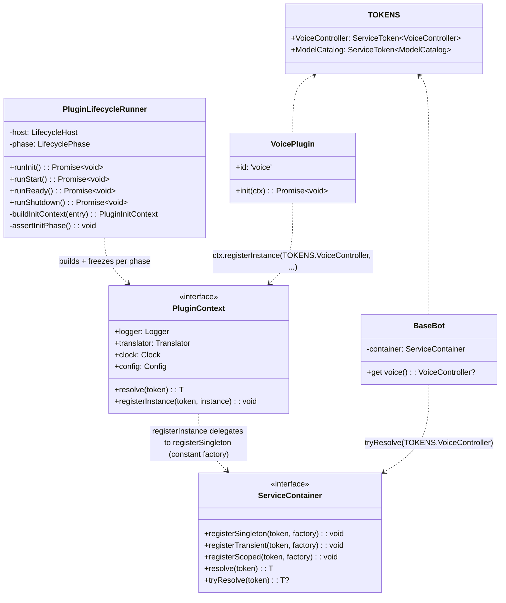
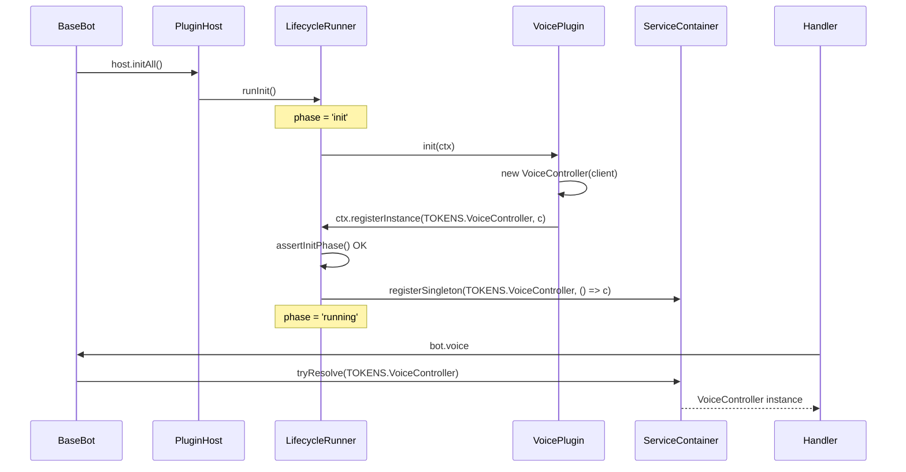
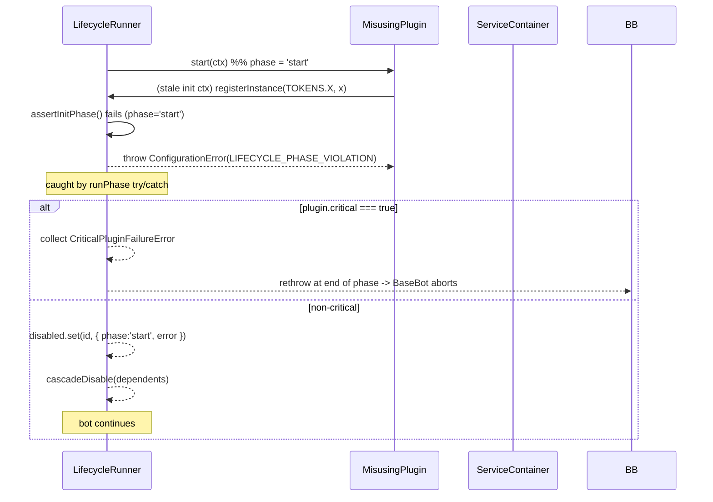

# R2 詳細設計 — 消除 DI 旁路（`PluginContext.registerInstance`）

| 欄位     | 內容                                                                                |
| -------- | ----------------------------------------------------------------------------------- |
| 對應需求 | [docs/proposal.md §5](../proposal.md#5-r2--消除-di-旁路)                            |
| 對應概要 | [docs/high-level-design.md §5](../high-level-design.md#5-r2--消除-di-旁路)          |
| 文件層級 | Per-R 詳細設計（TypeScript 介面骨架 + class 骨架 + pattern 採用理由 + 測試驗收點）  |
| 共通契約 | 沿用 [docs/design.md §2](../design.md#2-共通設計原則)（命名、可測性、Result/Error） |

---

## 1. 概要

`src/plugins/voice/internal/active-controller.ts` 與
`src/infra/llm/models-catalog.ts` 目前以 module-scope 的可變 holder
（`let active*`）把 plugin `init` hook 產出的物件回傳到
`BaseBot.run()`。這條旁路繞過 IoC，使「`bot.voice` 從何接線」無法在
container 中追蹤。R2 為 `PluginContext` 增補一條窄面合法寫入口
`registerInstance<T>`，並由 `PluginLifecycleRunner` 以 stage guard 確保
僅在 `init` 階段可呼叫；`VoicePlugin` 與 `models-catalog` 改用此新管道。

R2 範圍**僅限**新契約 + 兩處改寫；不改 `ctx.resolve` 路徑、不開放
`registerFactory` / `registerSingleton`、不批次重寫其他 plugin。

---

## 2. 設計目標

- 在 `src/plugins/**` 與 `src/infra/**` 內，`grep "let active"` 結果為 0；
  plugin↔BaseBot 通信統一走 IoC。
- `PluginContext.registerInstance` 是**窄面 facade**：只接受已建構好的
  instance，不暴露 factory / singleton lazy / 容器原物件。
- 「合法呼叫時機」必須由 host 在第一次違規時 fail-loud；非 `init`
  階段呼叫 → 拋 `ConfigurationError`（不允許靜默成功）。
- `bot.voice` 由 public field 改為 getter，從 container `tryResolve`；
  無 plugin 註冊時自然回傳 `undefined`。
- `models-catalog` 移除 `setActiveModelCatalog` / `getModelCatalog` /
  `listProviderModels` 對 module-global 的依賴；`listProviderModels`
  改為 plugin 提供或由呼叫端注入。
- 整改後的 DI walk 可由一條 trace「BaseBot resolve token → plugin init
  registerInstance」完整對上；新進工程師循 `TOKENS.X` 即可追到接線點。

---

## 3. 元件結構

### 3.1 變更概覽



### 3.2 TypeScript 骨架

#### 3.2.1 `PluginInitContext` 新增 `registerInstance`

```ts
// src/core/plugin/types.ts (additions)

/**
 * Narrow write surface handed to a plugin's `init` hook. Allows the
 * plugin to publish a pre-built instance under a typed token so the
 * rest of the bot can resolve it through normal DI.
 *
 * Legal **only inside `init`**. The host's lifecycle runner guards this
 * — calling it from `start`, `onReady`, `onShutdown`, an event hook, a
 * scheduled job, or an interaction handler throws a
 * {@link ConfigurationError} with code `'LIFECYCLE_PHASE_VIOLATION'`.
 *
 * Idempotency: the same token may not be registered twice in the same
 * init pass; the underlying container raises
 * `DuplicateRegistrationError` which the host surfaces verbatim so the
 * conflict between two plugins is loud rather than last-write-wins.
 *
 * Width: only register a *built* instance. Factories and lazy
 * singletons are deliberately not exposed — opening that surface would
 * make `PluginContext` a service-locator registrar.
 */
export type RegisterInstance = <T>(token: ServiceToken<T>, instance: T) => void;

export interface PluginInitContext<Config> extends PluginRuntimeServices {
  readonly config: Config;
  readonly registerInstance: RegisterInstance;
}
```

`PluginStartContext` / `PluginRuntimeContext` / `PluginEventContext`
**保持不變**——刻意不挂上 `registerInstance`，型別層就讓誤用無法編譯。

#### 3.2.2 Lifecycle stage guard

```ts
// src/core/plugin/host/lifecycle.ts (additions)

/** Lifecycle phase tag used by the stage guard. */
export type LifecyclePhase = 'idle' | 'init' | 'start' | 'ready' | 'running' | 'shutdown';

export class PluginLifecycleRunner {
  private phase: LifecyclePhase = 'idle';

  constructor(private readonly host: LifecycleHost) {}

  public async runInit(): Promise<void> {
    this.phase = 'init';
    try {
      await this.runPhase('init', async (entry, ctx) => {
        if (entry.plugin.init !== undefined) {
          await entry.plugin.init(ctx as PluginInitContext<unknown>);
        }
      });
    } finally {
      // Even on critical failure, leaving phase === 'init' would let a
      // late-arriving async callback sneak a registerInstance through.
      this.phase = 'running';
    }
  }

  // runStart / runReady / runShutdown set this.phase analogously.

  /**
   * Guard called by every `registerInstance` invocation. Lives on the
   * runner (not on the context object) so the closure captured by
   * `buildInitContext` always points at the *current* phase, even if
   * the plugin stored the ctx reference and called it later.
   */
  private assertInitPhase(token: ServiceToken<unknown>, pluginId: PluginId): void {
    if (this.phase === 'init') return;
    throw new ConfigurationError({
      code: 'LIFECYCLE_PHASE_VIOLATION',
      messageKey: 'errors:plugin.lifecycle_phase_violation',
      messageParams: {
        plugin: pluginId,
        token: token.description,
        phase: this.phase,
      },
    });
  }

  private buildInitContext(entry: RegisteredPlugin): PluginInitContext<unknown> {
    const registerInstance: RegisterInstance = (token, instance) => {
      this.assertInitPhase(token, entry.plugin.id);
      // Facade — delegate to the existing container API. Wrap the
      // instance in a constant factory so the container's lifetime
      // bookkeeping (singleton cache + DuplicateRegistrationError)
      // applies uniformly.
      this.host.container.registerSingleton(token, () => instance);
    };
    return Object.freeze({
      ...this.buildRuntimeServices(entry),
      config: entry.config,
      registerInstance,
    }) as PluginInitContext<unknown>;
  }
}
```

`LifecycleHost` 需追加 `readonly container: ServiceContainer`（runner
目前只看得到 `resolve`，因為要呼叫 `registerSingleton` 必須拿到
container 寫入面；這條 widening 僅限同 package 內部，不外洩）。

#### 3.2.3 `ConfigurationError` 重用（不新增 subclass）

依 `core/errors/configuration-error.ts` 現有規格——`code` 集合需擴
一個 enum value：

```ts
// src/core/errors/configuration-error.ts (diff)
export type ConfigurationErrorCode =
  | 'MISSING_ENV'
  | 'INVALID_ENV'
  | 'INVALID_CONFIG_JSON'
  | 'UNSUPPORTED_FEATURE'
  | 'LIFECYCLE_PHASE_VIOLATION'; // R2
```

對應 i18n catalog：

```jsonc
// src/i18n/locales/<lang>/errors.json
{
  "plugin": {
    "lifecycle_phase_violation": "Plugin {{plugin}} called registerInstance({{token}}) during phase '{{phase}}'; only 'init' is allowed.",
  },
}
```

選擇**重用** `ConfigurationError` 而不新增 `LifecyclePhaseViolationError`
的理由：違規本質是「程式組裝期錯誤」，與既有 `MISSING_ENV` /
`INVALID_CONFIG_JSON` 同類；fail-fast 語意一致；error tree 不必為單
一觸發點再分支。

#### 3.2.4 新增 tokens

```ts
// src/core/ioc/tokens.ts (additions)
import type { VoiceController } from '../../plugins/voice/internal';
import type { ModelCatalog } from '../../infra/llm/models-catalog';

export interface Tokens {
  // ... existing
  readonly VoiceController: ServiceToken<VoiceController>;
  readonly ModelCatalog: ServiceToken<ModelCatalog>;
}

export const TOKENS: Tokens = {
  // ... existing
  VoiceController: token<VoiceController>('VoiceController'),
  ModelCatalog: token<ModelCatalog>('ModelCatalog'),
};
```

> R3 後續會把這兩個 token 從 `core/plugin` barrel re-export，給 plugin
> 端使用；R2 只負責**加進 `tokens.ts` 並讓 BaseBot 與 plugin（後者經
> R3 通道）能取用**。R2 落地時 plugin 仍走 `core/ioc` import，R3 完
> 成後切到 `core/plugin` 再 import。

#### 3.2.5 `VoicePlugin.init` 改寫

```ts
// src/plugins/voice/plugin.ts
import { TOKENS } from '../../core/ioc'; // R3 後改為 '../../core/plugin'
import type { Plugin } from '../../core/plugin';
import { VoiceController } from './internal';

const PLUGIN_ID = 'voice';
const PLUGIN_VERSION = '1.0.0';

export const createVoicePlugin = (): Plugin => ({
  id: PLUGIN_ID,
  version: PLUGIN_VERSION,
  scope: 'bot',
  critical: false,

  async init(ctx): Promise<void> {
    const client = ctx.resolve(TOKENS.DiscordClient);
    const controller = new VoiceController(client);
    // OLD: setActiveVoiceController(controller);  // removed in R2
    ctx.registerInstance(TOKENS.VoiceController, controller);
  },
});

// `src/plugins/voice/internal/active-controller.ts` is deleted.
// `setActiveVoiceController` / `getActiveVoiceController` exports go away.
```

#### 3.2.6 `BaseBot.voice` 改為 getter

```ts
// src/bot/index.ts (diff)

// REMOVED:
//   public voice?: VoiceController;
//   ...
//   this.voice = getActiveVoiceController();

/**
 * Live VoiceController, if the bot registered VoicePlugin. Resolved
 * each access so a (future) reload path is observable without
 * touching cached fields. Returns undefined for bots that do not
 * register the plugin (e.g. msg-archive).
 */
public get voice(): VoiceController | undefined {
  return this.container.tryResolve(TOKENS.VoiceController);
}
```

呼叫端（`handlers/commands/record/...`）已是 `bot.voice?.start(...)`
形式，無需更動。

#### 3.2.7 `models-catalog` 改寫（採方案 a：plugin 持有）

選擇方案 a（`llm-chat` plugin 在 `init` 註冊）的理由：與 `VoicePlugin`
對稱、職責歸屬清晰（catalog 屬於 llm-chat 功能域），且 `BaseBot` 對
LLM 細節零認識，方案 b 會把該知識洩漏進 composition root。

```ts
// src/infra/llm/models-catalog.ts (diff)
// REMOVED: let activeModelCatalog, setActiveModelCatalog, getModelCatalog
//
// Keep ONLY the ModelCatalog class. listProviderModels becomes a method
// on the class:
//
//   class ModelCatalog {
//     public list(provider: LLMProviderName): string[] { ... }
//   }

// src/plugins/llm-chat/plugin.ts (diff)
async init(ctx): Promise<void> {
  const modelCatalog = new ModelCatalog(/* deps from ctx.resolve */);
  // OLD: setActiveModelCatalog(modelCatalog);
  ctx.registerInstance(TOKENS.ModelCatalog, modelCatalog);
}

// src/handlers/commands/ai_settings/index.ts (diff)
// OLD: const modelOptions = listProviderModels(provider);
const catalog = this.resolver.tryResolve(TOKENS.ModelCatalog);
const modelOptions = catalog?.list(provider) ?? [];
```

> handler 端的 resolver 注入路徑沿用 R1 後 BaseBot 暴露的 typed
> resolver；R2 不另開新接線。

### 3.3 Design Pattern 採用

| Pattern            | 使用點                                                                | 理由                                                                    |
| ------------------ | --------------------------------------------------------------------- | ----------------------------------------------------------------------- |
| **Facade**         | `ctx.registerInstance` 對 `ServiceContainer.registerSingleton` 的窄面 | 限制可寫入面為「pre-built instance」，杜絕誤用為 service locator 註冊器 |
| **Guard clause**   | `assertInitPhase()` 於每次 `registerInstance` 開頭                    | 第一次違規 fail-loud，符合「契約越早失敗越便宜」                        |
| **Token-based DI** | `TOKENS.VoiceController` / `TOKENS.ModelCatalog`（沿用既有 pattern）  | 與全 codebase 接線方式一致，trace 容易                                  |

「為何不直接把 `ServiceContainer` 傳給 plugin」：那會讓 plugin 取得
`registerSingleton` / `registerTransient` / `registerScoped` /
`createScope` 全部寫入面，並能 `resolve` 任意 token——這正是 Service
Locator 反 pattern。窄面 facade 在型別層就把可能性收斂到「註冊一個
已建好的物件」，與「拒絕回傳容器」的既有契約（`host.ts` line 32
header doc）一致。

---

## 4. 介面契約

### 4.1 `ctx.registerInstance<T>(token, instance)`

| 屬性          | 規格                                                                                       |
| ------------- | ------------------------------------------------------------------------------------------ |
| 呼叫時機      | 僅在 plugin `init` hook 內合法。其他階段呼叫 → `ConfigurationError`                        |
| 重入 / 重註冊 | 同一 token 第二次呼叫 → `DuplicateRegistrationError`（由 container 直接拋）                |
| 並行          | 不要求 thread-safe；plugin init 在 host 內為單執行緒序列化執行                             |
| 副作用        | 註冊一個 lifetime = `singleton` 的常量 factory；resolve 時直接回傳同一 instance reference  |
| 失敗語意      | 拋出後，當前 plugin 視為 `init` 階段失敗 → 進入 `DisabledPlugin`（critical=true 則 abort） |
| 型別保證      | `token: ServiceToken<T>` 與 `instance: T` 必須型別一致；TS 編譯期攔截錯配                  |

### 4.2 `PluginLifecycleRunner.assertInitPhase()`

| 屬性     | 規格                                                                                      |
| -------- | ----------------------------------------------------------------------------------------- |
| 觸發點   | `registerInstance` 內部入口                                                               |
| 通過條件 | `this.phase === 'init'`                                                                   |
| 失敗行為 | 拋 `ConfigurationError({ code: 'LIFECYCLE_PHASE_VIOLATION', messageKey, messageParams })` |
| 不變式   | `runInit()` 進入時 `phase='init'`、離開時（即使丟出 critical 也）`phase='running'`        |

---

## 5. 元件互動

### Happy path



### Error path（非 init 階段誤用）



事件 hook / job / handler 路徑無法拿到 `PluginInitContext`，型別層先
攔；上面的「stale init ctx」案例假設 plugin 在 `init` 把 `ctx` 存到
this 並於 `start` 再呼叫——這正是 stage guard 要堵住的真實風險。

---

## 6. 測試設計

### 6.1 驗收點

| 驗收項                                                      | 內容                                                                                                      | 期望                                                                                                                                                                       |
| ----------------------------------------------------------- | --------------------------------------------------------------------------------------------------------- | -------------------------------------------------------------------------------------------------------------------------------------------------------------------------- |
| `registerInstance` happy（init phase）                      | plugin 在 init 內以正確 token + instance 呼叫                                                             | container 之後 `resolve(token)` 回傳同 reference                                                                                                                           |
| `registerInstance` 重複 token                               | 同一 init pass 重複呼叫，或兩個 plugin 對同 token 都註冊                                                  | 拋 `DuplicateRegistrationError`，第二個 plugin 進 `DisabledPlugin`                                                                                                         |
| `registerInstance` 型別錯配                                 | `registerInstance<Dog>(TOKENS.Cat, dog)`                                                                  | TS 編譯失敗（編譯期驗收，寫入 type-test 檔）                                                                                                                               |
| `registerInstance` 於 `start`                               | plugin 在 init 緩存 ctx，於 start hook 呼叫                                                               | 拋 `ConfigurationError` with code `'LIFECYCLE_PHASE_VIOLATION'`、messageKey `errors:plugin.lifecycle_phase_violation`、messageParams 含 `{ plugin, token, phase:'start' }` |
| `registerInstance` 於 `onReady` / event hook / `onShutdown` | 同上                                                                                                      | 同上，`phase` 對應為 `'ready'` / `'running'` / `'shutdown'`                                                                                                                |
| `VoicePlugin` 整合                                          | host.initAll → bot.voice 為 VoiceController instance；msg-archive bot 不註冊 plugin → bot.voice undefined | resolve / undefined 行為一致                                                                                                                                               |
| `models-catalog` 整合                                       | llm-chat init 註冊 catalog；ai_settings handler 對 4 provider 都拿到 list                                 | 4 個 provider 各回對應 model 陣列；移除舊 `setActiveModelCatalog` 後 grep `let active` 為 0                                                                                |

### 6.2 Fixture / Mock 策略

| 相依               | 測試替身                                                                                       |
| ------------------ | ---------------------------------------------------------------------------------------------- |
| `Logger`           | `FakeLogger`（既有 in-memory recorder）                                                        |
| `Translator`       | identity translator（既有測試工具）                                                            |
| `Clock`            | `FakeClock`（既有）                                                                            |
| `ServiceContainer` | 真實 `DefaultServiceContainer`——R2 本質是驗證 container 與 runner 的整合契約，不應 mock        |
| `Discord Client`   | 不需要——stage-guard 單元測試不需 Discord；VoicePlugin 測試用 stub Client（既有 voice fixture） |
| `ModelCatalog`     | 真實類別 + stub provider keys（既有 llm-chat 測試 fixture）                                    |

### 6.3 整合面 / 檔案配置

| 檔案                                                               | 用途                                                                   |
| ------------------------------------------------------------------ | ---------------------------------------------------------------------- |
| `test/unit/core/plugin/lifecycle-guard.test.ts`（新）              | 涵蓋 6.1 前 5 項——stage-guard 全部 phase × happy/duplicate/type        |
| `test/unit/plugins/voice/voice-plugin.test.ts`（既有，擴充）       | 改驗 `ctx.registerInstance` 路徑；刪除 `getActiveVoiceController` 斷言 |
| `test/unit/plugins/llm-chat/llm-chat-plugin.test.ts`（既有，擴充） | 同上，驗 catalog 從 ctx 註冊                                           |
| `test/int/router/router-dispatch.int.test.ts`（既有，調整）        | `ai_settings` 流程的 catalog 取得改走 `resolver.tryResolve`            |
| `test/unit/bot/voice-getter.test.ts`（新）                         | `BaseBot.voice` getter 對 with/without plugin 兩種 bot 行為驗證        |

新增測試需引入既有 `createPluginHost(...)` test helper，配 `FakeClock`

- `FakeLogger`，每個 case 在 < 50 行內完成 arrange/act/assert。

---

## 7. 與其他 R 的整合點

- **R1（拆解 BaseBot）**：`bot.voice` getter 假設 `BaseBot` 對外有
  穩定的 `container` 或 typed resolver accessor。R1 完成後此 accessor
  歸屬於 `BaseBot` 主體（不在拆出去的 collaborator）；R2 直接以
  `this.container.tryResolve(...)` 實作。**R2 在 dependency order 上
  排在 R1 之後**，與 proposal §3 的 R1→R2→R3 序一致。
- **R3（plugins↔core/ioc 契約對齊）**：R2 在 `tokens.ts` 新增的兩個
  token 必須由 R3 的 `core/plugin` barrel re-export，plugin 才能脫離
  `import { TOKENS } from '../../core/ioc'`。R2 落地時 plugin 仍走舊
  import 路徑（lint 容許 `plugins/voice`、`plugins/llm-chat` 暫時保
  留——R3 才會把這條規則收緊並提供出口）。R2 不負責 lint 規則調整。
- **R4 / R5 / R6**：無直接耦合。

---

## 8. 不做的設計決策

承自 [proposal §5.3](../proposal.md#53-不做什麼)：

- **不**開放 plugin 取得 `ServiceContainer` 原物件。`PluginContext`
  只能寫一條 `registerInstance`，不暴露 `registerSingleton` /
  `registerTransient` / `registerScoped` / `createScope`。
- **不**改 plugin 既有的 `ctx.resolve(TOKENS.X)` 路徑。
- **不**為了統一而把所有 plugin 都改成在 `init` 註冊實例；R2 只動有
  DI 旁路的兩處（`voice`、`llm-chat` 的 models-catalog）。

額外於本文件明確：

- **不**新增 `LifecyclePhaseViolationError` subclass；重用
  `ConfigurationError` + 新 `code` value 即可（理由見 §3.2.3）。
- **不**為 `registerInstance` 增加 factory 重載——「給 instance、要 lazy
  自己 wrap」是刻意設計，避免讓 facade 漂移成 mini-container。
- **不**改變 `ServiceContainer` 的公開 API；R2 對 container 是純讀取
  消費者（透過既有 `registerSingleton` + 常量 factory）。
- **不**為 `bot.voice` getter 加 cache；每次 access 走
  `tryResolve(singleton)` 已是 O(1)，加 cache 反而會掩蓋未來重註冊
  路徑的可觀察性。
