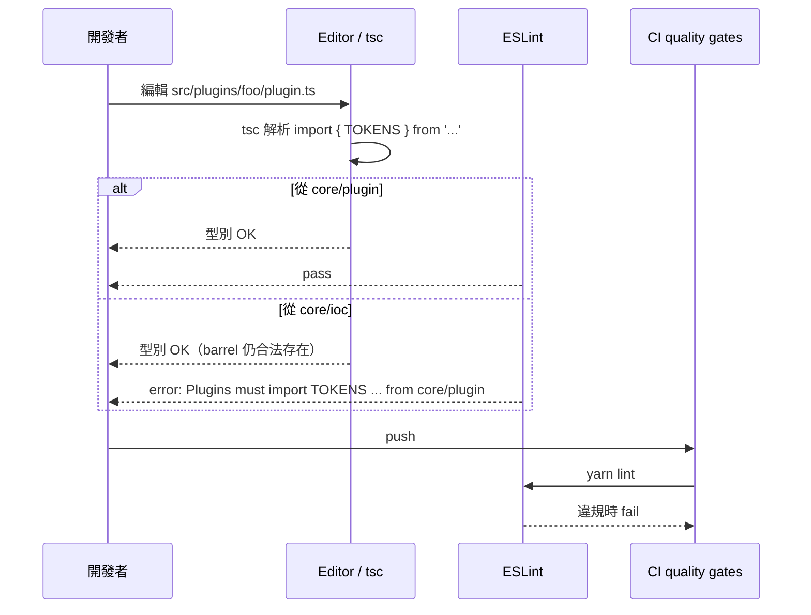

# R3 — plugins ↔ core/ioc 契約對齊（詳細設計）

| 項目         | 內容                                                                                      |
| ------------ | ----------------------------------------------------------------------------------------- |
| 對應需求     | [proposal §6](../proposal.md#6-r3--plugins--coreioc-契約對齊)                             |
| 對應 HLD     | [high-level-design §6](../high-level-design.md#6-r3--plugins--coreioc-契約對齊)           |
| 共通約定     | [design.md §2](../design.md#2-共通設計原則)                                               |
| 影響檔案     | `src/core/plugin/index.ts`、`eslint.config.mjs`、8 個 `src/plugins/*/plugin.ts`、4 份規範 |
| 落地分支     | 與 R2 同一 commit / 同一分支推進（見 §8）                                                 |
| 風險與相容性 | 純內部 import 路徑搬移；無對外契約變更；無 runtime 行為差異                               |

---

## 1. 概要

`src/plugins/**` 目前 8 個 `plugin.ts` 直接 `import { TOKENS } from '../../core/ioc'`。分層契約規定
`core/ioc` 僅供 `src/bot/**`（composition root）與 `test/**` 使用，但 `eslint.config.mjs` 的
`no-restricted-imports` 沒列入 `src/plugins/**`，導致「文件規範禁止、ESLint 放行、實際程式碼違反」
三者不一致。R3 把這條 gap 補齊：

- `core/plugin` barrel 新增 `TOKENS` 與必要型別 re-export，成為 plugin 對 IoC 的**唯一窗口**。
- 8 個 plugin 改 import 來源為 `core/plugin`。
- ESLint 把 `src/plugins/**` 加入 `core/ioc` 禁區。
- 四份規範文件（CLAUDE.md、CONTRIBUTING.md、兩個 skill SKILL.md）以**完全一致**的段落把此規則明文化。

範圍限縮見 [proposal §6.3](../proposal.md#63-不做什麼) 與本文件 §9。

---

## 2. 設計目標

源自 [proposal §6.4](../proposal.md#64-驗收質化)：

1. 任何 `src/plugins/**` 程式碼不再直接 import `core/ioc`；違規由 ESLint 在 lint 階段擋下。
2. 「plugin 對 IoC 的合法窗口」在程式碼、ESLint 規則、文件三處的描述一致（同一句話、同一路徑、同一規則）。
3. 抽換 `core/ioc` 實作的假想實驗：若日後改寫容器內部，plugin 程式碼不需更動，只需 barrel 維持相同
   re-export 名稱。

---

## 3. 元件結構

### 3.1 邊界示意

```mermaid
flowchart LR
    subgraph core
        ioc["core/ioc<br/>TOKENS, ServiceContainer,<br/>createContainer"]
        pluginPkg["core/plugin (barrel)<br/>Plugin / ctx / +TOKENS re-export"]
    end
    subgraph bot["src/bot/** (composition root)"]
        BB[BaseBot 等]
    end
    subgraph plugins["src/plugins/**"]
        Px[plugin.ts]
    end

    BB -- 允許 --> ioc
    BB -- 允許 --> pluginPkg
    Px -- 允許 --> pluginPkg
    Px -. ESLint error .x ioc
```

### 3.2 `core/plugin/index.ts` 變更

既有 export 全部保留；新增三個 re-export 自 `../ioc`：

```ts
// existing exports preserved
export type {
  Plugin,
  PluginInitContext,
  PluginStartContext,
  PluginRuntimeContext,
  // ... 其他既有 type exports 不變
} from './types';

export {
  PluginHost,
  PluginRegistrationError,
  // ... 其他既有 value / error exports 不變
} from './host';

export { mergeRegistries, type ContributionSource } from './registries';
export { EventDispatcher } from './event-dispatcher';
export { InteractionRouter, DoubleNextError } from './interaction-router';
export type { GuildOnboardingPort, GuildOnboardingResult } from './guild-onboarding-port';

// R3 additions — plugin 端對 IoC 的唯一窗口：
export { TOKENS, type ServiceToken, type Resolver } from '../ioc';
```

**刻意不 re-export 的項目**（保持封裝、避免 plugin 反向擴張對容器的權限）：

| 項目                                                                       | 為什麼不 re-export                                                                                         |
| -------------------------------------------------------------------------- | ---------------------------------------------------------------------------------------------------------- |
| `createContainer`                                                          | 建立容器是 composition root 的職責；plugin 不應自行建另一個容器。                                          |
| `ServiceContainer` / `ScopedContainer` / `DefaultServiceContainer`         | 容器的**寫入面 API**（`register*`、scope 切換）只屬於 composition root；plugin 透過 `ctx` 取得受限的代理。 |
| `token()` factory                                                          | 新 token 必須登錄在 `core/ioc/tokens.ts` 中央目錄；plugin 不得在自己檔案內就地造 token。                   |
| `ServiceFactory` / `ServiceResolutionError` / `DuplicateRegistrationError` | 與容器建構 / 初始化錯誤相關；plugin 端遇到的失敗已由 `PluginInitContext` 包裝。                            |

Plugin 端只需 `TOKENS`（要查的鍵）與 `ServiceToken<T>` / `Resolver`（要描述函式參數型別時用），其餘
全部留在 `core/ioc`。

### 3.3 ESLint 規則新增

在 `eslint.config.mjs` 既有的 service-locator guard block **之後**追加獨立 block（不合併進舊 block，
因為舊 block 的 message 寫的是 「receive dependencies via constructor parameters」，與 plugin 適用的
「改走 `core/plugin`」訊息不同；分開可給更精準的錯誤訊息）：

```js
// R3: plugin 對 IoC 表面的唯一窗口是 core/plugin barrel。
{
  files: ['src/plugins/**/*.ts'],
  rules: {
    'no-restricted-imports': [
      'error',
      {
        patterns: [
          {
            group: ['**/core/ioc', '**/core/ioc/*', '@core/ioc', '@core/ioc/*'],
            message:
              'Plugins must import TOKENS / ServiceToken from core/plugin, not core/ioc.',
          },
        ],
      },
    ],
  },
},
```

`test/**` 的放行區段已涵蓋（既有 block 把 `no-restricted-imports` 設為 `off`），plugin 的測試夾具
不會被新規則卡住。

### 3.4 Design Pattern 採用

| Pattern                             | 用在哪                                              | 為什麼                                                                                |
| ----------------------------------- | --------------------------------------------------- | ------------------------------------------------------------------------------------- |
| **Module Barrel (Facade)**          | `core/plugin/index.ts`                              | 對外提供穩定且最小化的公開表面，內部模組結構可自由演化。                              |
| **Encapsulation（容器寫入面收斂）** | 不 re-export `ServiceContainer` / `createContainer` | Plugin 取得的是「能查、可在 init 註冊已建構實例」的受限視圖，無法重設或重新組裝容器。 |

**這不是 Adapter**：plugin 端使用的 `TOKENS` / `ServiceToken<T>` / `Resolver` 在型別與 runtime 行為
都與 `core/ioc` 原始匯出**完全相同**——只是換 import 路徑。Adapter pattern 會另立介面型別 / 轉換語意；
本變更不做轉換，只做封裝聚焦。

---

## 4. 介面契約

`src/plugins/**` 程式碼**可以做**：

- `import { TOKENS, type ServiceToken, type Resolver } from '<相對路徑>/core/plugin'`
- `ctx.resolve(TOKENS.X)`（讀取）
- `ctx.registerInstance(TOKENS.X, instance)`（R2 引入的 init-time 註冊；其表面同樣透過 `ctx`，不需要
  plugin 自行接觸 `ServiceContainer`）
- 從 `core/plugin` import `Plugin`、`PluginInitContext` 等既有型別（不變）

`src/plugins/**` 程式碼**不可以做**：

- `import { ... } from '<任何路徑>/core/ioc'`（ESLint error）
- 把 `ctx` 強制 cast 成 `ServiceContainer` 以取得 `register*` 等寫入面 API
- 自行呼叫 `createContainer()` 或自造 `token()`

違反前者由 lint 擋；違反後兩者由 code review 擋（runtime 上 `ctx` 物件本來就不暴露 `register*`，
強制 cast 等同有意繞過契約，會在 reliability-reviewer 階段被退件）。

---

## 5. 元件互動



關鍵：tsc 不會擋（`core/ioc` 仍是合法模組），守門人是 ESLint。R3 的價值在於把 lint 與契約對齊。

---

## 6. 測試設計

### 6.1 測試驗收點

1. **ESLint 規則 fixture 測試**：`test/eslint/r3-plugin-ioc.test.ts`
   - 用 `ESLint` programmatic API 建立 fixture，對一個位於 `src/plugins/__fixture__/bad.ts` 內容為
     `import { TOKENS } from '../../core/ioc';` 的虛擬檔案執行 lint，斷言結果包含
     `no-restricted-imports` 的 error，且 message 含 `'core/plugin'` 字串。
   - 反例：對同樣內容但 import 來源換成 `'../../core/plugin'` 的檔案，斷言 lint 0 錯誤。
2. **Barrel 表面 compile-time 測試**：`test/core/plugin/barrel.test.ts`
   - 從 `@core/plugin` 直接 `import { TOKENS, type ServiceToken, type Resolver }`，並斷言
     `TOKENS.Logger`、`TOKENS.ReposFactory` 等關鍵 key 為 truthy。
   - 同檔內以型別斷言（`const _t: ServiceToken<Logger> = TOKENS.Logger`）確保 type alias 正確 re-export。
3. **Grep guard（CI 端）**：新增 `scripts/check-plugins-no-ioc.sh`（或併入既有 lint:check 流程），
   用 `grep -rE "from\s+['\"][^'\"]*core/ioc" src/plugins` 比對；命中即非 0 結束。
   - 此 guard 與 ESLint 規則語意重疊，但提供**第二道防線**——萬一未來 eslint config 被誤改，
     CI script 仍能擋下。

### 6.2 Fixture / Mock 策略

- R3 是純靜態檢查；不需要 runtime mock。
- ESLint fixture 直接以字串內容呼叫 `ESLint#lintText({ filePath })`，避免在 repo 內留 `.ts` 違規檔
  污染主 lint。

### 6.3 整合面

- `yarn lint` 全綠（既有 quality gate）。
- `yarn test` 包含上述 fixture / barrel 測試。
- `yarn build`（tsc）不會受影響，因為 R3 只搬 import 路徑。

---

## 7. 規範文字（4 份文件 verbatim）

下列段落必須以**完全相同**的繁體中文文字插入 4 份文件，方便日後以 grep + sed 一次替換：

> **Plugin 對 IoC 的依賴契約**：plugin 對 IoC 的依賴只能透過 `core/plugin` 取得
> （`import { TOKENS, type ServiceToken } from '<path>/core/plugin'`）。任何 `src/plugins/**` 對
> `core/ioc` 的直接 import 由 ESLint 在 lint 階段擋下。Plugin 可呼叫 `ctx.resolve(token)` 讀取依賴、
> 可在 `init` hook 內呼叫 `ctx.registerInstance(token, instance)` 註冊已建構的實例；不得透過任何
> 方式（包含對 `ctx` 強制 cast）取得 `ServiceContainer` 的寫入面 API。新 token 必須登錄在
> `src/core/ioc/tokens.ts` 中央目錄，再由 `core/plugin` 的 `TOKENS` re-export 自動曝露給 plugin。

各文件錨點位置：

| 文件                                          | 插入位置（既有章節 / 標題）                                              |
| --------------------------------------------- | ------------------------------------------------------------------------ |
| `CLAUDE.md`                                   | `## Key abstractions` → `### IoC container` 段落結尾                     |
| `CONTRIBUTING.md`                             | 「Adding a plugin」recipe 之後新增 `### Plugin ↔ IoC 契約` 小節          |
| `.claude/skills/project-conventions/SKILL.md` | 「IoC container」/「Plugin contract」rule list 內，作為獨立 bullet group |
| `.claude/skills/coding-standards/SKILL.md`    | 「Security / Layer boundaries」段落內，作為獨立 bullet group             |

四份文件的段落字字相同；任何未來修訂必須四處同步，PR template / `update-wiki` skill 將檢查同步性。

---

## 8. 與其他 R 的整合點

- **R2（消除 DI 旁路）**：R2 引入 `ctx.registerInstance(token, instance)`，新 token（如
  `TOKENS.VoiceController`、`TOKENS.ModelCatalog`）必然透過 R3 開的窗口曝露給 plugin。R3 與 R2 在
  **同一分支、相鄰 commit** 落地，避免「R2 期間 plugin 又改回直 import `core/ioc` 拿新 token」的
  回潮窗。建議順序：先 R2 把新 token 與 `registerInstance` 加進 `core/ioc`，再 R3 在 barrel 重新
  曝露 + 改 import + 加 ESLint。
- **R4（過長 handler 拆分 + 規範）**：R4 也會新增 ESLint rule（`max-lines-per-file`）。R3 的
  `no-restricted-imports` block 與 R4 的 `max-lines-per-file` block 對 file glob 沒交集
  （R3 限 `src/plugins/**`、R4 限 `src/handlers/**`），不會互相干擾。實作時兩 block 分開，避免合併。
- **R6（低優先單點清理）**：R6 不涉及 plugin/ioc 邊界；無交互。

---

## 9. 不做的設計決策

依 [proposal §6.3](../proposal.md#63-不做什麼) 與本輪 scope：

- **不擴充 `TOKENS` 內容**——新 token 屬 R2（`VoiceController`、`ModelCatalog`）。
- **不調整 `ctx.resolve(...)` 簽名 / 語意**——僅搬 import 路徑。
- **不把 `TOKENS` 拆成多個 sub-namespace**（例 `TOKENS.repos.*` / `TOKENS.infra.*`）——當前
  flat namespace 仍足以容納；過早 namespace 化會增加 plugin 端 import 噪音。
- **不 re-export 容器寫入面 API**（`createContainer` / `ServiceContainer` / `register*`）——
  composition root 的權限不應外漏給 plugin。
- **不替換 IoC 框架、不引入 reflect-metadata**——本提案明確排除（proposal §2.2）。
- **不為 plugin 撰寫專屬的 `PluginServiceToken` newtype**——R3 §3.4 已說明這不是 Adapter；
  另立型別只會在每個 plugin call site 增加無語意的轉型成本。
