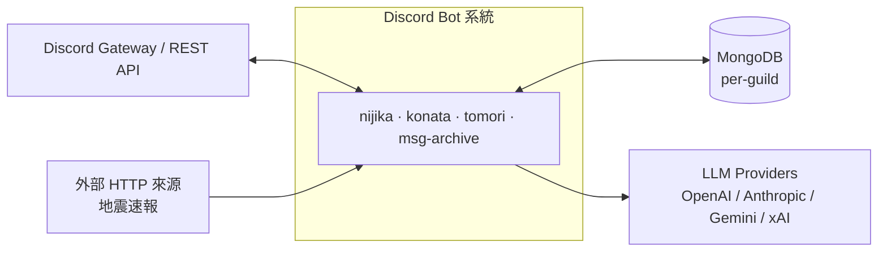
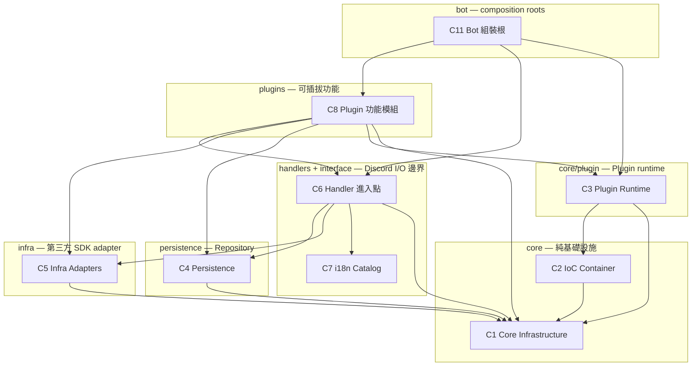
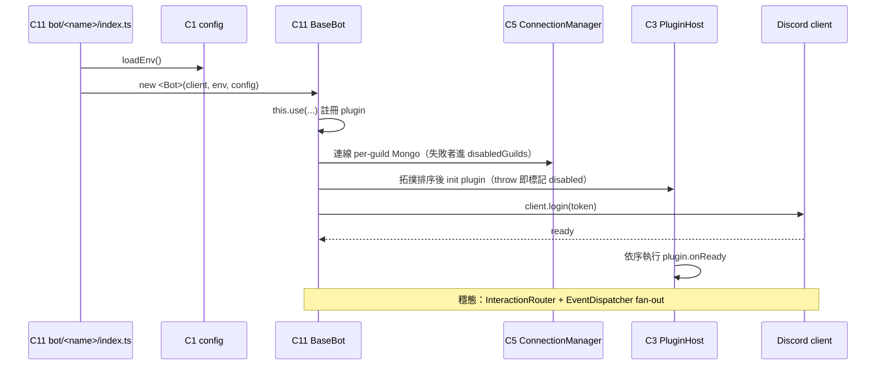

# 概要設計文件 — Discord Bot 架構

| 欄位     | 內容                                                   |
| -------- | ------------------------------------------------------ |
| 文件類型 | 概要設計（High-Level Design）                          |
| 文件版本 | 1.1                                                    |
| 最後更新 | 2026-05-20                                             |
| 上游文件 | [`docs/proposal.md`](proposal.md)（需求規格 RFC v2.0） |
| 讀者     | 技術團隊 / 工程師 / 架構審查者                         |
| 取代     | 本文件取代並合併原 `docs/architecture.md`              |

---

## 1. 文件目的與範圍

本文件是 [`docs/proposal.md`](proposal.md) 所定義之重構需求（REQ-A1 ~
REQ-G7）的**概要設計**。其任務是：

1. 將需求轉譯為一組明確的**元件（component）**。
2. 釐清元件的**職責邊界**、**對外介面**與**彼此依賴關係**。
3. 提供需求到元件的**追溯對照**（見第 8 節），使每項 REQ 都能定位到
   負責它的元件。

本文件以**設計視角**撰寫：描述系統「應如何被切分與組裝」，作為詳細設計
與實作的依據；不展開逐函式的詳細設計，也不記錄落地排程（後者見
proposal.md 第 6 節）。

**設計基準線**：本文件描述的是**目標設計**，且該目標設計**不保留任何
過渡性技術債**。凡 codebase 現存的過渡層（典型者為 `src/events/`），
本設計一律給出收斂方案並納入正式元件（見 §9.4）。後續任何設計變更
都應在此基準線上進行，不得重新引入過渡層。

**顆粒度**：元件以「分層 + 大模組」為單位切分（共 11 個元件）。各 bot
與各 plugin 為同質實例，於所屬元件內列舉，不各自展開為獨立元件。

---

## 2. 設計目標與原則

### 2.1 目標

源自 proposal.md 第 3.1 節：

- 單向依賴的分層目錄結構。
- 以手寫 IoC 容器取代 Service Locator。
- 以 Plugin 契約 + PluginHost 取代 bot 繼承。
- 以 Repository pattern 取代字串查表式資料存取。
- 統一 LLM 存取為 Provider Strategy。
- 結構化錯誤樹與 `Result` 型別。
- 全面 i18n 路由並以 scanner 強制。
- 全 repo 品質閘門。

### 2.2 設計原則

1. **單向分層依賴**：`bot → plugins → handlers → infra → persistence
→ core`。每個元件僅依賴同層或下層；`core` 不依賴任何上層或第三方
   SDK。
2. **Plugin 化的可組裝行為**：所有業務功能皆為註冊至 `PluginHost` 的
   `Plugin` 實例；bot 以組裝（composition）而非繼承挑選功能集合。
   **不存在 plugin 層以外的業務行為承載點**。
3. **介面優先**：跨元件依賴一律對介面（repository interface、
   `LLMService`、`ServiceToken<T>`、生命週期 port）；測試以 fake /
   mock 注入。
4. **錯誤與文案外顯**：錯誤以結構化 `DomainError` 表達、邊界以
   `Result<T, DomainError>` 傳遞；user-facing 文案一律走 i18n key。
5. **無過渡層**：目標設計不含「待未來再處理」的過渡元件；每個職責
   都有明確歸屬的正式元件。

### 2.3 非目標

- 不拆獨立的 `domain/` 與 `application/` 層（見 §9.1 設計取捨）。
- 不引入 `reflect-metadata` 或第三方 DI 框架。
- 不改動四個 bot 的對外行為（重構須行為等價）。

---

## 3. 系統脈絡

系統在單一 codebase 內託管四個 Discord 機器人人格，共用同一套分層
核心：

| 外部系統      | 互動方式                                                                  |
| ------------- | ------------------------------------------------------------------------- |
| Discord       | Gateway 事件（interaction / message / reaction）與 REST（指令註冊、回覆） |
| MongoDB       | 每個 guild 一條獨立連線，由 `ConnectionManager` 管理生命週期              |
| LLM Providers | 四家 SDK，統一藏於 `LLMService` 抽象之後                                  |
| 外部 HTTP     | `nijika` 暴露 Express 路由 `/discord/earthquake` 接收地震速報             |

---

## 4. 分層架構

箭頭為依賴方向，單向向下。**`core/` 之下不 import `src/` 內任何其他
模組**，亦不依賴 Discord.js / Mongoose / LLM SDK。

設計目標目錄不含 `src/events/`（見 §9.4）；C9–C11 為跨切面與組裝
元件。

| 層                | 路徑                         | 對應元件 |
| ----------------- | ---------------------------- | -------- |
| Core              | `src/core/`（除 plugin/ioc） | C1       |
| IoC               | `src/core/ioc/`              | C2       |
| Plugin Runtime    | `src/core/plugin/`           | C3       |
| Persistence       | `src/persistence/`           | C4       |
| Infra             | `src/infra/`                 | C5       |
| Handlers          | `src/handlers/`              | C6       |
| Interface         | `src/i18n/`                  | C7       |
| Plugins           | `src/plugins/`               | C8       |
| Codegen / Scripts | `scripts/`                   | C9       |
| Quality Gates     | CI / 設定檔                  | C10      |
| Bots              | `src/bot/`                   | C11      |

---

## 5. 元件分解

每個元件描述：**職責**、**對外介面**、**依賴**、**對應需求**。

### C1 — Core Infrastructure（核心基礎設施）

> `src/core/`（不含 `ioc/`、`plugin/`）

- **職責**：提供與業務無關、與第三方無關的純基礎設施。內含子模組：
  - `config/` — zod 解析的 `Env`，單一 `loadEnv()` 進入點。
  - `errors/` — `DomainError` 錯誤樹（見 §7.2）。
  - `result/` — `Result<T, E>` 型別與組合子。
  - `i18n/` — `Translator`（i18next-backed）。
  - `logger/` — 結構化 logger 與敏感欄位 redaction。
  - `time/` — `Clock` 抽象（測試可注入固定時間）。
  - `ids.ts` — branded ID 型別。
  - `guild-registry.ts` — 依 guild 查 channel / role / repo bundle。
- **對外介面**：`loadEnv()`、`DomainError` 及子類、`Result`
  建構子、`Translator`、`Logger`、`Clock`、branded ID 工廠、
  `GuildRegistry`。
- **依賴**：標準函式庫與 zod / i18next。**不**依賴 `src/` 其他模組。
- **對應需求**：REQ-A1、REQ-C1、REQ-E1、REQ-F1。

### C2 — IoC Container（依賴注入容器）

> `src/core/ioc/`

- **職責**：以約 150 行的手寫容器管理依賴生命週期，取代 Service
  Locator。型別由 `ServiceToken<T>` 保證。
- **對外介面**：`ServiceContainer`（register / resolve）、`TOKENS`
  常數表（`Env` / `Logger` / `Translator` / `Clock` /
  `DiscordClient` / `GuildRegistry` / `ConnectionManager` / 各
  `<X>RepoFactory` …）。
- **依賴**：C1。
- **對應需求**：REQ-A2。
- **設計約束**：raw container 不對 plugin 暴露；plugin 僅能透過
  `ctx.resolve(token)` 取得依賴，runtime hook 內禁止 Service Locator
  （以 eslint rule 強制）。

### C3 — Plugin Runtime（Plugin 執行時）

> `src/core/plugin/`

- **職責**：定義 Plugin 契約並驅動其生命週期與事件分派。子模組：
  - `types.ts` — `Plugin<Config>` 契約（`id` / SemVer `version` /
    `scope` / `critical` / `dependencies` / `configSchema` / 生命
    週期 hook / `events` / `contributes`）。
  - `host.ts` + `host/{lifecycle,topology,contributes-merger}.ts`
    — `PluginHost`：依宣告依賴拓撲排序、以錯誤隔離方式執行
    `init / start / onReady / onShutdown`、合併 plugin 貢獻的
    handler 與 codegen registry。
  - `interaction-router.ts` — Chain-of-Responsibility 的
    `InteractionRouter`，作為 bot 主 dispatch 路徑。
  - `event-dispatcher.ts` — 將 Discord gateway 事件（含
    `guildCreate`）fan-out 給 plugin 訂閱。
  - `registries.ts` — handler registry 型別。
- **對外介面**：`Plugin<Config>` 契約、`PluginHost`、
  `InteractionRouter`（及 middleware 介面）、`EventDispatcher`、
  `PluginRuntimeContext`（含 `resolve` / `logger` / `translator` /
  `clock`）、**guild-onboarding port**（typed 介面，使 plugin 能在
  `guildCreate` 時初始化 guild-info，不需穿透 `BaseBot` 內部，見
  §9.4）。
- **依賴**：C2、C1。
- **對應需求**：REQ-A3、REQ-A4、REQ-G1。

### C4 — Persistence（資料持久層）

> `src/persistence/`

- **職責**：以 Repository pattern 封裝 MongoDB 存取。
  - `schemas/<x>.schema.ts` — Mongoose schema + TS doc 介面。
  - `repositories/<x>.repo.ts` — repository 介面 + `Mongo<X>Repo`
    實作（`activity` / `fetch` / `giveaway` / `message` / `reply` /
    `todo` / `user-api-setting`）。
- **對外介面**：各 repository 介面、`buildRepos(connection)` 回傳
  綁定特定 guild 連線的 `Repos` bundle。
- **依賴**：C1、`mongoose`。
- **對應需求**：REQ-B1。
- **設計約束**：消費端（plugin / handler）一律依賴 repository
  介面；測試注入 in-memory fake。不得殘留 `db.models["X"]` 字串查表。

### C5 — Infra Adapters（第三方 SDK adapter）

> `src/infra/`

- **職責**：把外部世界的 SDK 隔離在 typed adapter 之後。子模組：
  - `mongo/` — `ConnectionManager`：每 guild 連線的建立 / 重試 /
    降級；持續失敗的 guild 進入 `disabledGuilds`。
  - `llm/` — LLM Provider Strategy + Registry：四家 provider
    （`openai` / `anthropic` / `gemini` / `xai`）藏於 `LLMService`
    抽象後，含 `error-translator`、`models-catalog`、`pricing`。
  - `discord/` — Discord 周邊 adapter（`channel-log`、
    `attachment-archive`）。
- **對外介面**：`ConnectionManager`、`LLMService`（含 provider
  registry）、Discord 周邊 adapter。
- **依賴**：C1、各 SDK。
- **對應需求**：REQ-C3、REQ-D1。
- **設計約束**：infra 僅丟 `DomainError` 子類，不丟 raw `Error` /
  `TypeError`。

### C6 — Handlers（Discord interaction 進入點）

> `src/handlers/`

- **職責**：Discord interaction 的進入點，一個資料夾對應一個
  slash command / button / modal / select-menu / reaction。class-based，
  經 codegen 註冊。
- **對外介面**：各 handler 類別、`registry.generated.ts` 匯出的
  `*_REGISTRY` 陣列、`requireGuildRepos(bot, interaction)` helper
  （收斂 repos null-check 與 disabled-guild 訊息）。
- **依賴**：C1、C4、C5、C3、`@bot`。
- **對應需求**：REQ-C4、REQ-E1、REQ-F4、REQ-G7。
- **設計約束**：零 CJK literal；catch `DomainError` 後依 taxonomy
  決定回覆 `messageKey`。

### C7 — i18n Catalog（語系目錄）

> `src/i18n/locales/`

- **職責**：存放 user-facing 文案目錄
  `<lang>/{commands,errors,replies}.json`，key 格式
  `<namespace>:<feature>.<purpose>`。
- **對外介面**：JSON catalog 檔（由 C1 的 `Translator` 載入）。
- **依賴**：無（純資料）。
- **對應需求**：REQ-E1。

### C8 — Plugins（功能模組）

> `src/plugins/`

- **職責**：自足的業務功能模組，各自擁有狀態、排程 job 與事件
  訂閱。每個 plugin 一個資料夾，業務 use case 內聚於此（不另立
  domain / application 層）。**所有業務行為皆歸此元件**，共 9 個
  plugin 實例：
  - `auto-reply` · `tts-reply` · `llm-chat` · `message-backup` ·
    `giveaway` · `activity` · `voice`
  - `guild-events` — 鏡射訊息編輯 / 刪除、角色變更至 `event`
    channel；並訂閱 `guildCreate` 經 guild-onboarding port 初始化
    新 guild（吸收原 `events/guild_event.ts`）。
  - `earthquake` — bot-scoped（僅 `nijika` 組裝），於 `start` hook
    內擁有 Express 路由 `/discord/earthquake`，收到速報後對各 guild
    的地震 channel 廣播（吸收原 `events/earthquake.ts`）。
- **對外介面**：每個 plugin 匯出符合 C3 `Plugin<Config>` 契約的
  實例或工廠（如 `createLlmChatPlugin()`）；對外貢獻經
  `contributes` 區塊（commands / buttons / modals / select-menus /
  reactions / jobs / locale namespaces）。
- **依賴**：C3、C1、C4、C5、C6、`@bot`。
- **對應需求**：REQ-A6（reboot self-ownership）、REQ-B3（`features`
  折入 `plugins/<x>/internal/`）、REQ-C5（reboot 非同步正確性）、
  REQ-G1（`message-backup` 拆 `internal/`）、REQ-G3（`VoicePlugin`）。
- **設計約束**：reboot 邏輯由 plugin 經 typed dependency 自行擁有，
  不由 composition root 驅動；reboot 迴圈須 `await Promise.all` 並
  逐項 `try/catch`。

### C9 — Codegen & Scripts（程式碼生成）

> `scripts/`

- **職責**：`gen-registry.ts` 掃描 `src/handlers/<type>/` 產生
  `registry.generated.ts`（顯式 import + typed registry 陣列），
  使 runtime 無需反射檔案系統。
- **對外介面**：`yarn handlers:gen`（手動）、
  `yarn handlers:gen:check`（CI drift 偵測）。
- **依賴**：讀取 C6 的目錄結構。
- **對應需求**：REQ-F4。

### C10 — Quality Gates（品質閘門）

> CI workflow + `tsconfig` / `eslint` / `vitest` 設定

- **職責**：以 CI gate 強制全 repo 品質。涵蓋 `typecheck` /
  `typecheck:emit` / `lint`（全 `src/**`）/ `format:check` /
  `handlers:gen:check` / `knip` / `test` / `test:coverage`
  （coverage threshold）/ CJK literal scanner（範圍
  `src/handlers` · `src/plugins` · `src/bot`）/ `smoke`（四 bot
  pre-deploy 探針）。
- **對外介面**：`yarn` script 與 CI job。
- **依賴**：橫切所有元件。
- **對應需求**：REQ-E2、REQ-F1、REQ-F2、REQ-F3、REQ-F5、REQ-G2、
  REQ-G5、REQ-G6。

### C11 — Bot Composition Roots（組裝根）

> `src/bot/`

- **職責**：唯一的 wiring 層。`BaseBot`（`src/bot/index.ts`）為
  生命週期擁有者：建立 Discord client、per-guild `ConnectionManager`、
  `GuildRegistry`、`Translator`，再以 `this.use(...)` 註冊 plugin。
  四個 bot（`nijika` / `konata` / `tomori` / `msg-archive`）各自於
  `src/bot/<name>/` 挑選 plugin 集合。`BaseBot` 拆出
  `setupContainer()` / `buildHost()` / `attachListeners()` 等
  private helper，並提供 C3 guild-onboarding port 的實作。
- **對外介面**：`BaseBot`、各 bot 進入點 `index.ts`、共用
  `middlewares.ts`、`deploy.ts`（slash command 註冊）。
- **依賴**：上述所有元件。
- **對應需求**：REQ-A3（不再被繼承）、REQ-G1（`BaseBot` 拆模組）、
  REQ-G4（`deploy.ts` 全域註冊）、REQ-G7（kebab-case 命名）。
- **設計約束**：`BaseBot` 不被繼承；bot 差異一律以 plugin 組合表達。
  `BaseBot` 不直接承載業務行為，僅做 wiring 與生命週期。

---

## 6. 元件互動

### 6.1 啟動序列

### 6.2 Interaction 分派

`Discord 事件 → C3 InteractionRouter（middleware chain：blocked-channel
filter → 權限檢查 → channel logging）→ C6 Handler → C8 Plugin use case
→ C4 Repository`。Handler 邊界以 `Result<T, DomainError>` 收斂成敗，
catch 後依錯誤 taxonomy 經 C1 `Translator` 產生回覆。

### 6.3 Gateway 事件分派

非 interaction 的 gateway 事件（`messageUpdate` / `messageDelete` /
`guildMemberUpdate` / `guildCreate` …）由 C3 `EventDispatcher`
fan-out 給訂閱該事件的 plugin。`guildCreate` 由 `guild-events`
plugin 訂閱，經 C3 guild-onboarding port 完成新 guild 初始化。

### 6.4 Reboot（重啟重建排程）

重啟時 plugin 自行經 typed dependency 重建排程 job（REQ-A6）。重建
迴圈以 `await Promise.all(map(...))` 並逐項 `try/catch` 走結構化 log，
不使用 fire-and-forget（REQ-C5）；排程完成前函式不 return。

---

## 7. 橫切關注

### 7.1 i18n

所有 user-facing 文案經 C1 `Translator` 解析 C7 catalog。
`src/handlers` / `src/plugins` / `src/bot` 零 CJK literal，由 C10 的
scanner 在 CI strict mode 強制（REQ-E1、REQ-E2）。原 proposal REQ-E2
列出的 `src/events` 因該層在本設計中已消除（§9.4），不再屬掃描範圍。

### 7.2 錯誤處理與 Result

C1 `errors/` 定義 discriminated `DomainError` 樹：`ValidationError` /
`NotFoundError` / `ConflictError` / `PermissionError` /
`ExternalServiceError`（→ `DiscordApiError` / `DatabaseError` /
`LlmProviderError`）/ `ConfigurationError`。每個錯誤帶 `code` /
`messageKey` / `messageParams` / `cause`。use case 邊界（LLM service、
repository）以 `Result<T, DomainError>` 傳遞（REQ-A5、REQ-C1）。七個
repository 邊界皆回 `Result<T, DatabaseError>`：mongoose 錯誤經
`persistence/error-translator.ts` 的 `databaseErrorFrom` 轉譯後以 `err`
回傳，查無資料為 `ok(undefined)`；契約違反（如非正整數 `limit`）為程式員
錯誤，仍擲原生 `TypeError`，不進 `Result`（缺口 G-2）。operator-facing
訊息集中為常數，不散落 literal（REQ-C2）。

### 7.3 可觀測性

C1 `logger/` 為結構化 logger，對 `token` / `apiKey` / `mongoURI` /
`password` / `authorization` / `secret` 做 redaction；boot 時安裝
`unhandledRejection` / `uncaughtException` handler。意外錯誤回覆帶
`traceId`，可對應結構化 log。

### 7.4 連線降級

C5 `ConnectionManager` 區分 transient（可重試）與 persistent 失敗；
持續失敗的 guild 進入 `disabledGuilds`。該 guild 的 DB-touching
handler 經 C6 `requireGuildRepos` 回 `errors:db.guild_disabled` 並
附 traceId（REQ-C3、REQ-C4）。

---

## 8. 需求到元件追溯對照

| 需求   | 主責元件    | 協作元件       |
| ------ | ----------- | -------------- |
| REQ-A1 | C1–C11      | 全分層         |
| REQ-A2 | C2          | C3, C8         |
| REQ-A3 | C3          | C8, C11        |
| REQ-A4 | C3          | C6, C11        |
| REQ-A5 | C1          | C4, C5, C8     |
| REQ-A6 | C8          | C3             |
| REQ-A7 | 本文件 §9.1 | C8             |
| REQ-B1 | C4          | C6, C8         |
| REQ-B2 | C4          | C2             |
| REQ-B3 | C8          | C9             |
| REQ-C1 | C1          | C5, C6         |
| REQ-C2 | C5          | C6, C10        |
| REQ-C3 | C5          | C6             |
| REQ-C4 | C6          | C5             |
| REQ-C5 | C8          | C3             |
| REQ-D1 | C5          | C8             |
| REQ-E1 | C1, C7      | C6, C8         |
| REQ-E2 | C10         | C6, C8         |
| REQ-F1 | C10         | 全 `src`       |
| REQ-F2 | C10         | 全 `src`       |
| REQ-F3 | C10         | C1–C4          |
| REQ-F4 | C9          | C6, C10        |
| REQ-F5 | C10         | C11            |
| REQ-G1 | C3, C8, C11 | —              |
| REQ-G2 | C10         | C1             |
| REQ-G3 | C8          | C6             |
| REQ-G4 | C11         | —              |
| REQ-G5 | C10         | C6             |
| REQ-G6 | C10         | C3, C2, C1, C4 |
| REQ-G7 | C11         | C6             |

---

## 9. 設計取捨

### 9.1 刻意不拆 `domain/` 與 `application/`（REQ-A7）

不引入 `src/domain/` 與 `src/application/` 兩層。理由：本專案每個
use case 僅被單一 plugin 消費，拆兩層只會為每個 plugin 增加兩個
介面與一次目錄跳轉，而不啟用任何新 use case。**plugin 檔本身即
application 層；typed Mongoose schema + repository 即 domain 產物。**

若未來某功能出現第二個消費者（例如同一 use case 同時被 slash
command 與 HTTP 端點使用），應在該 plugin 內長出 `internal/` 子目錄
抽出共用邏輯，而非新增 top-level `application/` 目錄。

### 9.2 不引入 DI 框架

以約 150 行手寫 IoC 容器（C2）取代 `reflect-metadata` 或第三方 DI
框架，換取零反射、可被完整型別檢查、依賴關係顯式可讀。

### 9.3 組裝取代繼承

`BaseBot` 不被繼承（REQ-A3）。bot 之間的行為差異一律以「挑選哪些
plugin」表達，使共用核心不被個別 bot 的特例污染，行為差異集中於
`src/bot/<name>/` 的組裝程式碼。

### 9.4 消除 `src/events/` 過渡層

重構前的 `src/events/` 是 plugin 化未完成的殘留層。本設計**不保留
此層**，其兩項殘留職責於目標設計中各有歸屬：

| 原 `src/events/` 職責             | 收斂方案                                                                                     |
| --------------------------------- | -------------------------------------------------------------------------------------------- |
| `earthquake.ts`（地震速報廣播）   | 併入新的 bot-scoped `earthquake` plugin（C8），由其 `start` hook 擁有 Express 路由與廣播邏輯 |
| `guild_event.ts`（`guildCreate`） | 併入 `guild-events` plugin（C8），改以訂閱 `guildCreate` 事件實作                            |

`guild_event.ts` 之所以未在前期 plugin 化，是因 `detectGuildCreate`
需穿透 `BaseBot.connectOneGuild` 與 `commandHandlers`——這兩者尚未
以 port 形式對 plugin 層暴露。本設計補上這個缺口：C3 Plugin Runtime
新增 **guild-onboarding port**（typed 介面），由 C11 `BaseBot`
提供實作；`guild-events` plugin 經此 port 完成新 guild 初始化，不再
依賴 `BaseBot` 內部結構。

收斂後 `src/events/` 目錄與 `@event` path alias 一併移除。此舉貫徹
§2.2 原則 5「無過渡層」：目標設計不留下任何「待未來再 plugin 化」的
元件。
