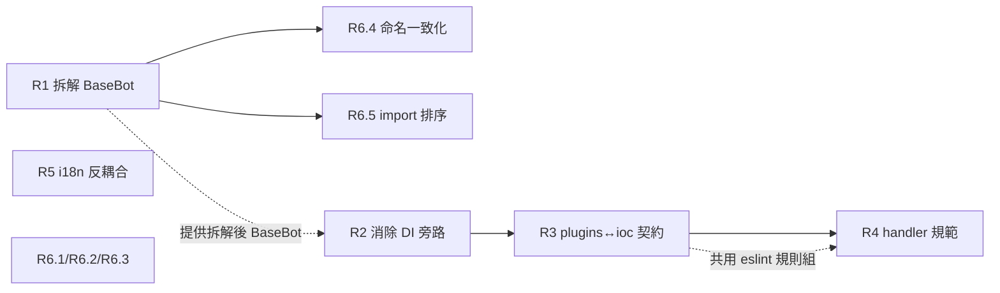
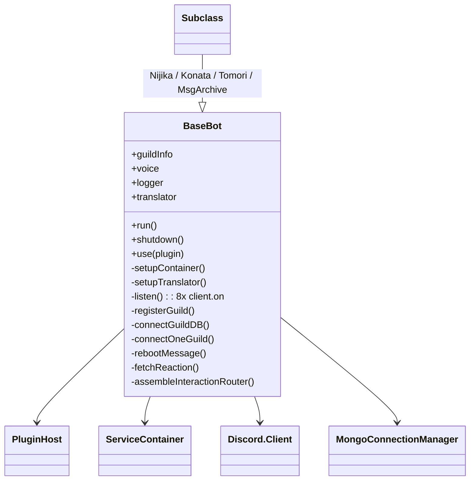
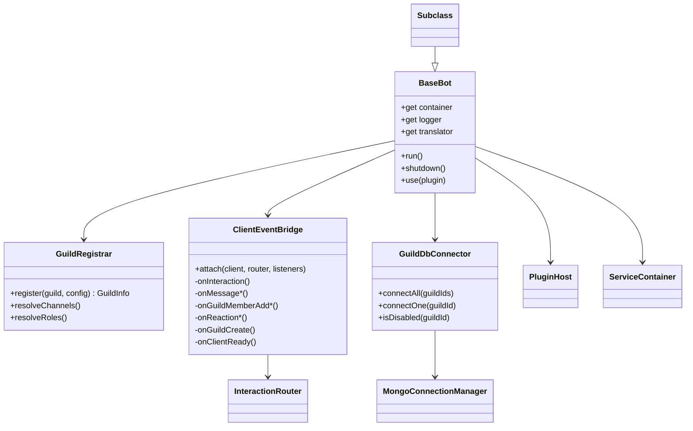
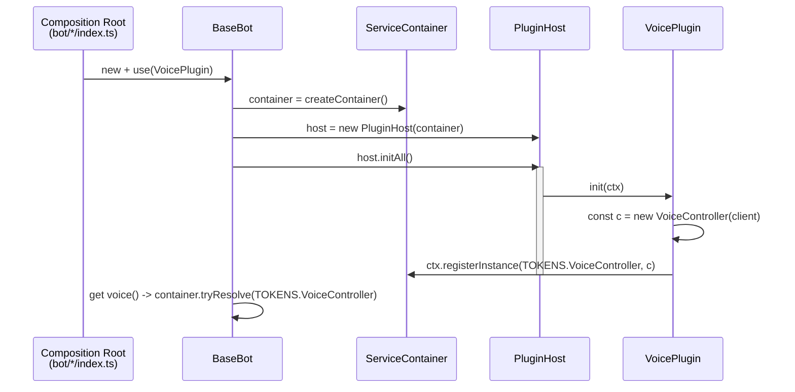

# 概要設計文件 — Tech-Debt Cleanup (R1–R6)

| 欄位     | 內容                                                                                                            |
| -------- | --------------------------------------------------------------------------------------------------------------- |
| 對應需求 | [docs/proposal.md](proposal.md)                                                                                 |
| 文件層級 | 架構演變層級——記錄「為什麼這樣拆」「邊界落在哪裡」的高階決策；介面簽名等細節留給 per-R design                   |
| 主軸     | 設計單元 = R 項。每個 R 是一條獨立的設計線，按 §3 的依賴順序落地                                                |
| 範圍對齊 | R1 拆解 BaseBot、R2 消除 DI 旁路、R3 plugins↔ioc 契約對齊、R4 handler 規範、R5 i18n 反耦合、R6 低優先項一次掃乾 |

---

## 1. 設計原則

本輪沿用 architecture-overhaul 的既有原則（分層、SRP、IoC、Result、i18n 強紀律），並針對技術債特性追加三條：

1. **契約 = 程式碼 = 規則**——任何聲稱的邊界（誰可以 import 誰、誰可以 mutate 什麼）都必須同時體現在 (a) 公開契約、(b) 實際程式碼、(c) lint / 型別規則 三處。三者不一致即視為缺陷。
2. **DI 是唯一接線管道**——任何 plugin 與 BaseBot 之間、或 plugin 之間的物件傳遞，都必須穿越 IoC 容器。Module-scope 的全域 holder 不再是合法接線。
3. **行數紀律 by ESLint**——「handler 不該太肥」這類工程紀律不靠人工 review，靠機器在 lint 階段擋下。

---

## 2. 設計單元總覽

| 單元 | 簡述                                 | 主要動到的 component                          | 性質       | 風險  |
| ---- | ------------------------------------ | --------------------------------------------- | ---------- | ----- |
| R1   | 拆解 BaseBot 為 thin lifecycle owner | bot/、新增 3 個 collaborator                  | 結構性重構 | 高    |
| R2   | 消除 DI 旁路                         | core/plugin（契約）、plugins/voice、infra/llm | 契約擴張   | 中    |
| R3   | plugins↔core/ioc 契約對齊            | core/plugin（barrel）、plugins/\*、eslint     | 邊界對齊   | 低    |
| R4   | handler 行數規範 + 4 個示範拆分      | handlers/、eslint、4 份規範文件               | 紀律落地   | 低    |
| R5   | i18n catalog 路徑反耦合              | core/i18n、bot/\*/index.ts                    | 介面收窄   | 低    |
| R6   | 5 個低優先單點清理                   | bot/、handlers/、eslint                       | 散點修正   | 低-中 |

> 風險評等延用 [proposal §10.3](proposal.md#103-風險與緩解)；本文件不重述緩解措施。

---

## 3. 單元間依賴與落地順序



落地順序按依賴鏈：R1 → R2 → R3 → R4 → R5 → R6。

- **R1 是其他項的基礎**：BaseBot 仍肥大時，R2 的 `bot.voice` getter 改寫、R6.4 命名改名都會被 R1 重新洗牌。R1 不先做，後續 PR 會反覆動到同個檔。
- **R6.4 / R6.5 與 R1 同分支同步**：屬 BaseBot 內部 breaking change；分到不同 commit，但安排在 R1 落定後立刻做，避免再次 touch 同一檔。
- **R2 → R3 順序**：R3 把 `core/plugin` 改為 plugin 對 IoC 的唯一窗口；R2 新增的 `TOKENS.VoiceController` 也要從這個窗口走，先 R2 再 R3 才能一併把新 token 暴露面對齊。
- **R3 → R4 共用 eslint 變更**：R3 加 `no-restricted-imports`、R4 加 `max-lines-per-file`，安排相鄰可在同一輪 eslint 校驗中收斂。
- **R5、R6.1–R6.3 互不相依**：可在任何時點插入，安排在末段集中處理以縮小 review 切片。

---

## 4. R1 — 拆解 BaseBot

### 4.1 動機

`src/bot/index.ts` 1,018 行同時擁有 8 種職責（生命週期、IoC 接線、Guild 註冊、DB 連線、reboot 訊息、8 個 raw `client.on`、reaction 抓取、Router 組裝）。docstring 自稱「Thin lifecycle owner」與現況背離。R1 把 BaseBot 退回真正的薄殼。

### 4.2 改前結構



讀者要追任何一條動線都得在 1,018 行裡跳。

### 4.3 改後結構



### 4.4 collaborator 邊界與責任

| Collaborator        | 唯一輸入                                              | 唯一輸出                                         | 不負責                                      |
| ------------------- | ----------------------------------------------------- | ------------------------------------------------ | ------------------------------------------- |
| `GuildRegistrar`    | Discord `Guild` 物件 + bot 設定                       | 完整填好 channels / roles / repos 的 `GuildInfo` | 不開 DB 連線、不發 Discord 訊息             |
| `ClientEventBridge` | `Client` + 已組好的 `InteractionRouter` + listener 們 | 純粹的 fan-out，不持有業務狀態                   | 不解析 channels / roles、不參與 router 組裝 |
| `GuildDbConnector`  | guild id 清單 + Mongo URI                             | per-guild `Connection` + repos bag               | 不關心 guild metadata、不送訊息             |

`BaseBot` 退化為 lifecycle 編排器：在 `run()` 內依序呼叫 `setupContainer → setupTranslator → guildDbConnector.connectAll → guildRegistrar.register × N → clientEventBridge.attach → host.startAll`，自身不直接觸碰任何上述細節。

### 4.5 與其他 R 的關係

- **R6.4**（命名一致化）在 R1 之後立即做。R1 重組 BaseBot field 時，新類別的 Handler Map 命名直接套複數規則；舊 BaseBot 殘留的 `buttonHandler/modalHandler/...` 一併改名。
- **R6.5**（import 排序）在 R1 commit 內順手處理——拆 BaseBot 必然動 import 區，沒有理由不順便把中間夾的 `sharedConnectionManagers` 搬下。
- **R2**：R2 把 `bot.voice` 從 public field 改成 getter，需要 BaseBot 已被 R1 重組成 `container` 為單一狀態存放點的形式。

### 4.6 風險緩解（架構觀點）

- 拆解前先補 contract 測試（見 proposal §4.3）——HLD 不規範案例集，但要求新的 `ClientEventBridge` / `GuildRegistrar` / `GuildDbConnector` 各自有獨立 spec，且舊整合測試覆蓋的 8 條 `client.on` 行為皆有對應驗證。
- BaseBot 對 subclass 的 lifecycle 順序契約（`use → run → shutdown`）不動；subclass 改的是欄位/取值方式而非 hook 順序。

---

## 5. R2 — 消除 DI 旁路

### 5.1 改後 DI 走線



### 5.2 契約變化

`PluginContext`（plugin 收到的 ctx）新增 `registerInstance<T>(token, instance): void`：

- **時機合法性**：只在 `init` hook 內有效；其他階段呼叫由 `host/lifecycle.ts` 階段檢查器擋下並丟 `ConfigurationError`。HLD 不規定錯誤訊息措辭，只規定「違規必須在第一次發生時失敗，不允許靜默成功」。
- **API 寬度**：只能 register 已建構好的 instance；不開 factory、不開 singleton lazy。理由：plugin 對容器的合法寫入面要窄到不可能被誤用為 service locator 註冊器。

### 5.3 與既有 DI 設計的關係

`core/ioc/container.ts` 的 `Resolver` / `ServiceContainer` 分離不變。`ctx.registerInstance` 是 PluginContext 對 `register` 的一層窄面 facade，內部仍呼叫 container 的 `registerSingleton`，但對 plugin 隱藏 factory 形式。

### 5.4 同等模式套用 models-catalog

`infra/llm/models-catalog.ts` 既有的 `setActiveModelCatalog` / `getActiveModelCatalog` module-global 函式組移除。改由（具體選擇留給 R2 design）：

- 由負責構建 catalog 的 plugin / composition 點，在 `init` 階段透過 `ctx.registerInstance(TOKENS.ModelCatalog, ...)`；
- 或由 BaseBot 在 `setupContainer` 內直接 register。

R2 要求的成果不變：`grep` `let active` 在 plugin / infra 樹歸零。

---

## 6. R3 — plugins ↔ core/ioc 契約對齊

### 6.1 邊界示意

```mermaid
flowchart LR
    subgraph core
        ioc[core/ioc<br/>TOKENS, Container]
        pluginPkg[core/plugin<br/>Plugin, ctx, re-export TOKENS]
    end
    subgraph bot[bot/composition root]
        BB[BaseBot]
    end
    subgraph plugins[plugins/*]
        Px[plugin.ts]
    end
    BB --> ioc
    BB --> pluginPkg
    Px --> pluginPkg
    Px -. forbidden by eslint .x ioc
```

### 6.2 設計重點

- `core/plugin/index.ts` 是 plugin 對 IoC 表面的**唯一入口**：re-export `TOKENS` 與型別（`ServiceToken<T>`、`Resolver`），不 re-export `ServiceContainer` 的寫入 API。
- 違規由 ESLint `no-restricted-imports` 把 `src/plugins/**` import `core/ioc` 設為 error。
- 規範文字（誰可以 import 誰）在 CLAUDE.md / CONTRIBUTING.md / `.claude/skills/project-conventions/SKILL.md` / `.claude/skills/coding-standards/SKILL.md` 四處同步——這對應原則 §1.1（契約=程式碼=規則）。

### 6.3 與 R2 的疊加

R2 新增的 `TOKENS.VoiceController` / `TOKENS.ModelCatalog` 必然走 R3 的窗口暴露給 plugin。R2 與 R3 在同分支落地，避免 R2 期間 plugin 又繞回 `core/ioc` 直 import 新 token。

---

## 7. R4 — 過長 handler 拆分 + 規範

### 7.1 Handler 內部結構準則

`src/handlers/<type>/<name>/index.ts` 只保留 Discord I/O 邊界職責：

- 從 interaction 物件抽 input
- 權限 / guild repos 檢查
- Translator 呼叫
- 把 domain 結果組裝成 Discord 回覆物件

純函式（不依賴 Discord 物件、無 I/O）必須抽到同目錄獨立檔。具體新檔命名由 per-handler design 決定（proposal §7.2A 已給示範對應）。

### 7.2 為什麼放在 handler 同目錄而非 shared 區

- 抽出的 helper 是該 handler 的**內部實作細節**，跨 handler 共用機率低；放 shared 區會誘導日後跨 handler 共用導致耦合。
- handler 目錄就是 codegen 的掃描單位（`scripts/gen-registry.ts` 以資料夾名 = Discord 指令名），同目錄不破壞 registry codegen 的假設。

### 7.3 ESLint enforce 點

- `eslint.config.mjs` 新增 `max-lines-per-file` 規則 group，files glob 限定 `src/handlers/**/*.ts`，max 150。
- 規則放在獨立 config block，不污染其他層的 lint 設定。

### 7.4 規範同步

四份文件文字一致（proposal §7.2B 列點）。HLD 不重抄規則細節；只主張：規範條目要在每份文件中以**完全相同的措辭**出現，便於 grep 與一次性同步更新。

---

## 8. R5 — i18n catalog 路徑反耦合

### 8.1 改前 / 改後

| 面向                            | 改前                                                   | 改後                                                  |
| ------------------------------- | ------------------------------------------------------ | ----------------------------------------------------- |
| 誰知道 `src/i18n/locales` 在哪  | `core/i18n/catalog-loader.ts`（透過 `__dirname` 反推） | composition root（`bot/*/index.ts`），core 完全不知道 |
| `LoadCatalogOptions.localesDir` | optional，有 `DEFAULT_LOCALES_DIR` 預設                | required                                              |
| 違規偵測                        | 無——任何呼叫端忘記指定路徑就走預設                     | 編譯期型別錯誤——呼叫端必須顯式傳入                    |

### 8.2 為什麼這算 component 邊界改善

`core` 的「不感知下游層位置」是分層架構的核心紀律。R5 不增加 component，只把既有 component 的對外契約**收窄**到符合該紀律。介面收窄是低風險高 ROI 的修正——任何呼叫端遺漏會在編譯期被擋。

---

## 9. R6 — 低優先單點清理

R6 不新增 component；改動分布見下表。

| 子項 | 動到的 component / 檔案                                   | 性質                                                | 與哪些 R 互動                    |
| ---- | --------------------------------------------------------- | --------------------------------------------------- | -------------------------------- |
| R6.1 | `BaseBot` router middleware                               | 換隨機源（`Math.random` → `crypto.randomUUID`）     | 與 R1 拆解後位置一致             |
| R6.2 | `BaseBot.login()` / `run()` 順序                          | 失敗語意改變（reject 而非吞）                       | 屬 R1 範圍內的副題               |
| R6.3 | 全 `src/` 殘餘 `console.*` + ESLint `no-console` 提 error | 規則拉緊 + 全樹掃                                   | 與 R3 / R4 共享 eslint 工序      |
| R6.4 | `BaseBot` 與所有 Handler Map 命名（複數化、camelCase）    | breaking change，影響所有 handler / subclass / test | **同分支同步 R1**，避免雙重 diff |
| R6.5 | `src/bot/index.ts` import 區整理 + ESLint `import/first`  | 純排序 + 規則固化                                   | 隨 R1 順手做                     |

### 9.1 對外可見的變化

R6 對外（執行行為、catalog key、Discord 指令簽名）皆零影響，但對任何引用 `bot.buttonHandler` 等舊命名的程式碼為 breaking change。修正集中在同分支內。

---

## 10. 退場後的整體圖

```mermaid
flowchart TB
    subgraph composition[Composition Root]
        Nijika
        Konata
        Tomori
        MsgArchive
    end
    subgraph bot_layer[bot/]
        BaseBot
        GuildRegistrar
        ClientEventBridge
        GuildDbConnector
    end
    subgraph core_layer[core/]
        ioc[core/ioc]
        pluginPkg[core/plugin]
        i18n[core/i18n]
        logger[core/logger]
    end
    subgraph plugins_layer[plugins/]
        Vp[VoicePlugin]
        Other[其他 plugin*]
    end
    subgraph handlers_layer[handlers/]
        H[handler index.ts ≤150]
        Helpers[pure helpers]
    end
    composition --> bot_layer
    composition --> i18n
    bot_layer --> ioc
    bot_layer --> pluginPkg
    plugins_layer --> pluginPkg
    handlers_layer --> H
    H --> Helpers
    BaseBot --> GuildRegistrar
    BaseBot --> ClientEventBridge
    BaseBot --> GuildDbConnector
    Vp -.ctx.registerInstance.-> ioc
    plugins_layer -. forbidden .x ioc
```

退場狀態下：

- BaseBot 是真薄殼；複雜性散在三個 single-purpose collaborator。
- Plugin 與 IoC 容器的接觸面僅剩 `core/plugin` 一個入口，且寫入面（`registerInstance`）有 lifecycle 階段守門。
- Handler 行數紀律由 ESLint 自動保護。
- Core 不感知任何下游層的目錄佈局。
- `console.*` / 命名混雜 / Math.random traceId / 吞 login 失敗 等小坑全清。

---

## 11. 不做的設計決策（明確留白）

- **RouterAssembler** 不抽——proposal §4.4 已說明；架構觀點上，router 組裝是一次性程序，獨立 ROI 低。日後 router 真正長大時，另列 R 項。
- **catalog 抽成獨立 npm package** 不做——proposal §3 結論為「規模不足以支撐獨立 package」。
- **DI 框架替換** 不做。`core/ioc` 自製容器是經過審閱認可的比例恰當實作。
- **Handler 跨層共用 helper 區（如 `src/handlers/shared/`）** 不引入——本輪 helper 一律放各 handler 同目錄。日後若真有跨 handler 共用需求再評估提升。

---

## 12. 參考

- 需求：[docs/proposal.md](proposal.md)
- 審閱：[docs/codebase-review-2026-05.md](codebase-review-2026-05.md)
- 整改背景：[docs/revision.md](revision.md)
